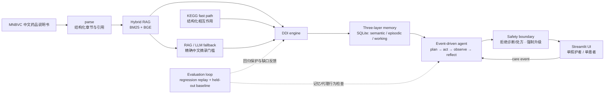

# 用药协管员：可审计的家庭用药记忆

**记住父母健康史、主动预警用药冲突、全程可审计的“用药协管员”。**

## What it is

This repository is a single-caregiver, single-patient engineering demonstration. It turns Chinese medicine-label evidence and caregiver events into a durable SQLite record: patient facts, current medication state, change events, warnings, citations, and unresolved conflicts. The default path is deterministic and offline-first, so the UI and scripted demo can be replayed without an LLM or network access.

## What it is not

It is **not a medical device, diagnostic system, prescriber, or clinical decision-support service**. It does not diagnose, prescribe, or tell a person to start, stop, or change a medicine. Severe, uncertain, uncited, and conflicting results are explicitly escalated to a doctor or pharmacist. The metrics below are software-engineering measurements, not clinical validation or evidence of patient-outcome safety.

## Architecture



## Pipeline walkthrough

1. **Data → parse.** `stage0/` keeps the MNBVC-derived label corpus and the existing parser. Relevant Chinese sections are chunked with source metadata.
2. **Parse → hybrid RAG.** `rag.py` combines local BM25 and BGE/FAISS retrieval. A degraded exact-token path is available when the embedding runtime is unavailable.
3. **RAG → DDI engine.** `ddi_engine.detect()` normalizes Chinese brand/generic names, expands mapped compounds and enumerates ingredient pairs. KEGG is the fast corroboration path; grounded RAG/LLM extraction is a bounded fallback. A warning is not accepted as cited evidence unless its quote is an exact substring of a retrieved Chinese chunk.
4. **DDI → memory.** `MemoryStore` writes patient facts, medication versions, warning episodes, conclusions, and audit rows. A conflict links both sides without silently choosing one.
5. **Memory → agent.** `MedicationCoordinatorAgent.handle(CareEvent)` chooses one tool at a time, observes it, reflects on confidence/citations/conflicts, and replans when evidence is weak.
6. **Agent → UI.** `stage0/app.py` calls that real agent and real `MemoryStore`; it does not duplicate detection or memory logic. The UI exposes the current ledger, citations, audit references, and a cross-session query.

## Why exact recall instead of embeddings for memory?

Embeddings are useful for finding label evidence, but they are the wrong source of truth for safety-critical patient facts. The memory layer therefore uses exact SQLite keys and immutable versions for age, allergies, renal/hepatic function, chronic disease, preferences, and medication records. Exact `(namespace, key)` recall gives deterministic “what is currently recorded?” answers, stable references such as `memory:semantic:3@v1`, and a clear audit trail. Time decay only changes episodic retrieval ranking; it never deletes the underlying event. When two safety-critical facts disagree, `conflicts` stores both sides as open instead of allowing a similarity score to erase history.

## The agent loop and safety boundary

The loop is deliberately event-driven rather than a fixed chatbot script:

```text
CareEvent
  → plan one tool
  → act and observe
  → reflect on confidence, citations, failures, and contradictions
  → re-plan or respond through SafetyBoundary
```

Medication add/remove/dose-change events trigger a real DDI check against the current list. Patient facts can trigger a local label search for allergy, age, renal, or hepatic cautions. Low-confidence class inference triggers another retrieval goal and remains labelled as inference. Procedure exposure can create an explicit conflict between a reported clinical action and a label warning. The boundary rejects diagnosis/prescribing requests, rejects uncited warnings, and appends “建议咨询医生/药师” for severe, unknown, low-confidence, failed-tool, or conflict cases.

## Evaluation

The table intentionally reports **both** the reproducible regression replay and the isolated held-out baseline. The regression numbers are **not generalization accuracy**. Both rows are a **small single-evaluator engineering baseline, not clinical validation**.

| Evaluation slice | Scope | Precision | Recall | F1 | Severity accuracy | High-risk severity accuracy | Chinese citation coverage |
|---|---|---:|---:|---:|---:|---:|---:|
| Regression replay (**not generalization**) | 26 replay lists; 41 gold pair occurrences; persisted KEGG/RAG evidence | 1.0000 | 1.0000 | 1.0000 | 1.0000 | 6/6 required severe pairs flagged | 1.0000 |
| Held-out live baseline | 26 isolated lists; leakage audit passed; 15 TP / 0 FP / 5 FN | 1.0000 | 0.7500 | 0.8571 | 0.6667 | 0.4444 | 0.4000 |

The held-out result is the honest product signal: precision is strong in this small sample, but the recall gap is concentrated in theophylline-class pairs; KEGG-only `P` defaults to moderate and causes severity errors; and nine of fifteen warnings lack a Chinese citation. Do not quote the regression `1.0000` as accuracy. Full artifacts remain in `stage0/data/structured/engine_regression_metrics.json` and `stage0/data/structured/engine_heldout_metrics.json`.

## Business value / who pays

The first buyer is the adult child paying for a parent’s safer, less fragmented medication history (C端). A later B2B extension could package the same auditable workflow for养老机构 and insurers: medication reconciliation, handoff evidence, unresolved-conflict visibility, and a review queue. That is a product hypothesis, not current deployment scope; this demo has no authentication, multi-tenancy, cloud service, or clinical governance.

## Setup and run

Use Python 3.11+ from the repository root:

```powershell
python -m venv .venv
.\.venv\Scripts\Activate.ps1
python -m pip install -r stage0/requirements-stage1.txt

# Deterministic, offline-first interactive UI.
streamlit run stage0/app.py

# Optional structured fact extraction. Streamlit passes app arguments after --.
streamlit run stage0/app.py -- --llm

# Scripted two-session walkthrough.
python stage0/demo.py --reset
```

In the UI, **清空并重新开始** removes only `stage0/memory.db` and its SQLite sidecars. **开启新会话（保留记忆）** closes and reopens the database with a fresh agent, which makes cross-session recall visible. The app starts with the real local agent and memory; it does not require an API key in its default mode. See [DEMO.md](DEMO.md) for a ≤3-minute click-by-click run.

The existing Stage 0/1/2 reproduction commands, data lineage, and detector details remain in [stage0/REPORT.md](stage0/REPORT.md). The three Stage 3 behavior tests can be run with:

```powershell
python -m unittest stage0.test_stage3 -v
```

## Known limitations

- The held-out labels and controls are small and single-evaluator; they are not clinical validation.
- KEGG is corroborative, not authoritative Chinese-label evidence.
- Source freshness and label coverage are not guaranteed; the curated local corpus is an MNBVC-derived sample.
- The held-out recall gap is concentrated in theophylline-class pairs (`茶碱`).
- KEGG `P` interactions default to `moderate` when stronger severity evidence is absent, producing the observed high-risk severity gap.
- Class inference (for example aspirin × ibuprofen) is deliberately low-confidence and escalated, not presented as a direct label claim.
- The UI is intentionally one caregiver/one patient, with no auth, tenancy isolation, clinical review workflow, or cloud persistence.
