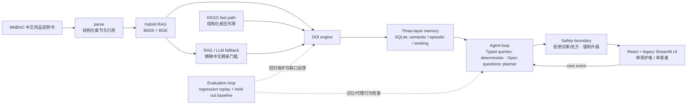

# 用药协管员：可审计的家庭用药记忆

**记住父母健康史、主动预警用药冲突、全程可审计的“用药协管员”。**

## What it is

This repository is a single-caregiver, single-patient engineering demonstration. It turns Chinese medicine-label evidence and caregiver events into a durable SQLite record: patient facts, current medication state, change events, warnings, citations, and unresolved conflicts. The default path is deterministic and offline-first, so the UI and scripted demo can be replayed without an LLM or network access.

## What it is not

It is **not a medical device, diagnostic system, prescriber, or clinical decision-support service**. It does not diagnose, prescribe, or tell a person to start, stop, or change a medicine. Severe, uncertain, uncited, and conflicting results are explicitly escalated to a doctor or pharmacist. The metrics below are software-engineering measurements, not clinical validation or evidence of patient-outcome safety.

## Architecture

### Product upgrade P0–P6: material reconciliation and durable care tasks

The React frontend supports **open an alert → read and highlight its original evidence → inspect recorded facts → correct a medication record → inspect that operation's impact**. Evidence reads enforce scope and verify the stored content hash; unknown source versions remain unknown. New operations persist their `run_id` on mutation audit entries, so impact comes from the actual operation's invalidations. Historical operations without attribution explicitly report that their impact cannot be reconstructed.

The React app now also imports CSV or printed Chinese discharge tables, shows original document regions beside candidate fields, records each confirmed difference with an atomic receipt, queues risk checks, resumes durable care tasks, and downloads immutable visit summaries. Versioned evidence caches, conservative citation-support checks and explicit source replacement preserve evidence history.

See [P0–P6 delivery and reproducible acceptance](docs/product-upgrade/final-acceptance/README.md). The [earlier P0–P1 closeout](docs/product-upgrade/closeout/README.md) is retained as historical evidence. Engineering/synthetic regression, actual local OCR, real-model quality and independent domain review are reported separately. New pages: `/materials` and `/tasks`. Optional OCR dependencies: `requirements-product-ocr.txt`.



## Pipeline walkthrough

1. **Data → parse.** `stage0/` keeps the MNBVC-derived label corpus and the existing parser. Relevant Chinese sections are chunked with source metadata.
2. **Parse → hybrid RAG.** `rag.py` combines local BM25 and BGE/FAISS retrieval. A degraded exact-token path is available when the embedding runtime is unavailable.
3. **RAG → DDI engine.** `ddi_engine.detect()` normalizes Chinese brand/generic names, expands mapped compounds and enumerates ingredient pairs. KEGG is the fast corroboration path; grounded RAG/LLM extraction is a bounded fallback. A warning is not accepted as cited evidence unless its quote is an exact substring of a retrieved Chinese chunk.
4. **DDI → memory.** `MemoryStore` writes patient facts, medication versions, warning episodes, conclusions, and audit rows. A conflict links both sides without silently choosing one.
5. **Memory → agent.** `MedicationCoordinatorAgent.handle(CareEvent)` runs one LLM decision per plan → act → observe → reflect cycle when `--llm-planner` is enabled. The model sees the event, patient snapshot, tool schemas, observations and trace, chooses its tool and free arguments, and decides when to answer. `ResponseComposer` writes the final text from actual warnings, conflicts and memory references. The default remains offline and deterministic. In LLM mode the deterministic planner runs only after provider/parse failure. Schema or safety rejection is recorded and sent back to the LLM on the next cycle, without selecting a replacement action.
6. **Agent → UI.** `stage0/app.py` calls that real agent and real `MemoryStore`; it does not duplicate detection or memory logic. The UI exposes the current ledger, citations, audit references, and a cross-session query.

## Why exact recall instead of embeddings for memory?

Embeddings are useful for finding label evidence, but they are the wrong source of truth for safety-critical patient facts. The memory layer therefore uses exact SQLite keys and immutable versions for age, allergies, renal/hepatic function, chronic disease, preferences, and medication records. Exact `(namespace, key)` recall gives deterministic “what is currently recorded?” answers, stable references such as `memory:semantic:3@v1`, and a clear audit trail. Time decay only changes episodic retrieval ranking; it never deletes the underlying event. When two safety-critical facts disagree, `conflicts` stores both sides as open instead of allowing a similarity score to erase history.

## Memory deepening (Stage 7)

Belief revision is indexed and selective rather than a hand-written one-hop scan:

- **Conclusion dependency index.** Every conclusion records what it consumed — cited facts by `(namespace, key)`, medications by normalized ingredient, DDI pairs parsed from its own text, and for whole-list scan warnings a hash of the medication set it was checked against. The `conclusion_dependencies` table replaces the pre-Stage-7 full-table scans; migration backfills it deterministically, and a NULL set-hash means "always re-verify" (the conservative pre-Stage-7 behaviour).
- **Selective invalidation.** Adding an unrelated drug no longer stales patient-condition findings — they depend only on their focus drug and cited facts. Whole-list pair warnings keep the set-scoped rule (a full-list scan produced them), and stopping or dose-changing a member still stales everything citing it. The ablation `MemoryStore(ablations={'selective_invalidation'})` restores the full-invalidation baseline: on scenario S28 the over-invalidation rate drops from 1.0 to 0 while invalidation coverage stays 1.0.
- **Recheck hardening.** Task claims carry an expiring lease (crashed workers are recovered; three failed claims mark the task failed instead of looping forever), one detector run serves a whole batch (memoized by the current medication-set hash — three stale conclusions, one detection), and patient-condition conclusions get a deterministic label-vs-facts recheck instead of only the conservative template.
- **As-of reconstruction.** `query_state(known_at=...)` now folds the conflict action trail (resolve/reopen/undo), so a conflict resolved today still appears open in earlier known-at views and disappears from current ones; `retrieve_episodic(as_of=...)` is a knowledge cutoff over `recorded_at`.
- **Promotion state machine.** `verification_status` moves `recorded_as_reported → verified` only by rule — two consistent reports from distinct events, or an explicit caregiver confirmation — while an open conflict blocks promotion and marks the key disputed. Event replays never count toward promotion.
- **Backup and export.** `python -m stage0.backup --backup | --export | --restore <file> --to <path> | --verify <file>`: WAL-safe online backups with checksum sidecars, a JSON interchange export, and restores that refuse to overwrite existing targets.

Scenario coverage grew from 22 to 28 (`python -m stage0.eval_memory --ablate`), with all four mechanisms — policy, bitemporal, dependency, and the new selective_invalidation — load-bearing under ablation. Implementation details and the four design corrections found during implementation are in `docs/production-upgrade-2026-09-05/stage7_implementation_report.md`.

## Agent-loop hardening (Stage 8)

The LLM-decided loop is bounded, breakable and verifiable:

- **Per-turn budget** (`AGENT_TURN_BUDGET_SECONDS`, default 120s wall-clock; `AGENT_TURN_TOKEN_BUDGET`, a conservative chars/1.5 estimate backstop; max_cycles). The first exhausted budget degrades the turn to a deterministic completion with an explicit “结果可能不完整” notice — appended *before* the final safety check, so the checked text is exactly the delivered text. Live planner calls measured 18–60s in the Stage 6 run, which is why the wall-clock budget — not a shorter per-call timeout — is the limiter.
- **Bounded planner payloads.** Only the current cycle plus the two before it keep full observations; earlier ones carry a tool/purpose/ok summary with a result digest, RAG chunk text is truncated, and `recent_trace` no longer embeds a duplicate of every observation. Compression applies only to the serialized planner view — hydration and the response path keep reading the originals. Measured on synthetic RAG-sized stacks: 12 cycles of observations cost 77k → 9k payload characters (`docs/production-upgrade-2026-09-05/payload_budget.json`).
- **Consecutive-rejection circuit breaker.** Two consecutive safety rejections trip the breaker and the rest of the turn finishes on the deterministic planner — no more burning up to 16 LLM calls (18–60s each) on a model that keeps proposing unsafe actions. A single rejection still feeds back to the LLM as before.
- **Veto-only response verifier** (`--llm-verifier`, explicit opt-in). When the rule checker flags a semantic class (the false-positive-prone Stage 6 classes), an LLM verifier may adjudicate it benign — or reject with line-numbered, verbatim-quoted findings that the code re-verifies. It can never rewrite or add text; hard gates (fabricated refs/URIs, missing escalation) are never adjudicable; any verifier failure falls back to the full rule checker, so degradation is never weaker.
- **Persistent turn traces.** Every plan/act/observe/reflect/respond entry lands in a `turn_traces` table (process record), deliberately separate from `audit_log` (data-mutation record), so “why did it answer that way?” is answerable across sessions.

## RAG corpus fix (Stage 9, C1)

The held-out recall gap was concentrated in theophylline-class pairs because 茶碱 was absent from the chronic-drug priority list — their labels could only enter the 1,200-label corpus via the random hash sample. The term list now includes 茶碱/氨茶碱/多索茶碱, and a v2 corpus (`rag_corpus_v2.jsonl`, selection seed `stage1-rag-v2`) was rebuilt alongside the untouched v1: **90 theophylline labels** now in corpus, index at 4,051 chunks. The held-out DDI re-run for the recall delta is pending (needs live KEGG + provider); no number is claimed until it runs. Retrieval-layer work (rerank, query expansion, second-pass citation) is deferred by the one-month cut.

## Service layer, two-layer idempotency, outbox (Stage 10)

`stage0/server.py` exposes the system as a single-writer FastAPI service (the Streamlit default direct path is unchanged; the UI becomes an API client only when `STAGE0_API_URL` is set):

- **Async-first events.** `POST /v1/events` with an `Idempotency-Key` header atomically claims the key and enqueues an outbox task in one transaction, then returns `202` with a polling URL; a single in-process worker executes agent turns (also draining durable rechecks).
- **Two idempotency layers.** Request-level: same key + same payload replays the same acceptance (concurrent same-key submissions get the identical 202 — no 409 storm); same key + different payload → 422. Domain-level: the event key derives from the idempotency key, so replays dedup in the projection itself.
- **At-least-once, effectively-once.** Worker claims carry expiring leases; crashed claims are recovered; three failed claims mark the task failed (409 on that key, a new key retries). Tests assert crash recovery produces exactly one projection.
- Read endpoints (`/v1/memory/state|timeline|conflicts`, `/v1/alerts`), conflict actions, `/v1/rechecks`, `/v1/health`, and a four-category error model (validation/safety/provider/internal) with `trace_id`.

Honest boundary: one writer process (`--workers >1` unsupported by design); see the design document section D7 for the documented Postgres migration triggers.

**Reliability P0 (2026-09)** hardened this layer: server-generated `event_id`/`run_id` identity (the agent turn id is a uuid, no longer a truncation of the idempotency key — long-key prefix collisions cannot merge two events), lease-fenced worker writes with heartbeat renewal, one-transaction publication of task result + idempotency-key state, durable `operation_receipts` protecting consolidation/warning writes against replay, classified failures (`retryable`/`permanent`/`safety`/`effect_unknown`) with backoff+jitter and an explicit `POST /v1/events/{key}/retry` recovery endpoint, a committed-replay POST that now returns the same full body as the status endpoint, `SubmitKeyStore` so UI timeout retries reuse the same event, and a `Principal` layer (`STAGE0_AUTH_MODE=local-demo` default with an explicit warning; `deployment` refuses to start without `STAGE0_AUTH_TOKEN`). Design and audit trail: [docs/reliability-design/](docs/reliability-design/), implementation report: [docs/reliability-implementation/p0_implementation_report.md](docs/reliability-implementation/p0_implementation_report.md).

**Reliability P1 (2026-09, opt-in)** adds a LangGraph StateGraph runner behind `AGENT_GRAPH_RUNNER=1` (legacy stays the default path): the turn is split into `load_context → plan → execute → compose → publish` nodes with a persistent SQLite checkpointer, so a crashed turn resumes from the last completed step; the "domain commit succeeded but checkpoint missing" window is closed by the P0 operation receipts (a replayed `execute` node returns the stored result instead of duplicating the effect); accumulated budget is persisted to `workflow_runs` and never resets on restart; the checkpointer state carries JSON-safe fields only; and in-flight runs keep the runner version that created them (`workflow_runs.graph_version`), so flag changes never silently re-route a paused run. Shadow comparison runs on isolated databases only. See [docs/reliability-implementation/p1_implementation_report.md](docs/reliability-implementation/p1_implementation_report.md).

**Reliability P2 (2026-09, opt-in behind `STAGE0_REVIEW_ENABLED=1` + the graph runner)** closes the human-review loop: severe warnings or unresolved conflicts open an idempotent review case, publish a safe waiting response and park the run on a LangGraph `interrupt()` — the worker lease is released immediately, so no thread/lock/transaction ever waits for a human. Reviewers (a clearly-marked **simulated** local workbench, `streamlit run stage0/review_app.py`) claim cases with CAS revision, submit one of five structured decisions (Idempotency-Key protected; no graph goto/SQL/state patch is expressible), and the worker resumes the run via `Command(resume=...)`. The resume node re-validates everything and re-checks fact freshness: if medications or facts changed while waiting, the decision is refused as `review_stale`, the case is cancelled and a fresh round opens — an old approval never authorizes a new state. Overdue cases are an operational state only; timeout never auto-approves. No real clinician service is connected: UI, exports, and the reviewer page all say so explicitly. See [docs/reliability-implementation/p2_implementation_report.md](docs/reliability-implementation/p2_implementation_report.md).

## The agent loop and safety boundary

The loop is deliberately event-driven rather than a fixed chatbot script:

```text
CareEvent
  → plan one tool
  → act and observe
  → reflect on confidence, citations, failures, and contradictions
  → re-plan or respond through SafetyBoundary
```

Medication add/remove/dose-change events trigger a real DDI check against the current list. Patient facts can trigger a local label search for allergy, age, renal, or hepatic cautions. Low-confidence class inference triggers another retrieval goal and remains labelled as inference. Procedure exposure can create an explicit conflict between a reported clinical action and a label warning. The boundary rejects diagnosis/prescribing requests, rejects uncited warnings, and appends “建议咨询医生/药师” for severe, unknown, low-confidence, failed-tool, or conflict cases.

Stage 6 uses one `CANONICAL_PROPOSAL_SCHEMA` in the function definition, prompt payload and validator. `decision` selects `tool` or `respond`; a tool decision supplies its registered name and schema arguments. Extra fields are ignored and rationale/purpose are optional annotations. Reads, DDI checks and searches have no required policy order; the LLM also receives the memory snapshot directly. The guard protects consolidation before an answer, real observed-warning provenance (from `ddi_check` or `rag_search` observations) before warning persistence, grounded conflict links and user-visible clarification safety. It hydrates safety-critical evidence and the current medication list from actual memory, recording argument corrections. There is no code-generated operational plan in the model payload.

`response_safety.py` checks the composed text for Chinese/English diagnostic or medication directives, invented citations/references, missing warning provenance, missing conflict sides and required escalation. Each warning must keep its recorded effect, citation and memory reference together. Rejected composition switches to a logged template, which is also checked in LLM mode. Clarifications carry the same warnings/conflicts through this path. The unchanged `SafetyBoundary` remains the last gate. These finite text checks and four synthetic scenarios are engineering evidence, not a universal guarantee of natural-language clinical safety.

`--llm-planner` is an explicit third-party-data opt-in. The default mode is local and deterministic. Planner payloads are bounded and omit credentials; API keys remain in the gitignored `stage0/.env`. The selected provider still receives the current CareEvent and the minimum recent state needed to plan, which can contain patient information, so do not enable this flag unless that disclosure is acceptable for the configured provider.

## Evaluation

The table intentionally reports **both** the reproducible regression replay and the isolated held-out baseline. The regression numbers are **not generalization accuracy**. Both rows are a **small single-evaluator engineering baseline, not clinical validation**.

| Evaluation slice | Scope | Precision | Recall | F1 | Severity accuracy | High-risk severity accuracy | Chinese citation coverage |
|---|---|---:|---:|---:|---:|---:|---:|
| Regression replay (**not generalization**) | 26 replay lists; 41 gold pair occurrences; persisted KEGG/RAG evidence | 1.0000 | 1.0000 | 1.0000 | 1.0000 | 6/6 required severe pairs flagged | 1.0000 |
| Held-out live baseline | 26 isolated lists; leakage audit passed; 15 TP / 0 FP / 5 FN | 1.0000 | 0.7500 | 0.8571 | 0.6667 | 0.4444 | 0.4000 |

The held-out result is the honest product signal: precision is strong in this small sample, but the recall gap is concentrated in theophylline-class pairs; KEGG-only `P` defaults to moderate and causes severity errors; and nine of fifteen warnings lack a Chinese citation. Do not quote the regression `1.0000` as accuracy. Full artifacts remain in `stage0/data/structured/engine_regression_metrics.json` and `stage0/data/structured/engine_heldout_metrics.json`.

The checked-in Stage 5 artifact is the explicit live TokenDance `glm-5.3-flash` run over four demo outcomes with deterministic DDI/RAG fixtures. It records 30 attempts: 11 accepted, 17 schema-rejected, and two malformed-JSON/protocol errors. Fifteen of 23 action cycles used same-cycle deterministic fallback (65.22%); no unsafe proposal reached the executor, one cycle-aligned safe divergent action was accepted, there were no extra cycles or clarifications, and final outcomes agreed 4/4 with the deterministic baseline. The fallback rate is an honest model-quality limitation. The separate offline fake-provider run observed 30/30 accepted, zero fallback, eight cycle-aligned safe divergences, zero unsafe execution, and the same 4/4 agreement; those offline numbers verify wiring rather than model quality. Both modes are software behavior evaluation, not clinical validation. See `stage0/data/structured/planner_eval_metrics.json`.

The current Stage 6 artifact comes from a fresh live TokenDance `glm-5.3-flash` pass of the final revision: **4/4 outcomes live, 0 unsafe executor actions, 0 unsafe delivered texts**, 16/20 accepted proposals with 4 provider-timeout emergency fallbacks (**0.2000 of all cycles, exactly at the target boundary**), and worse efficiency (**20 vs 17 cycles; median 5.5 vs 4.5**). All four live compositions were initially rejected by the response checker; inspection showed false positives (benign disclaimers, conflict-side summaries, one negated refusal), the checker was corrected with the concrete-hazard rule intact, and a zero-call replay of the same recorded outputs then accepted **3/4 compositions** with all delivered texts re-verified clean. The honest weak spot: this live run yielded only **1 genuine safe divergent tool sequence** against the ≥2 qualitative target (an earlier recorded run, retained as `agentic_eval_live_before_output_fix.json`, yielded 3). Raw online/replay responses, provenance, and side-by-side sequences are in [the metrics](stage0/data/structured/agentic_eval_metrics.json) and [the Stage 6 report](stage0/REPORT.md#76-stage-6--llm-decisions-and-response-composition-safety-only-enforcement). **GO for controlled engineering evaluation; NO-GO for product/clinical use or for treating single-run fallback, divergence, and composition counts as stable model quality.**

## Business value / who pays

The first buyer is the adult child paying for a parent’s safer, less fragmented medication history (C端). A later B2B extension could package the same auditable workflow for养老机构 and insurers: medication reconciliation, handoff evidence, unresolved-conflict visibility, and a review queue. That is a product hypothesis, not current deployment scope; this demo has no authentication, multi-tenancy, cloud service, or clinical governance.

## Setup and run

Use Python 3.11+ from the repository root:

```powershell
python -m venv .venv
.\.venv\Scripts\Activate.ps1
python -m pip install -r stage0/requirements-stage1.txt

# Deterministic, offline-first interactive UI.
streamlit run stage0/app.py

# Optional structured fact extraction. Streamlit passes app arguments after --.
streamlit run stage0/app.py -- --llm

# Separately opt in to LLM planning with deterministic validation/fallback.
streamlit run stage0/app.py -- --llm-planner

# Scripted two-session walkthrough.
python stage0/demo.py --reset

# Same walkthrough with LLM-first planning. Provider failure safely falls back.
python stage0/demo.py --reset --llm-planner

# Stage 10 (optional): run the single-writer service layer instead of direct mode.
python -m pip install -r stage0/requirements-stage10.txt
python -m uvicorn stage0.server:app --host 127.0.0.1 --port 8000
#   then: $env:STAGE0_API_URL="http://127.0.0.1:8000"; streamlit run stage0/app.py
#   POST /v1/events with an Idempotency-Key header returns 202 + a polling URL.
```

In the UI, **清空并重新开始** removes only `stage0/memory.db` and its SQLite sidecars. **开启新会话（保留记忆）** closes and reopens the database with a fresh agent, which makes cross-session recall visible. The app starts with the real local agent and memory; it does not require an API key in its default mode. See [DEMO.md](DEMO.md) for a ≤3-minute click-by-click run.

The existing Stage 0/1/2 reproduction commands, data lineage, and detector details remain in [stage0/REPORT.md](stage0/REPORT.md). The current offline Stage 3 and Stage 6 behavior/safety tests can be run with:

```powershell
python -m unittest stage0.test_stage3 stage0.test_stage5 stage0.test_stage6 stage0.test_memory_p0 stage0.test_memory_p1 stage0.test_memory_p2 stage0.test_stage8_agent stage0.test_stage10_server

# Rebuild a separate network-free fixture artifact.
python stage0/test_stage6.py --evaluate-offline --metrics stage0/data/structured/agentic_eval_offline.json

# Replay the saved live run with no new model calls.
python stage0/test_stage6.py --replay-live stage0/data/structured/agentic_eval_live_before_output_fix.json

# Explicit live evaluation; writes agentic_eval_metrics.json and raw traces.
python stage0/test_stage6.py --evaluate-live
```

## Known limitations

- The held-out labels and controls are small and single-evaluator; they are not clinical validation.
- KEGG is corroborative, not authoritative Chinese-label evidence.
- Source freshness and label coverage are not guaranteed; the curated local corpus is an MNBVC-derived sample.
- The held-out recall gap was concentrated in theophylline-class pairs (`茶碱`); the Stage 9 corpus fix puts 90 theophylline labels into the v2 corpus, but the held-out re-run for the recall delta has not yet been executed — no improvement is claimed until it is measured.
- KEGG `P` interactions default to `moderate` when stronger severity evidence is absent, producing the observed high-risk severity gap.
- Class inference (for example aspirin × ibuprofen) is deliberately low-confidence and escalated, not presented as a direct label claim.
- Stage 6 planning sat exactly at the 0.20 fallback target in the fresh live pass (4 provider timeouts in 20 cycles) and took 3 extra cycles. The 3/4 accepted compositions come from a zero-call replay after one checker correction; only 1 live scenario qualified as a safe divergent tool order against the ≥2 target. Single-run counts are not stable model-quality estimates.
- The UI is intentionally one caregiver/one patient, with no auth, tenancy isolation, clinical review workflow, or cloud persistence.
