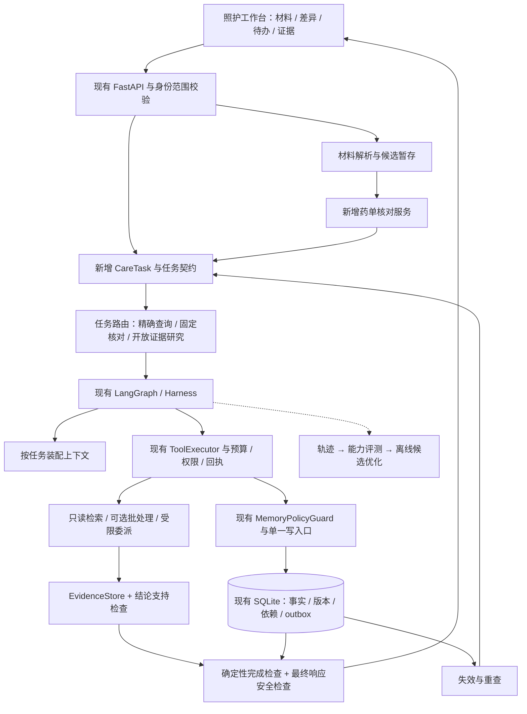

# HealthAssistant：从可审计用药记忆到持续照护任务 Agent

日期：2026-09-07。依据：当前工作区代码（包含未提交实现）、本地已有最终验收工件、公开项目与官方技术资料。本次为代码阅读和技术调研，没有重新运行测试、调用真实模型或验证医疗效果。下文新增能力均为建议，工期和门槛均为规划值。

## 1. 推荐结论

项目已经具备相当完整的 Agent 运行底座。下一阶段应集中做成一条产品链：**导入照护材料 → 核对药单与事实 → 解释检查依据 → 更正后增量重查 → 跟进未决事项 → 生成就诊摘要**。

优先交付三个可见亮点：

1. 多来源药单核对：用户提供一份材料，系统列出新增、缺失、剂量差异和无法确认项，用户逐项确认后才更新“当前报告药单”。
2. 会随事实变化的证据解释：每条提醒能展开“患者事实版本 → 检索原文 → 适用性 → 当前状态”；更正之后显示哪些提醒需要重新核查。
3. 跨会话照护任务：未解决问题有持久任务、等待条件、恢复入口和明确完成标准，用户回来后可继续办理。

建议定位：“能核对多来源用药记录、追踪证据变化并持续跟进未决事项的家庭照护 Agent”。保留现有项目对诊断、处方和真实医生服务的边界。

## 2. 当前实现到哪里了

| 能力 | 当前证据 | 下一步真正缺什么 |
|---|---|---|
| 事件驱动单协调 Agent，LLM 逐轮工具决策、规则兜底 | [agent.py](/D:/py/HealthAssistant/stage0/agent.py:78) | 从单次 CareEvent 扩展为可跨事件推进的业务任务 |
| BM25 + BGE/FAISS + RRF 混合检索 | [rag.py](/D:/py/HealthAssistant/stage0/rag.py:288) | 证据相关性重排、问题覆盖判断、明确的无结果状态 |
| KEGG 与中文说明书证据、DDI 检查、引用门禁 | [ddi_engine.py](/D:/py/HealthAssistant/stage0/ddi_engine.py:531) | 原文支持的具体结论、适用条件、版本变化与缓存失效 |
| 三层记忆、双时间查询、冲突、结论依赖与重查 | [memory.py](/D:/py/HealthAssistant/stage0/memory.py:2188) | 将已有机制呈现为“变更影响”和持续任务 |
| 幂等请求、outbox、回执、持久图执行、人工审核恢复 | [server.py](/D:/py/HealthAssistant/stage0/server.py:710)、[graph_runner.py](/D:/py/HealthAssistant/stage0/graph_runner.py) | 面向真实业务结果组织工作流，避免另造运行时 |
| ToolSpec、受控执行、证据卸载与回读、预算和上下文完整性标记 | [default_tools.py](/D:/py/HealthAssistant/stage0/harness/default_tools.py)、[evidence.py](/D:/py/HealthAssistant/stage0/harness/evidence.py:103)、[context.py](/D:/py/HealthAssistant/stage0/harness/context.py:53) | 面向任务按需装配上下文，并向前端提供受控原文读取 |
| React 照护界面、任务进度与取消、引用抽屉 | [AssistantPage.tsx](/D:/py/HealthAssistant/frontend/src/features/assistant/AssistantPage.tsx)、[evidence.tsx](/D:/py/HealthAssistant/frontend/src/components/evidence.tsx) | 材料导入、差异确认、证据原文高亮和待办工作台 |
| 批处理和只读委派实验 | [最终 P3 结果](/D:/py/HealthAssistant/docs/harness-upgrade/final-acceptance/p3-eval.txt) | 使用真实模型、等量证据、独立任务集验证质量与成本 |

已有最终验收报告记录了 281 项后端测试和 14 项浏览器检查通过，综合工件状态为 pass。这是此前本地合成验收结果，本次没有重跑。[验收说明](/D:/py/HealthAssistant/docs/harness-upgrade/final-acceptance/README.md)、[综合结果](/D:/py/HealthAssistant/docs/harness-upgrade/final-acceptance/acceptance-summary.json)。

必须区分历史报告版本：早期 P3 报告曾判定委派收益不足；最终等量回读实验中，长证据场景单 Agent / 批处理 / 委派的 planner 次数分别为 12 / 6 / 4，最终 adopt_delegation 与 adopt_batching 均为 true。它们只达到离线候选门槛；worker 为确定性实现、延迟为合成模型，开关仍默认关闭。不能据此宣布真实多 Agent 提升了回答质量。

最终 P1 评测明确记录 regression=8、dev=0、held_out=0；这只描述该 Harness 评测集，不代表整个仓库从未做过 DDI held-out 实验。[P1 结果](/D:/py/HealthAssistant/docs/harness-upgrade/final-acceptance/p1-eval.json)。

## 3. 前沿项目借鉴与取舍

下表左侧为官方资料描述，右侧为结合本仓库的设计判断；外部项目结果不能作为本项目收益。

| 项目 / 资料 | 可借鉴机制 | 对本项目的建议 |
|---|---|---|
| [LangChain Deep Agents](https://github.com/langchain-ai/deepagents) | 可扩展 harness、隔离子任务上下文、按需技能、持久状态 | 保留当前 LangGraph 与 harness，新增版本化业务任务契约；无需整体迁移框架 |
| [Deep Agents context engineering](https://docs.langchain.com/oss/python/deepagents/context-engineering) | 大工具输出外置，按需回读 | 现有 EvidenceStore 已具备相似基础；增加任务相关 evidence 索引与前端读取，不再重复造证据存储 |
| [Anthropic 长任务 harness](https://www.anthropic.com/engineering/effective-harnesses-for-long-running-agents) | 将任务进展和验收状态保留为持久工件，跨会话继续 | 照护任务需要待办、阻塞原因和完成依据；借鉴任务外化机制，不能假定编程任务经验直接证明医疗效果 |
| [Anthropic context engineering](https://www.anthropic.com/engineering/effective-context-engineering-for-ai-agents) | 控制上下文信息密度，按任务选择信息 | 对关键事实保留权威完整性检查；只对辅助历史使用相关性摘要 |
| [FutureHouse PaperQA](https://github.com/future-house/paper-qa) | 分开收集证据、评价相关性和生成带引用回答 | 建立“问题 → 待证结论 → 支持/反对/缺失证据”过程；先用于已有说明书，不把论文直接升级为个体用药指令 |
| [Graphiti](https://github.com/getzep/graphiti) | 有效时间、历史事实、来源关系和增量更新 | 展示现有双时间与依赖关系；目前用 SQLite 关系表即可，暂不增加图库运维 |
| [Docling](https://github.com/docling-project/docling) | 文档结构解析、OCR、本地运行 | 先试出院材料/PDF 的字段定位；药盒照片另做中文 OCR 小样本评估，不能假定文档工具能可靠识别所有药盒 |
| [DSPy GEPA](https://github.com/stanfordnlp/dspy/blob/main/docs/docs/diving-deeper/gepa-in-depth.md) | 根据轨迹反馈产生指令候选并评测 | 作为离线检索 query / 抽取提示词优化器；先有独立验证集，再考虑自动搜索；固定存储和安全规则 |
| [Anthropic agent evals](https://www.anthropic.com/engineering/demystifying-evals-for-ai-agents) | 区分能力评测与回归评测，组合程序评分、模型评分和人工评分 | 既验证任务完成后的数据库状态，也评价回答证据与多次运行一致性 |

## 4. 产品能力：先做什么

### A. 多来源药单核对——最强可见亮点

场景：用户上传一份出院用药记录，要求“帮我和家里的记录对一下，哪些地方需要确认”。

输出为差异表：材料中存在但档案没有、档案中存在但材料未列出、剂量/频次不同、品牌与成分映射可能重复、患者/日期/单位不确定。每个字段可以回到原图位置。

材料中未出现某药只能表示“此材料未列出”，不能自动认定已经停用。用户确认的是记录是否准确，不是授权系统改变处方。

实现链：

```text
文件入库与哈希 → OCR/结构解析 → 带页码/位置的候选字段
  → 患者归属、日期、单位和药名校验 → 与权威快照做差异
  → 用户逐项确认 → 受控事件提交 → 依赖失效与重新检查
```

新增 DocumentArtifact、ExtractionCandidate、ReconciliationCase 三种对象。候选保留 raw_text、page、bbox、source_document_id、patient_scope、confidence、status。OCR 数值与单位不能只存在模型摘要中。

第一版限定一种输入格式，例如清晰的中文出院用药表。先用结构化文本/CSV 跑通核对与提交，再插入 OCR，可避免把解析问题与 Agent 规划问题混在一起。

业务完成标准：每个差异项有处理状态；已接受项有持久回执；剩余项明确待确认。采用基于 patient_revision 的 CAS，确认期间档案变化则重算差异。多条变更的最小版本可逐项提交并展示部分完成；若产品承诺“整单原子应用”，必须新增同事务批量领域操作，不能靠循环多个现有 API 冒充。

### B. 证据核查与变化解释——最快复用现有优势

场景：“为什么有这条提醒？”以及“我更正了上次的记录，哪些提醒会变？”

展示四层：当前结论、所依赖的患者事实版本、说明书原文和来源版本、还缺哪些适用条件。提醒状态区分当前有效、依据已变化待重查、历史记录、证据不足。

先补受控 `GET /v1/evidence/{evidence_id}`，复用 EvidenceStore 的 scope 校验、内容哈希与分页上限；通过 evidence_id 读取，不能开放任意本地路径。已有引用组件目前对本地语料指针只做说明，因此后台可审计还没有完全转化为用户可核查。

结论依赖关系先用查询 API + 小型关系视图表达，不新建通用知识图谱平台。新增变更影响摘要包含 changed_fact_refs、affected_conclusion_ids、recheck_status、new_conclusion_refs。后端计算影响，LLM 仅表述。

### C. 跨会话照护任务——体现 Agent 的持续性

例子：“上次那份记录还差药名确认”“已经拿到报告，继续上次核对”“复诊前把未解决问题整理出来”。

持久化 CareTask，而非用聊天摘要猜进度：

```text
ready → running → waiting_input / waiting_review → completed
                   ↘ failed / cancelled
```

待用户输入与专业审核分开建模，前者不能冒充临床审批。任务持有 goal_type、subject_id、base_revision、required_outputs、missing_inputs、waiting_reason、next_action、result_refs、due_at、status、revision。完成状态由代码核对产物与回执。

一期在应用内显示待办，事件到达后恢复。二期才加入持久调度与通知：依赖现有 outbox 投递任务，按 task_id + trigger_revision 去重；到期只改变待办/催办状态，不能自动通过审核。应用进程未运行时，现有进程内 worker 不会持续工作，若要离线期间仍触发，需要独立常驻 worker/调度服务。

### D. 就诊准备摘要——低成本收束完整演示

从当前报告药单、近期变更、用户报告的不适、未核实事实、待处理提醒生成可保存的摘要。每一项带来源和时间，区分家属陈述、材料摘录、系统检查结果。首版 HTML/Markdown 即可，后续再做 PDF。摘要记录 patient_revision 和生成时间，事实变化后标记旧版。

## 5. 架构怎么改



推荐六个具体改动：

1. **增加任务层，复用运行层。** CareTask 可以对应多个 CareEvent / workflow_run；一个任务恢复不能重置原 run 的预算，新增 run 也需要任务级累计开销上限。
2. **任务契约收敛工具空间。** 契约定义目标、输入、允许工具、输出、完成标准和预算。使用项目内版本化 Python/JSON 定义即可；所谓“业务技能”不应成为 LLM 可随意改写的安全配置。
3. **分三种执行路径。** 明确类型的“当前药单”可直接权威查询并保留访问审计；固定核对走确定性图；证据不足与开放问题才使用多轮 planner。自然语言路由有歧义时保留补充提问或 planner 路径，避免误路由遗漏警告。
4. **按任务装配上下文。** 固定保留任务目标、患者 revision、关键事实状态、未决冲突、缺口清单；历史与证据正文按需加载。延续现有截断标记，关键检查仍使用完整权威集合。
5. **先批处理，后验证有限委派。** 独立只读检索可共享一次规划决策；需要独立上下文核对长材料时才试只读 worker。worker 返回结构化 evidence refs 与判定，主协调器复核，写入权限仍集中。
6. **发布结构化结果。** AnswerBundle 至少包含 claims、evidence_refs、fact_refs、unresolved_questions、action_items、coverage、patient_revision、status。正文与卡片由同一 bundle 派生，避免聊天说成功但任务仍未提交。

增量新增目录建议：`stage0/care_tasks/`、`stage0/documents/`、`stage0/reconciliation/`、`stage0/evidence_research/`。通过适配器接现有 agent、memory、harness；不要在同一个迭代中同时重写数千行 memory.py 与 agent.py。

## 6. 真正提升效果的检索与证据改造

当前 `HybridRetriever.search()` 已有 RRF；继续建议“加入混合检索”没有增量。更有价值的是：

1. **从待证问题生成检索目标。** 先规范药品实体、成分与记录时间，再分别查询相互作用、禁忌、注意事项及相关事实条件。只读 query 批处理优先。
2. **候选合并后重排。** 对说明书章节、主体匹配、双药提及和语义相关性重排。候选量如 20–40 仅为起始配置，通过 dev 集调参；先分清语料缺失与排序失败。
3. **建立 claim-evidence 契约。** 原文确实包含引用，只能证明引用真实性；还须核对它是否支持结论、谈论的是不是同一药品/人群/条件、有无否定和反证。可用受限模型判定辅助，但结果需与人工样本校准。
4. **根据缺口补检索并有界停止。** 输出 supported / contradicted / insufficient；补检索次数和成本由任务预算控制。没有检索到不能转换成“没有风险”。已报告的缺口必须保留在最终结果中。
5. **修正缓存语义。** 当前 `_live_fallback` 按药对命中缓存，`not_found` 和 `error` 也直接返回；读取段未见语料版本或 TTL 校验。建议 key 包含规范化药对、corpus/index 版本、extractor/prompt 版本，负缓存分类型过期，临时 provider 失败不能长期充当无证据。需另补回归复现后实现。[代码](/D:/py/HealthAssistant/stage0/ddi_engine.py:592)
6. **来源等级与临床严重度分离。** 当前 KEGG `P` 分支在没有明确证据级别时回退为 moderate。建议保留 source_classification=P，将没有被可靠证据确定的 severity 表达为 unknown，另由策略决定是否需要升级核实；具体映射须有明确依据及领域审核。[代码](/D:/py/HealthAssistant/stage0/ddi_engine.py:677)

证据应带 source_type、source_document_version、corpus_version、retrieved_at、quote_location、applicability、support_status。患者陈述、上传材料、药品说明书、研究论文分开标识；“有网址”不能替代来源质量或适用性判断。来源更新也应能让依赖结论进入待重查状态，这是现有患者事实依赖机制值得延伸的方向。

## 7. 效果怎样验证

先建立 30–50 个开发任务用于发现失败，再另收集并封存独立 held-out 任务。按患者情景模板、材料来源或药物组合分组隔离，避免只是把同义改写分到两边。数据不足就报告不确定性，不用已调试回归集更名充当 held-out。

建议对比：A 当前实现；B 任务契约 + 只读批处理；C 在 B 上增加证据重排与支持检查；D 仅复杂任务启用独立模型只读委派。固定模型版本、语料、输入状态与预算，并同时做固定检索结果回放和真实检索端到端测试。初筛每任务至少运行 3 次，规模允许再增加重复。

| 指标 | 怎么判 | 目的 |
|---|---|---|
| 任务完成率 | 检查持久状态、产物与回执，同时核对输出 | 防止“文字说完成” |
| 字段准确率与差异召回率 | 独立标注药名、剂量、单位、日期和差异项 | 衡量材料核对价值 |
| 引用真实性 / 结论支持率 | 字符与定位检查 + 人工或经校准的语义评分 | 分开评价引用存在和引用能证明结论 |
| 严重问题遗漏 / 错误安心表述 | 人工标注预期，固定失败类别 | 不用一个综合平均分掩盖关键失败 |
| 必要提问召回 / 无效提问数量 | 标注缺失条件与无须追问场景 | 验证 Agent 是否补齐了真正有用的信息 |
| 更正后失效覆盖 / 过度失效率 | 对受影响和不受影响结论分别判分 | 展示现有记忆机制价值 |
| 跨会话恢复完成率 | 等待输入、重启、补充材料后检验最终状态 | 衡量持续任务能力 |
| p50/p95、真实 token 与费用 | provider usage、墙钟和所有 worker 开销 | 防止把成本隐藏到子任务或重试中 |
| 多次运行一致通过率 | 任务的多次运行均通过才记一致成功 | 对应 pass^k 的可靠性思路 |

参考：[Anthropic 的能力/回归区分及 pass^k 说明](https://www.anthropic.com/engineering/demystifying-evals-for-ai-agents)。不要限定唯一工具调用顺序，只约束有业务意义的不变量与最终结果。

验收建议：任何新方案出现未授权写入、伪造证据、旧事实审批通过新状态等关键回归，即不进入候选；质量收益和成本门槛在看测试结果前约定。有限测试中零事故不等于真实世界零风险。没有独立医疗专业评审时，将准确性结果限定为工程标注口径。

DSPy/GEPA 放在此流程之后：开发轨迹 → 失败分类 → 优化 query / extractor prompt → dev 选候选 → 冻结版本 → held-out 验证。若查看 held-out 后再改方案，下一轮最终验证要准备新的独立数据；禁止线上自动改存储规则、权限规则或临床等级映射。

## 8. 推荐排期与演示

下列为熟悉项目的单人开发估算，不含专业标注、真实数据接入或生产部署，实际工作量依解析质量而变化。

| 顺序 | 大致投入 | 可交付结果 |
|---|---|---|
| 1 | 3–5 天 | 证据回读 API、原文高亮、变更影响卡片；同时搭建 dev / held-out 划分与当前基线 |
| 2 | 5–8 天 | 结构化材料导入、差异核对、逐项确认与幂等提交、关联重查 |
| 3 | 5–8 天 | 一种文档格式的 OCR + 字段定位与纠错，任务跨会话等待/恢复 |
| 4 | 3–5 天 | 就诊摘要、任务工作台收尾、真实模型对比与失败复盘 |

如果只有两周：先做证据解释 + 结构化药单核对 + 一条可恢复任务，OCR、外部通知与独立模型委派顺延。检索重排和缓存改造根据基线失败归因插入，不与所有产品功能一起堆到首版。

建议演示使用明确标注的合成材料：

1. 载入已有药单与一条待确认事实。
2. 导入另一份用药记录，系统展示差异和原文定位。
3. 确认一个真实记录变更，重复提交仍只产生一次效果。
4. 系统显示受影响的旧提醒与重查进度，用户展开依据。
5. 对缺失药名留下任务，刷新/新会话后补齐，系统继续原任务。
6. 导出包含当前记录、变更、未决事项和证据的就诊摘要。

这条演示把材料理解、工具规划、受控写入、时序记忆、证据追踪和持续任务连接成一个可检验的用户成果。

暂缓全量多 Agent 化、整体迁移 Deep Agents/Graphiti、仅为展示而引入 MCP/A2A、没有负载依据就迁移数据库、泛化为诊断开药助手、无独立验证集的自我优化。它们当前都不如完成上述链路更能证明项目价值。
