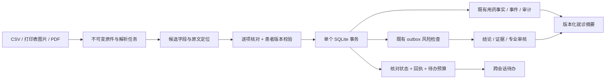

# HealthAssistant P0–P6 交付与验收

本轮按 P2 → P3 → P4 → P5 → P6 补齐默认实施范围，并保留 P0/P1 和既有 Harness/Review 能力。这里的完成口径是本地工程与合成场景，不是生产医学验证。最新运行结果以本目录 `acceptance-summary.json` 为准；旧的 `closeout/` 及 Harness 工件未覆盖。

## 最终运行结果（2026-09-08）

[统一验收报告](acceptance-summary.json) 于北京时间 14:19 完成，状态为 `pass`，P0–P6 全部为 `local_verified`，源码指纹前后一致，浏览器工件与最终代码匹配。

| 检查 | 本轮实际结果 |
| --- | --- |
| 后端测试 | 324 项通过，0 失败、0 错误、0 跳过 |
| 合成开发任务 | 30/30 通过 |
| 浏览器 | P1 14 项、完整流程 19 项通过；无 React 异常或 HTTP 5xx |
| 依赖 / 前端 | pip check、类型检查、生产构建通过 |
| 证据筛查 | 10 条合成样本、4 种配置完成比较；未证明重排收益 |
| 真实本地 OCR | 4 份同模板开发材料，59/60 个关键字段正确；倾斜模糊图有 1 个错误 |
| 下载产物 | HTML 下载后重新打开，内容检查与视觉复查通过，见 [记录](download-reopen.log) |

OCR 工程门禁通过表示解析、定位与人工确认流程可用，不表示所有字段正确；上述错误仍要求用户核实。前端构建保留约 508 KB 主包体积提示，浏览器开发环境保留 Router 未来版本提示和 favicon 404，均不影响已验收业务流程。独立盲测、真实模型对比、专业评审仍为 unavailable。

## 现在可以做什么

在“材料核对”导入一张打印版中文用药表，例如 [合成图片](../p5/samples/clear-table.png) 或 [扫描 PDF](../p5/samples/scanned-table.pdf)。页面呈现识别字段与实际原文位置，用户核实后逐项记录。未列出的药物保留，缺单位/姓名/日期等字段不会写入当前药单。每项确认获得持久回执，自动进入后台风险检查。离开页面后，可从“照护待办”补充缺失信息，继续同一个任务；最后生成包含药单、近期变化、未决问题和来源的 HTML/Markdown 就诊摘要。

风险页面仍支持原文回读、精确高亮、事实详情与真实变更影响。新增摘录支持筛查区分“引用存在”和“文字支持”；未知适用条件保持不足。

## 架构与兼容性



- 新领域模块为 `product.py`、`care_tasks.py`、`evidence_quality.py`、`document_parser.py`。复用现有 MemoryStore、领域策略、依赖失效、outbox、workflow run 和单次运行预算。
- 从现有公开写入方法拆出 `_apply_medication_change_tx`、`_accept_api_event_tx`，原方法保持兼容。核对校验、投影、队列和回执在同一事务提交，故障整体回滚。
- 迁移只新增 `product_objects` 与 `product_schema_version` 元数据；原数据库表、历史记录不删除。服务初始化可重复执行，已有 API 响应的新字段可被旧客户端忽略。
- `STAGE0_PRODUCT_WRITES=0` 将新增产品写接口置为只读，已有材料、任务与摘要可读取。OCR 依赖是可选安装，缺失时 CSV 仍可工作。当前患者范围沿用服务端 Principal 的单患者 local-demo 授权，不接受请求体指定任意患者范围。
- 摘要是独立产物，事实或材料发生新变化会标记过期。取消保留此前已提交事实；到期待办不自动批准，不承诺关闭应用后主动通知。

阶段实现与接口细节：[P2](../p2/README.md)、[P3](../p3/README.md)、[P4](../p4/README.md)、[P5](../p5/README.md)。

## 启动隔离演示

在仓库根目录，先准备后端与前端依赖；本轮已在现有 `.venv` 安装 OCR 可选依赖。

```powershell
uv pip install --python .venv/Scripts/python.exe -r requirements-product-ocr.txt
npm --prefix frontend install
```

终端一（临时数据库，合成 detector；不会打开用户数据库）：

```powershell
.venv/Scripts/python.exe -m stage0.product_p1_browser_fixture --port 8011
```

终端二：

```powershell
$env:STAGE0_DEV_API_TARGET = 'http://127.0.0.1:8011'
npm --prefix frontend run dev -- --host 127.0.0.1 --port 5181 --strictPort
```

打开 `http://127.0.0.1:5181/materials`。端口被占用时换用空闲端口，不终止未知进程。上述 fixture 退出时清理自己的临时库；正式服务继续使用既有 `python -m stage0.server` 启动方式和配置。

六步演示：

1. “用药记录”查看合成基线药单。
2. “材料核对”上传 `docs/product-upgrade/p5/samples/clear-table.png`，实际运行本地 OCR。
3. 点击“定位药名”，对照原件更正或核实字段。
4. “确认记录内容”；材料未列出的条目选择“保留现有记录”，查看实际后台检查状态。
5. 再导入模板中缺药名的一行，在“照护待办”保存任务。刷新/重新进入后打开材料，补药名，继续确认与检查。
6. 在待办页生成就诊摘要，下载 HTML 或 Markdown。新增事实后旧摘要提示需要更新。

## 可复现验收

浏览器通过 Playwright CLI 执行两个脚本。先用一个固定命名 session 打开以上演示地址，再运行脚本；脚本自行验证服务为临时合成 fixture。

```powershell
npx --yes @playwright/cli -s=product-final open http://127.0.0.1:5181/alerts
$code = Get-Content scripts/product-p1-browser-acceptance.js -Raw
npx --yes @playwright/cli -s=product-final run-code $code > docs/product-upgrade/final-acceptance/browser.log
$code = Get-Content scripts/product-full-browser-acceptance.js -Raw
npx --yes @playwright/cli -s=product-final run-code $code > docs/product-upgrade/final-acceptance/full-browser.log
.venv/Scripts/python.exe -m stage0.run_product_acceptance --full --out docs/product-upgrade/final-acceptance
```

本机系统 Node 曾发生 CLI 退出断言，实际运行使用 Codex 自带 Node 调用同一 Playwright CLI；这不改变浏览器检查内容。实际命令、退出码、源码指纹在 JSON 和日志中记录。浏览器工件必须晚于实现代码；缺失、过期、任何必需检查失败均导致验收失败。验收过程中不要继续编辑源代码。

统一命令运行后端测试、30 个开发任务、P1 Harness、依赖一致性、前端类型检查/构建、证据筛查比较、真实 OCR 评测，并校验两个浏览器日志及截图。源码/样例 SHA-256 同时记录。真实模型与独立评审分轨 unavailable，不混入 pass 分母。

核心工件：

- `acceptance-summary.json`：最终状态、命令与版本指纹。
- `unittest-summary.json`、`unit.log`：全部后端测试。
- `product-dev-all.json`：30 个合成开发任务。
- `browser.json`：证据回读与影响流程，14 项检查。
- `full-browser.json`：OCR、恢复、预算、摘要和移动布局，19 项检查。
- `quality-ablation.json`：10 条合成支持筛查反例；重排默认关闭，未证明排序收益。
- `real-ocr.json`：实际 CPU 解析统计；60 个关键字段来自同一合成模板的四种开发材料，不能作为独立准确率结论。

## 尚需外部验证的范围

没有执行新增付费模型 A/B/C 对比；没有独立来源 held-out 数据或专业领域评审，因此不报告模型效果提升、临床准确率或生产可用性。Q1 独立模型只读委派、Q2 GEPA 是原 Prompt 明确排除在默认 P0–P6 外的可选实验，未默认开启。当前证据支持检查为保守文字规则，OCR 限定清晰打印表格；不支持手写、药盒、复杂报告。所有样例均为合成材料。
