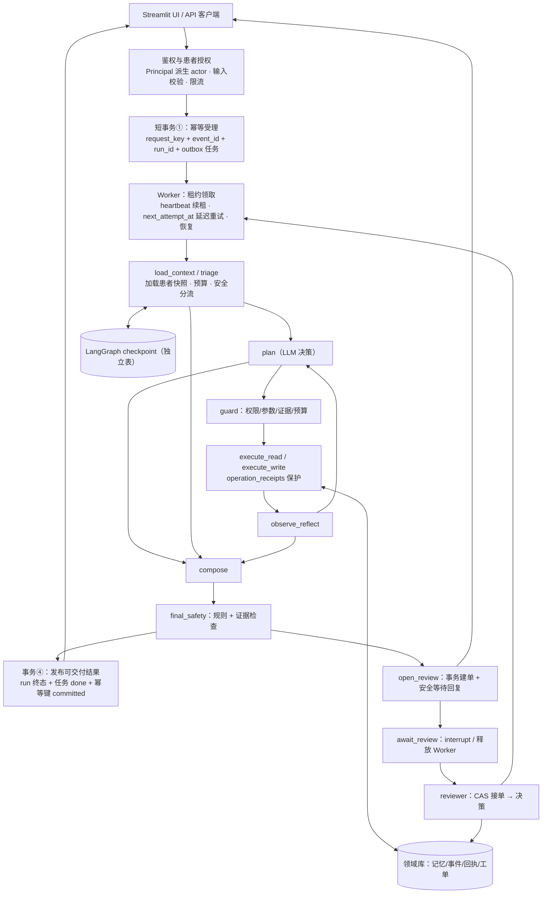
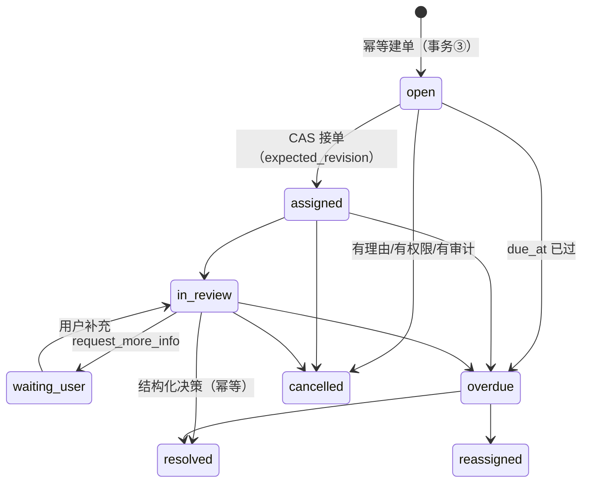

# 目标架构与 LangGraph 落点

## 1. 总体架构



事务编号：①=事件受理（现状已有，保留）；②=领域写（operation receipt 短事务）；③=审核决策+恢复任务（P2）；④=结果发布（P0 新增收敛）。LLM/外呼一律在事务外。

## 2. AgentRunner 接口与图节点映射

P1 引入。接口保持 `handle(event, session_id=..., turn_id=..., client_event_id=...) -> AgentResponse` 语义，UI/CLI/服务层无感：

```python
class AgentRunner(Protocol):
    def run(self, state: WorkflowState) -> RunOutcome: ...
# LegacyAgentRunner: 直接包装现有 MedicationCoordinatorAgent.handle（默认，行为不变）
# LangGraphAgentRunner: StateGraph 编排，feature flag（AGENT_GRAPH_RUNNER=1）只影响新 run
```

原函数到节点的映射（允许按代码实际微调命名）：

| 图节点 | 来源（agent.py） | 幂等要求 |
| --- | --- | --- |
| `load_context` | handle 开头的 expire_working + 快照读取 | 只读 |
| `triage` | 事件分类、安全路由选择（诊断/处方请求 → policy_refusal） | 只读 |
| `plan` | `planner.decide`（HybridPlanner，含 fallback/circuit_break 语义） | 可重入；消耗预算记账持久化 |
| `guard` | PlannerPolicyGuard + 参数校正 | 只读 |
| `execute_read` | memory_read / ddi_check / rag_search | 只读或天然幂等 |
| `execute_write` | `MemoryWriteTool`（consolidate、警告、冲突）→ **短事务②** | operation_receipts 必需 |
| `observe_reflect` | `_reflect` + 观察 enrich | 纯函数 |
| `compose` | ResponseComposer（含 verifier） | 纯函数 + 可重入 LLM |
| `final_safety` | response_safety 规则集 + `safety.enforce` | 纯函数 |
| `open_review` | P2：幂等建单 + 安全等待回复 | 建单逻辑键唯一 |
| `await_review` | P2：仅 `interrupt()`，无副作用 | — |
| `apply_review` | P2：验证决策 → Command(resume) 之后的效果写入 | 回执必需 |
| `publish` | 事务④发布结果 | 幂等 |

红线：禁止把整个 `handle` 包进单个节点后声称获得节点级恢复；普通路径仍由 LLM 在授权工具范围内决定下一步，代码负责硬性安全、权限、预算和证据。

## 3. WorkflowState 字段与所有者

| 字段组 | 字段 | 所有者 | 说明 |
| --- | --- | --- | --- |
| 身份 | `event_id, run_id, thread_id, session_id` | 服务端受理时生成 | thread_id 由服务端保存的映射产生，客户端传入的 thread id 不是授权 |
| 范围 | `authenticated_scope_ref, patient_revision, medication_set_hash` | 领域库 | 每次恢复重读，不信任 checkpoint 里的旧值 |
| 版本 | `workflow_version, state_schema_version, policy_version, tool_schema_version, model_id, corpus_version, prompt_version` | 配置/受理时快照 | 版本升级路由依据 |
| 证据 | `evidence_refs, observation_refs` | execute 节点 | 只存引用；完整证据在领域库，压缩摘要不替代证据 |
| 运行 | `cycle, pending_operation_ids, last_error_class, safety_route` | 图 | pending_operation_ids 是回执对账依据 |
| 预算 | `remaining_active_ms, consumed_tokens, consumed_cost, external_attempts` | 图（持久化） | 重启不归零；人工等待冻结活动预算、SLA 时钟照走 |
| 人工 | `review_case_id, interrupt_id, review_revision` | P2 | interrupt 恢复重跑节点，故 open_review 拆到 await_review 之前的独立节点 |
| 结果 | `status, result_ref, reason_codes` | publish | 终态写领域库，checkpoint 只存引用 |

checkpoint 内只放安全可序列化状态与引用：无连接对象、无 SDK client、无凭证、无可执行对象。

## 4. 双写窗口与 interrupt 语义（官方文档核验，2026-09-05）

- checkpoint 与领域事务**不是同一个事务**（即使同库也分属 saver 与领域连接），窗口用 operation receipt 关闭：领域 commit 成功但 checkpoint 未落时，恢复重跑 `execute_write` 节点会以相同 `operation_id` 命中回执并直接返回原结果，不产生第二个副作用。
- `interrupt()` 恢复会**从头重跑包含它的整个节点**；因此建单/通知等副作用拆入独立幂等节点，`await_review` 只做等待；不得用 try/except 包裹 `interrupt()`（会吞掉框架的中断信号），也不得在节点内条件化地改变 interrupt 调用顺序（resume 按 index 匹配）。来源：LangGraph Interrupts（访问日期 2026-09-05，见 [09-sources.md](09-sources.md)）。
- 框架节点 timeout 仅适用于 async 节点（langgraph≥1.2；sync 节点带 timeout 编译期报错）。当前 planner 是同步 OpenAI client 调用——P1 迁移时以 `asyncio.to_thread` 包装并设置真实 HTTP deadline，或维持节点内自检剩余预算；禁止把节点 timeout 当作对同步调用的保证。
- `RetryPolicy.max_attempts` 默认 3 且**包含首次尝试**；默认对 httpx 仅重试 5xx。与 SDK 自身 retry、Tenacity、outbox 重领的乘法放大必须在 ADR 中明确唯一所有者（见 [05-retry-and-security.md](05-retry-and-security.md)）。

## 5. 人工审核状态图（P2）



`overdue` 是仍待处理的运营状态；无人响应、超时**绝不默认通过**。未接入真实人工时 UI 明确显示"尚未接入人工服务，可导出摘要咨询医生/药师"，模拟 reviewer 页面带显著标记。详见 [06-human-handoff.md](06-human-handoff.md)。
