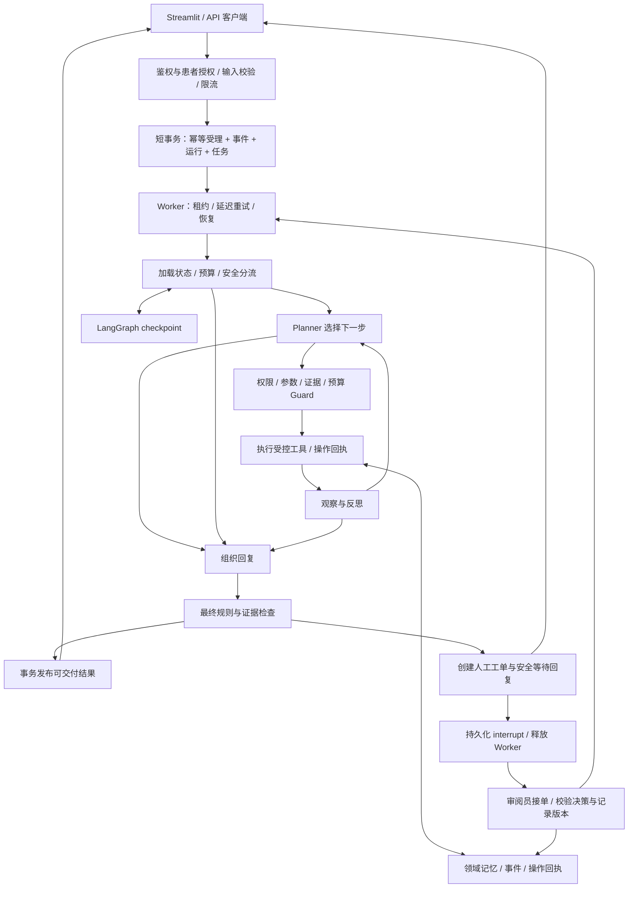

# 用药协管员：框架集成与生产可靠性升级方案

设计日期：2026-09-05。依据：当前工作区（HEAD `528b3a5`，包含未提交的 Stage 8–10 修改）、代码检查、临时数据库探针和框架官方资料。本次只交付设计与 Prompt，不实施业务改造；本文中的新增能力、指标和工期均为建议或目标。

## 1. 推荐方向

把项目升级成“可恢复、可审计、能明确拒答并交接人工的用药信息协管工作流”。保留现有 DDI、RAG、三层记忆、引用校验和确定性降级；引入 LangGraph 承接 Agent 流程状态、条件路由和暂停恢复。业务数据库继续拥有患者事实、事件、操作回执和工单的权威状态。

推荐近期组合：**FastAPI + Pydantic + LangGraph + 现有 MemoryStore/SQLite + 持久化任务表 + OpenTelemetry**。进入多进程、多患者和真实协作部署时，再增加 **PostgreSQL + SQLAlchemy/Alembic + 成熟身份提供方**。Tenacity 只用于未被图重试策略管理的外部调用。

最优先的工作不是更换框架，而是修复事件身份、租约校验、重试和响应契约。否则流程恢复越可靠，重复副作用越容易稳定发生。

默认范围仍是单照护者、单患者的工程演示；新增 reviewer 角色先用本地模拟账号验收。本文不假定已有医生团队、机构接入或全天候服务。保留已有“只记录和提示，不诊断、开药或自行调整剂量”的产品边界。

## 2. 现状与实际缺口

### 2.1 已具备，应该复用

| 现有能力 | 代码位置 | 本轮处理 |
| --- | --- | --- |
| 混合检索、DDI 检测、中文原文引用门槛 | `stage0/rag.py`、`stage0/ddi_engine.py` | 封装为受控工具，保留事实判定语义 |
| 双时间记忆、事实冲突、依赖失效、重查 | `stage0/memory.py` | 继续作为领域核心，不搬进聊天消息历史 |
| LLM 每轮决策、参数校验、证据回填 | `stage0/agent.py` 中 Planner/Guard | 拆成图节点，保留 LLM 在许可范围内选择工具 |
| 预算、连续安全拒绝熔断、确定性回退 | `TurnBudget`、`HybridPlanner` | 持久化预算，并补上依赖故障熔断 |
| 组合回复检查、否决式 verifier、最终边界 | `response_safety.py`、`SafetyBoundary` | 保留硬规则；校验通过的最终文本才可发布 |
| 202 受理、请求幂等、任务表、租约回收 | `stage0/server.py`、`memory.py` | 先补一致性，再接入图执行 |

### 2.2 必须先修的具体问题

以下行号对应本次检查的工作区，后续以函数名重新定位。

| 优先级 | 发现与依据 | 影响 | 设计修复 |
| --- | --- | --- | --- |
| P0 | `server.py:255` 用幂等键前 32 位生成 `turn_id`；两个前缀相同的不同键均获 202，任务内 turn 相同，已用临时库复现 | 不同事件进入同一个领域回合，可能错误去重或冲突 | 服务端生成并存储独立稳定的 `event_id/run_id`；完整键映射到该事件，禁止截断充当唯一标识 |
| P0 | API 生成 `event_key`，但 `_execute()` 未传入 `handle()`，`MemoryWriteTool` 也未传 `client_event_id`；实际 consolidation 默认用 `session_id:turn_id` | 文档声称的 `api:{key}` 领域身份没有端到端贯通 | 明确身份传递链并测试数据库中的实际事件键 |
| P0 | `memory.py:2441/2448` 完成/失败只按 task id 更新；过期租约重新发放后，旧执行者仍能写 `done`，已复现 | 后续并发/进程恢复时可能覆盖新任务结果 | claim/heartbeat/complete/fail 都携带 lease token；写入同时校验当前状态、有效租约和版本 |
| P0 | `api_client.py:44–46` 见 committed 就返回 acceptance；重复 POST 缺 `response`，GET 则有，已复现 | 相同业务请求通过不同重试路径得到不同结果形状 | POST 始终返回受理资源；客户端统一从状态端点取得完整结果 |
| P0 | `api_client.py:41` 默认每次调用新生成键，UI 调用未保存并传入业务操作的稳定键 | 用户超时后重试可能被当作新操作 | UI 为一次提交保存 operation key、event id、状态 URL；重试复用，明确“新增事件”才换键 |
| P0 | worker 异常统一 fail，未区分永久错误/瞬时错误；失败任务立即重开 | 无退避地消耗三次 claim；永久错误浪费资源 | 类型化错误、`next_attempt_at`、次数/时间上限、失败队列 |
| P0 | `drain_once()` 分别提交任务完成和请求完成状态 | 崩溃后两处状态可能不一致 | 同一领域事务发布最终结果和完成状态；增加对账修复 |
| P0 | 冲突操作从请求体接收 `actor`；服务端没有身份与对象授权层 | 不能安全用于真实多用户审阅 | actor 从可信 Principal 派生；鉴权、患者范围校验、操作授权全部在服务端 |
| P1 | `handle()` 每次新建 AgentState；trace 是记录，不是可恢复 checkpoint | 重启重跑整回合，不能可靠等待人工 | 引入持久化图状态与运行生命周期 |
| P1 | `record_conclusion` 直接 INSERT；consolidation 与显式药物变化并非同一整体操作事务 | 领域局部去重不足以证明整个 Agent 回合副作用唯一 | 操作回执、短事务、每种写工具的专用去重键 |
| P1 | 120s 预算在循环顶部检查，同步 provider 调用和末尾 composition 可能跨过截止线 | 声称的总时间上限不能由循环检查保证 | 调用前传递剩余时间、预留安全收尾预算、处理迟到结果 |
| P1 | 最终边界主要追加咨询建议；没有 reviewer 队列、接单、回执和无人接单状态 | “转人工”仅是文案 | 增加工单、review 决策、恢复事件和 SLA 状态 |
| P1 | 后台 loop/recheck 存在吞异常；`trace_id` 在错误处理时临时生成 | 队列停摆、重查失败和完整请求链不易关联 | 请求入口生成 trace，贯穿任务和图；记录结构化错误、队列龄和心跳 |

现有恢复测试 `test_stage10_server.py` 覆盖的是“claim 后尚未执行即崩溃”，随后再次 drain 无待执行任务。它不覆盖“写入领域数据后、任务完成前崩溃”，不能据此声称所有副作用 effectively-once。

本次没有运行全量回归或线上模型评测；旧报告的 117/117、28/28 属于历史工件，不能算作本次验证结果。

## 3. 框架选择与职责

| 组件 | 选择 | 用在本项目的职责 | 引入边界 |
| --- | --- | --- | --- |
| Agent 编排 | LangGraph StateGraph | 显式状态、条件路由、checkpoint、interrupt/resume | 首选；不要求全量改成 LangChain，也不直接拿预制 Agent 替换现有安全守卫 |
| 接口与数据契约 | 现有 FastAPI/Pydantic | 鉴权依赖、按 event_type 区分的请求模型、输出模型和错误类型 | 立即完善 |
| 短暂外部故障重试 | 图节点 RetryPolicy；独立适配器可选 Tenacity | 错误分类、指数退避、随机抖动、尝试上限 | 同一外呼仅一个策略所有者，禁 SDK/适配器/图叠加重试 |
| 持久化 | 先 SQLite；部署升级用 PostgreSQL | 事件、回执、工单、结果、任务状态 | 现有单写者模式先保留；多进程前完成迁移 |
| 数据迁移 | SQLAlchemy/Alembic（PostgreSQL 阶段） | repository 接口、连接/事务管理、增量迁移 | 不为接入 LangGraph 先重写全部记忆 SQL |
| 图 checkpoint | 本地持久化 SQLite saver；部署用 Postgres saver | 保存执行进度；可与领域表同库不同表/连接 | saver 表由其受控 migration/setup 管理；并不自动与领域事务原子提交 |
| 任务调度 | 加固现有 outbox_tasks 和独立 Worker | 受理、恢复、延迟执行、失败隔离 | 当前表实际兼具持久化作业队列功能，名称不意味着已接消息中间件 |
| 观测 | OpenTelemetry + 本地/自托管 OTLP 后端；按需 Prometheus | 请求到工具的 trace、聚合指标、故障告警 | 默认不向第三方上报患者内容 |
| 工作流平台 | Temporal 后置 | 跨服务、长周期、复杂补偿/运营流程时再评估 | 当前一套图加任务表足够；不得另起一套与图争夺重试/人工等待状态的引擎 |
| 重型依赖 | Redis、Celery、Kafka、向量库替换、多 Agent 协作后置 | 仅在实际负载或业务依赖明确时评估 | 不把“多框架”当作质量指标 |

LangGraph 官方定位是低层编排框架，可以混合确定性步骤与模型步骤，也不要求使用 LangChain。以上保留现有工具和安全核心的迁移方式与其定位一致。[LangGraph overview](https://docs.langchain.com/oss/python/langgraph/overview)

实施时锁定并验证 LangGraph、checkpoint 包及相关 SDK 的兼容版本；先做持久化/重启/interrupt 冒烟，再写依赖锁。官网当前示例可能使用较新的 API，本文不指定未经本仓验证的版本号。

## 4. 目标架构与 LangGraph 落点



### 4.1 图负责过程，领域层负责事实

建议从 `agent.py` 提取 `AgentRunner` 接口，提供 `LegacyAgentRunner` 与 `LangGraphAgentRunner`。接口仍能被现有 UI/CLI 使用；逐步将 planner、guard、executor、reflector、composer 包装成节点，避免一个大节点直接调用原 `handle()`，否则几乎得不到节点级恢复收益。

建议节点：`load_context`、`triage`、`plan`、`guard`、`execute_read`、`execute_write`、`observe_reflect`、`compose`、`final_safety`、`open_review`、`await_review`、`apply_review`、`publish`。

普通合法路径仍是 LLM 选择工具/回答，代码强制的是身份、预算、许可和医学边界。安全拒绝、依赖故障、用户补充信息、人工接管各有明确路由；不能靠统一 catch 后返回“成功”。最终回复安全检查失败时，先尝试受控模板，再次校验；仍失败则发布独立、预先审查的最小状态提示并交接，不输出候选正文。

### 4.2 持久化状态

`WorkflowState` 最少包含：

```text
event_id, run_id, authenticated_scope_ref, session_id
workflow_version, state_schema_version, policy_version, tool_schema_version
model_id, corpus_version, prompt_version
patient_revision_vector, medication_set_hash, evidence_refs
cycle, observation_refs, pending_operation_ids, last_error_class
remaining_active_ms, consumed_tokens, consumed_cost, external_attempts
safety_route, review_case_id, interrupt_id, review_revision
status, result_ref
```

完整证据存为不可变、可追溯的领域/证据记录，state 主要存引用及必要摘要。不得把压缩后的 planner 视图当成事实。不要在 checkpoint 中放数据库连接、SDK client、访问令牌或任意可执行对象；配置受支持的安全序列化、访问控制、加密和保留策略。

每个独立业务 run 使用服务端保存的唯一 `thread_id` 映射；`session_id` 只是交互关联，同一患者由 revision vector 与领域锁/CAS 保证一致性。恢复沿用原 run/thread，新增业务事件创建新 run。客户端提供的 thread id 绝不是授权证明；每次恢复重新验证当前权限。

预算不能因为重新 invoke 或进程重启归零：记录每个逻辑操作的调用消耗及未确认尝试；缺少 provider usage 时保守预留成本并对账。人工等待冻结“活动执行”预算，但业务过期时间/SLA 继续走时钟，恢复后使用剩余预算。

### 4.3 Checkpoint 与业务事务的边界

LangGraph 持久化支持恢复执行；checkpoint 不是领域数据库的事务协调器。即使两者都使用 PostgreSQL，也通常不是同一个事务。[Persistence](https://docs.langchain.com/oss/python/langgraph/persistence)

关键窗口：写药物记录成功 → 尚未写 checkpoint → 崩溃。恢复可能再次执行节点，因此每个领域写操作必须能用相同 `operation_id` 读取已提交回执并直接返回。只写 checkpoint 或只套 retry 均不能关闭这个窗口。

`interrupt()` 恢复时会从包含它的节点开头重新执行，所以建单、通知、写审核记录应拆入独立幂等节点；`await_review` 节点只做等待。不要用通用异常处理吞掉框架的中断信号。[Interrupts](https://docs.langchain.com/oss/python/langgraph/interrupts)

## 5. 幂等性：从两个键扩展到完整副作用链

### 5.1 区分五种身份

| 身份 | 含义 | 生成/约束 |
| --- | --- | --- |
| `request_key` | 客户端一次提交意图 | UI 持久保存；HTTP 超时、重连、轮询恢复复用 |
| `event_id` | 一次业务事实报告 | 首次受理时生成并落库；不因换 HTTP 请求或人工重试改变 |
| `run_id` | 处理该事件的工作流 | 首次受理时落库；恢复使用原 run；显式重新评估可另建关联 run |
| `operation_id` | 一次逻辑副作用 | 写入前持久化意图；恢复沿用；与 event/run/操作类型/业务目标/适用输入版本绑定 |
| `attempt_id` | 某次执行尝试 | 每次领取/外呼可新建，专门用于审计和成本统计，不充当去重键 |

请求唯一约束建议为 `(scope_id, principal_id, operation_name, request_key)`；当前单患者实现可用固定受信 scope，但不能让客户端任意声明并以此绕过隔离。事件、回执、工单和缓存都要继承相同数据范围。

请求哈希基于校验后的规范 JSON、目标患者、事件类型、动作及有意义的载荷；不纳入 trace id、鉴权 token 等传输字段。相同 key/相同 payload 指向同一事件；同 key/不同 payload 继续保留现有 422 契约。不要用文本相似度或全局内容哈希去掉患者在不同时间作出的真实重复报告。

幂等键和回执须有保留期限及回收策略；活动 run/待审核工单的记录不清理。若请求键缓存过期，仍要依靠保留的事件/操作身份防止重新执行历史事件，不能一删缓存就失去业务去重。

### 5.2 操作回执与事务

新增 `operation_receipts`：`scope_id, operation_id, event_id, run_id, operation_type, target_ref, input_hash, expected_revision, status, result_ref, attempt_id, timestamps`；唯一约束 `(scope_id, operation_id)`。

一次本地写工具在短事务中：校验租约和患者版本 → 查操作回执 → 同 id 不同 input_hash 拒绝 → 已成功则返回原结果 → 执行领域写入 → 写审计/必要任务 → 保存成功回执 → commit。事务中禁止 LLM 或网络调用。

明确去重边界：

- `consolidate_event` 和显式药物变更各有回执，或在完成外部提取后作为同一领域命令提交；两者不能因为第一步已 committed 就遗漏第二步。
- 警告按逻辑检测操作、药物对、证据与输入版本区分；同一检测操作重放不重复 INSERT，真实新版本重查仍能产出新结论。
- `review_case` 创建、审核决策、恢复任务、通知投递都拥有稳定 operation id。
- 合法的再次检查需有新的逻辑操作身份；不要简单用 `(run_id, node_name)` 去重整个循环，也不要在每次尝试里随机生成 operation id。

对外部通知，先在领域事务内落 notification intent，发送器使用下游认可的幂等键。若下游不支持幂等/结果查询，网络超时视为 `effect_unknown`，进入对账或人工，不盲目重发。系统只能在明确范围内承诺“至少一次执行、业务效果去重”，不能宣称端到端 exactly-once。Outbox 仍可能重复投递，消费者须去重。[AWS transactional outbox](https://docs.aws.amazon.com/prescriptive-guidance/latest/cloud-design-patterns/transactional-outbox.html)

### 5.3 租约、顺序与完成状态

所有 Worker 更新必须满足 `task_id + lease_token + running + 未过期`，并检查受影响行数；旧租约 heartbeat/fail/complete 均不生效。领域副作用同样校验有效执行资格和 operation receipt，单独给 `complete()` 加条件不够。

任务表增加 `next_attempt_at`、`heartbeat_at`、`last_error_class`、`max_attempts`、`deadline_at`；必要时使用单调递增 fencing generation。允许领取后短事务提交，工作期间续租，LLM 等待期间不占数据库事务。

同患者的短领域写操作按既有 revision 做 CAS；冲突时重新加载/重新评估。人工等待不能持有患者锁数小时阻塞后续事实；更新到来后旧 review 变成需要重新验证。全局单 Worker 阶段串行执行；迁移多 Worker 后按患者串行化写入，不能仅依赖不同 run 的 checkpoint。

任务结果、run 终态、请求结果引用及通知意图尽可能在一个领域事务中发布；checkpoint 与它们之间通过回执和 reconciler 收敛。对账涵盖“结果已提交但图/任务未标完成”“待审核已建单但中断标记未落盘”“已作审核决策但恢复任务未消费”。

## 6. 重试、超时、熔断、降级

### 6.1 分类策略

| 类别 | 策略 | 终点 |
| --- | --- | --- |
| 外部只读请求的网络抖动、可恢复 5xx、429 | 最多 3 次总尝试；指数退避 + jitter；支持时遵守 Retry-After；检查剩余预算 | 缓存/确定性降级，必要时人工 |
| 400/401/403、鉴权过期、非法参数、幂等冲突 | 不重试原请求；按具体错误引导修正/重新认证 | 明确失败或等待用户修正 |
| LLM JSON/schema 不合格 | 最多 1 次结构修复，计入统一外呼上限 | 确定性降级；不能通过修复取消安全限制 |
| 安全政策拒绝、无权执行、越权工具参数 | 不作为 transient retry | 拒绝或转有权限的人工；不换模型绕过政策 |
| 引用不足、信息缺失、事实矛盾 | 最多一次有目标的补检/澄清，仍不足即 abstain | 需要补充信息或人工核查 |
| 数据库死锁/短暂锁冲突 | 确认事务已回滚后有限重试完整短事务 | 超限进入恢复队列，保留原操作身份 |
| 外部写入结果不明 | 先按 operation id 查回执/对账 | `effect_unknown`；不凭超时认定失败 |
| 永久内部错误/超过预算 | 停止自动尝试，进入失败队列并记录脱敏故障 | 人工运维重试或安全终止 |

图内采用 `RetryPolicy` 显式设置异常谓词、次数、退避；`max_attempts` 包含第一次。框架的节点超时目前只适用于异步节点，具体 API 必须与安装版本核对。[Fault tolerance](https://docs.langchain.com/oss/python/langgraph/fault-tolerance)

图外的 KEGG/HTTP 适配器若使用 Tenacity，要明确 stop、wait 和 retry 条件，不能使用其无上限默认装饰器。[Tenacity](https://tenacity.readthedocs.io/en/latest/)

### 6.2 统一重试所有权

建议图节点管理其一次外呼的重试，SDK 自动 retry 为 0；未纳入图的适配器由自己的策略管理。Outbox 重领负责进程恢复和延迟调度，恢复同一个 run/operation，读取持久化 attempt ledger，不能重置调用次数再套一轮三次重试。

LLM 结构修复、备用 provider、依赖重试都计入同一调用/成本预算。默认只对已明确允许披露数据的 provider 做降级，不自动把患者信息发往另一个供应商。

### 6.3 时间与隔离

建议初始参数而非已达成 SLO：API 受理目标 1s 内；活动 Agent 回合仍以现有 120s 为起点，其中预留 15s 供安全收尾。单次 LLM 调用上限为 `min(60s, remaining_active_budget - reserve)`，不足则直接降级；verifier 上限同样受剩余预算约束。队列等待时间、处理时间、人工等待时间分开统计。

进程内用单调时钟计量耗时，持久化用 UTC 截止时间与累计消耗；明确重启后的恢复算法。`asyncio.to_thread`/Future 超时不能保证后台同步调用已停止，必须给 HTTP client 设置实际 I/O deadline，并让迟到结果在版本/租约检查时被拒绝；需要硬中止的阻塞计算再使用可终止进程隔离。

“连续安全拒绝熔断”继续保留；另设按 provider 的 `closed/open/half_open` 依赖熔断，open 时快速降级，half_open 只允许有限探测。配合每患者、每用户、每依赖并发上限和队列容量；过载返回 429/503 及重试提示。只读工具以后可并行，当前共享 sqlite connection 和可变 agent 状态未经改造前不能直接并发。

## 7. 安全体系：输入、权限、证据、输出、数据

### 7.1 入口与对象授权

服务端构造 `Principal(user_id, roles, authorized_scopes)`；主体身份来自验证过的登录会话/token，不能从 `payload.actor/source` 获得。`source` 可保存为“自述来源”，`claimed_actor` 与 `authenticated_actor` 分开。

所有状态查询、memory ref 解析、工单、审核和恢复端点都执行对象级授权。opaque id 或不可猜 key 不能代替授权。当前单患者本地演示可保留显式 local-demo profile；服务部署 profile 必须有鉴权，不能因为配置缺失静默退回匿名模式。

事件使用判别联合模型：`medication_change`、`patient_fact`、`procedure_exposure`、`query` 各自约束字段、枚举和长度；检查 body 大小、payload 深度、列表数量、日期和时区。领域命令区分“记录用户报告已改药”与“系统建议改药”。

### 7.2 Prompt injection 与工具边界

用户文本、RAG 文档、历史记忆、人工自由文本都作为数据处理。保留原始证据，规范化/标记可疑内容时不能破坏引用所需的原文和字节/字符偏移。模型只看必要字段和结构化摘要；用固定工具 allowlist、严格参数验证和最小权限阻断越权。

模型不可传任意 SQL、shell、文件路径或外部 URL；来源获取走受控域名和出站规则，拒绝本机/内网/云元数据地址，校验跳转及解析结果。UI 仅渲染允许的 Markdown/链接，避免模型生成远程图片/HTML触发数据外发。

规则扫描和 guard 模型只是辅助层；守卫模型也可能受注入影响，授权检查和工具执行策略必须在代码中。实现建议依据 OWASP 的分层防御和最小权限原则。[Prompt injection prevention](https://cheatsheetseries.owasp.org/cheatsheets/LLM_Prompt_Injection_Prevention_Cheat_Sheet.html)

### 7.3 证据与医学边界

每条警告绑定结构化来源、原文摘录、chunk/文档版本、memory ref、输入患者版本及生成时间。警告必须保持“作用/风险—依据—来源”对应，不能用一个真实 URL 给任意断言背书。保留中文原文 exact substring 检查，增加文档状态/来源版本和输入时效校验。

DDI 检索为空、KEGG 超时、药名未识别分别返回 `no_evidence_found`、`dependency_unavailable`、`unresolved_medication`，都不能映射为“没有风险”。基于检索覆盖、证据冲突和工具执行结果路由；不依赖 LLM 自报 0.9 置信度当作医学可信度。

真实高风险提示和明确的严重症状输入走预先由专业人员审核的安全提示/紧急求助路径；该提示必须先呈现，不能等待普通人工队列。本文只设计软件分流，不提供临床判定阈值。

最终 `SafetyBoundary` 目前可能追加文本，改造时应先生成全部正文/固定提醒再检查，并发布完全一致的内容。verifier 只能裁决允许的语义误报，不能取消硬性引用、越权和升级条件；人工也不能点击“同意”绕过这些边界。

### 7.4 隐私和审计

第三方 LLM 与第三方 tracing 分别配置数据披露开关；LangGraph 本地编排不意味着必须开 LangSmith 云 tracing。健康事实、checkpoint、备份、工单附件都纳入访问权限、加密、保留和删除设计。不得自动上传本地真实患者数据进行评测。

运行日志默认只记录 pseudonymous id、错误类别、耗时、token、工具名和证据引用；原始患者正文不进入普通日志/指标标签。结构化工具决策摘要足以审计，不采集或声称保存模型隐藏思维链。必要业务审计不可缺失；普通 telemetry 故障可降级，关键写入的审计与业务事务一起成功或失败。

健康信息属于敏感 telemetry，优先减少采集，再做脱敏/删除，而不是先全量采集再承诺清理。[OpenTelemetry sensitive data](https://opentelemetry.io/docs/security/handling-sensitive-data/)

## 8. 真正的人工交接闭环

### 8.1 分流而不是统一丢给客服

| 路由 | 触发 | 接收角色/处理 |
| --- | --- | --- |
| `need_user_input` | 药名、时间、报告对象等关键字段缺失 | 向用户发一次具体澄清，保存暂停状态 |
| `needs_clinical_review` | 严重警告、证据矛盾、来源不足且涉及风险判断 | 经授权的医生/药师审阅；角色范围需真实配置 |
| `needs_support` | provider 故障、任务卡住、提交/恢复失败 | 技术支持；无权解释或裁定用药风险 |
| `policy_refusal` | 请求诊断、开药、越权访问等超范围行为 | 立即拒绝对应动作；人工不用于洗白违规请求 |
| `urgent_guidance` | 命中经专业审核的紧急分流规则 | 立即显示固定指引，随后可附加交接，队列不承担急救等待 |

### 8.2 工单与审核状态

```text
open → assigned → in_review → resolved
                    ↘ waiting_user → in_review
open / assigned / in_review → overdue → reassigned / resolved
非终态 → cancelled（有理由、有权限、有审计）
```

`overdue` 是仍待处理的运营状态；无人响应、超时绝不默认通过。没有接入真实人工时，显示“尚未接入人工服务，可导出摘要咨询医生/药师”；演示页面明确标记模拟审阅员。只有持久化工单成功才能显示“已提交”，真实队列接收成功才可声称“已转接”。

工单字段：scope/patient、case id、event/run/thread/interrupt id、reason codes、priority、case status、assignee、due_at、版本号、结构化用药与风险摘要、证据引用、原始记录访问入口、已做检查/未做检查、允许的审核操作、创建/领取/处理时间。通知只发最小化摘要或受保护链接。

### 8.3 审阅与恢复

1. `open_review` 幂等建单并生成安全等待回复；`await_review` 调用 interrupt。释放执行租约，不让 Worker 线程/数据库事务等待人工。
2. reviewer 通过授权查询队列，用工单 revision 做 CAS 领取，避免重复接单。
3. reviewer 提交结构化动作：`request_more_info`、`confirm_reported_fact`、`resolve_conflict`、`reject_candidate`、`close_with_safe_guidance`；动作受角色限制。不能提交任意 graph goto、工具名、SQL 或任意 state patch。
4. API 验证身份、对象范围、工单/interrupt 版本和事实 revision；写 `review_decision` 与 `resume_task` 到同一事务。审核操作也接收 Idempotency-Key，重复按钮/重复回调只生效一次。
5. Worker 重新验权，加载最新患者事实并比对审阅依据。如果等待期间药物/过敏记录改变，则记录 `review_stale`、重新检测/审阅，不能拿旧审批放行新状态。
6. 只有验证通过的决策才能由服务端转换为 `Command(resume=...)`；恢复后仍经过工具权限、证据与最终回复检查。工单关闭和图恢复处理结果可追踪，不靠一次 HTTP 请求是否返回来认定成功。

工程演示可用短 SLA 参数测试超时流；真实响应时限取决于人员排班和服务承诺，不能在 UI 上虚构“5 分钟医生回复”。

## 9. API 与数据模型草案

保持 `/v1/events` 的 202 受理和同键异载荷 422；身份升级涉及公开资源契约，可增加 `/v2` 并提供兼容适配，不能悄悄改变 v1 客户端行为。

| 接口草案 | 契约要点 |
| --- | --- |
| `POST /v2/events` | 鉴权 + patient scope + Idempotency-Key；事务受理；返回 event_id/run_id/status_url |
| `GET /v2/events/{event_id}` | 对象授权；返回统一运行状态、结果或等待人工信息 |
| `POST /v2/events/{event_id}/retry` | 授权运维动作；保留 event/operation 身份；拒绝对 effect_unknown 直接盲重试 |
| `GET /v2/review-cases` | 按 reviewer 权限和患者范围查询，不提供全局裸列表 |
| `POST /v2/review-cases/{id}/claim` | expected_revision + CAS；返回最新 revision |
| `POST /v2/review-cases/{id}/decisions` | 结构化决策 + Idempotency-Key + expected_revision；事务写决策和恢复任务 |
| `GET /v2/events/{id}/updates` | 可选 SSE；只推状态/已审核可交付内容，支持断线后按游标补读 |
| `/health/live`、`/health/ready` | 区分进程存活与数据库/迁移/队列就绪；敏感诊断仅管理员可见 |

状态端点返回 200 表示“成功读到资源”，业务失败用 body 中 `status=failed` 表达；非法请求/鉴权失败/不存在仍用对应 4xx。受理使用 202；建议业务状态：`queued/running/waiting_user/waiting_review/degraded/succeeded/failed/cancelled`，并明确 degraded 是终态、待审核是非终态。

统一结果含 `result_version, status, event_id, run_id, safety_status, reason_codes, result, review_case, error`；错误区分 `retryable`、`user_action_required`、`effect_unknown`，不返回原始 provider 异常或患者正文。恢复原事件用 retry 端点，不再提示“换个幂等键重试”。

新增表/增量字段的最小集合：

| 表 | 主要约束与职责 |
| --- | --- |
| `api_requests` 或升级现有 `idempotency_keys` | scope/principal/operation/key 唯一，规范 payload hash、event/run 映射、结果引用 |
| `workflow_runs` | run id 唯一，event id、thread 映射、graph 版本、状态、预算、结果 |
| `operation_receipts` | scope/operation id 唯一；输入哈希、版本、效果状态、结果引用 |
| 升级 `outbox_tasks` | dedup key、有效租约、next_attempt_at、分类错误、恢复/重试上限 |
| `review_cases` | 唯一建单逻辑键、原因、权限范围、依据版本、assignee、revision、due_at |
| `review_decisions` | actor、case/revision、幂等键、结构化决定及审计 |
| `notification_deliveries` | intent key 唯一，下游回执、effect_unknown、投递次数 |
| checkpoint saver 自有表 | 不手工伪造其 schema；版本迁移、保留、加密独立管理 |

先给 MemoryStore 增加窄的 repository/UoW 边界，集中事件受理、效果提交、工单决定三个事务入口。完成 PostgreSQL 迁移前，保留单写者与短事务约束。以后多消费者可用 `FOR UPDATE SKIP LOCKED` 领取任务，但它只解决队列表竞争，不保证患者事件顺序或外部效果唯一。[PostgreSQL SELECT locking](https://www.postgresql.org/docs/current/sql-select.html)

## 10. 观测、质量与上线门槛

### 10.1 指标分开衡量

- 执行可靠性：提交/完成数、按错误类别的失败率、重试放大率、重复效果数、旧租约拒绝数、恢复成功率、最老任务年龄、各类活动耗时。
- 人工运营：建单/送达/接单数量、队列等待、逾期率、无可用审阅员比例、重复审核拦截、过期决策拒绝；不能把“转人工率越低”当成唯一目标。
- 证据质量：held-out DDI recall、中文引用覆盖、未识别药名率、证据不足导致拒答率、高风险场景漏升级率；LangGraph 本身不提高医学知识准确率。
- 安全与成本：越权阻断、最终输出违规、原始敏感内容落日志事件、实际/估算 token 区分、每 run 成本、provider 故障与预算耗尽。

trace 关联 `trace_id → request → event → run → node → tool attempt → review`。患者/事件 id 放受控 trace 字段，不能作为高基数 Prometheus label；正文和密钥禁止进入指标。

RAG 工作承接现有 v2 语料修复：先跑隔离评测、确认语料覆盖，再评估重排、查询构造、引用补检。测试集必须隔离，改语料版本后相关性标注也要更新；模型/知识质量与流程恢复指标分别报告。

### 10.2 必须能复现的故障与安全验收

| 场景 | 断言 |
| --- | --- |
| 同 key 并发提交 20 次 | 一个 event/run/待执行逻辑任务，20 次均指向同一资源 |
| 两个 key 前 32 位相同 | 两个独立事件，实际领域 event id 不冲突 |
| UI 轮询超时再点重试 | 原 event 继续查询/恢复，不新增事实报告 |
| 成功后重复 POST | 客户端取得与 GET 相同版本的完整结果 |
| 药物变更/警告结论写成功后，checkpoint 前 kill | 恢复后对应 operation receipt、领域效果、业务审计各只有一次 |
| 审核已提交但恢复消息未处理前 kill | 重启后同一决定只应用一次，工单与 run 最终收敛 |
| A 租约过期，B 领取，A 迟到 complete/fail/write | A 更新和副作用被拒绝，B 结果不被覆盖 |
| 连续 429/超时与 SDK 重试配置变化 | 总尝试/活动时间/成本受限，遵守 Retry-After，预算不足转降级 |
| 非法参数/安全拒绝 | 不进入依赖 transient retry，不通过换模型解除拒绝 |
| 外部写入超时结果不明 | 不直接重发，显示待对账/人工状态 |
| 人工等待后进程重启 | 工单仍可见，原 thread/run 可恢复，预算未重置 |
| reviewer 等待期间新增药物/过敏 | 旧决定无法直接放行，重新评估并记录依据变化 |
| 未授权用户读别人的结果/引用或提交 resume | 全部阻断，错误响应无患者信息 |
| 恶意 RAG/记忆内容要求改权限、删记录、外发数据 | 工具策略阻断，证据原文和审计仍可追溯 |
| 检索空/来源失效/依赖断网 | 返回未知/降级/待审核，不输出“无风险” |
| 无人接单或工单逾期 | 不自动通过、不声称已获得医生确认 |
| checkpoint/备份恢复与版本升级 | 旧 run 按兼容版本恢复；不兼容时明确迁移/人工处置，无静默新建重复 run |

上述是固定测试集的工程验收，不是对开放环境安全性或临床效果的保证。使用 fake provider、故障注入、临时数据库；PostgreSQL 并发语义必须另用真实 PostgreSQL 验证，SQLite 通过不能替代。

## 11. 分阶段实施与回滚

以下是一个熟悉仓库的开发者的粗估，需以 P0 复现结果校正；不把全部生产化包装成一个月内必然完成。

| 阶段 | 交付 | 粗估 | 验收与回滚 |
| --- | --- | --- | --- |
| P0：可靠性与权限入口 | 稳定事件身份、UI 复用键、统一结果、效果回执、租约 fencing、事务完成、分类退避、部署鉴权骨架 | 4–7 工作日 | 重复提交/写后崩溃/旧租约探针变绿；增量迁移，备份后验证；旧数据身份不重写 |
| P1：LangGraph 最小迁移 | Runner 适配、分节点状态、持久化 saver、预算恢复、受控中断 | 4–7 工作日 | 原回归行为对齐、进程重启可恢复；新 run 可用 feature flag 切回 legacy |
| P2：人工处理闭环 | 工单、模拟 reviewer UI、角色授权、CAS 决策、恢复任务、逾期与无人接单 | 5–8 工作日 | 建单→重启→接单→版本变化→恢复完整演示；真实服务需另有人力接入 |
| P3：观测和评测 | 全链路 trace、脱敏、队列/预算指标、故障演练、DDI/RAG 隔离评测 | 3–5 工作日 | 给出实际工件与未达标项；不虚构性能/医学数字 |
| P4：部署扩展（条件触发） | PostgreSQL、独立 Worker、多身份/患者隔离、备份恢复与运维手册 | 单独估算 | 真实多进程压测/隔离测试/迁移核对通过后开放 |

依赖顺序：P0 → P1 → P2；P3 的埋点与安全测试随各阶段实现，最后汇总。一个月资源有限时，优先完成前缀碰撞/重试安全、图恢复、一条真实的本地模拟人工闭环；推迟多 Agent、Kafka、全量 ORM 改写、向量库替换和 Temporal。

P1 可对相同离线 fixture 运行 legacy/graph 对比，但 shadow 路径必须只读或使用隔离数据库，不能在真实患者库双写。灰度标志仅影响新 run；已暂停的 graph run 继续路由原版本，不能切回 legacy 从头执行。保存 graph/state/policy 版本，发布前处理不兼容的在途任务。撤回新流量与删除数据库列是不同动作；回滚不删除已产生的事件和工单。

迁移 PostgreSQL 的触发条件：需要多写者/多进程、多人多患者协作、高可用目标，或 SQLite 锁等待/队列龄实测超出目标。不能通过单纯添加 `--workers 4` 宣称实现横向扩展。

Temporal 仅在后续跨服务和长周期运营成为独立需求时评估；若采用，应明确外层业务生命周期与内层 Agent 执行的唯一调度所有者，并重新定义 retry/补偿预算，避免双引擎管理同一暂停点。[Temporal retry policies](https://docs.temporal.io/encyclopedia/retry-policies)

## 12. 最值得展示的一条完整场景

用户上报一次用药变化 → API 超时后以原 key 重试 → 只有一个业务事件 → Agent 检查到证据冲突 → 生成可追溯警告与人工工单 → Worker 重启 → reviewer 仍可看到工单 → 用户补充新的健康事实 → 旧审阅决定被拒绝为过期 → 重新核验后恢复 → 最终答复、依据和所有操作均可查询。

这条演示能同时证明框架集成、身份设计、幂等、故障恢复、证据安全和人工交接；比单独展示“用了 LangGraph”更能说明工程完成度。

## 附：本次临时数据库探针结果

探针通过当前测试辅助类 `_App` 创建临时 SQLite，未启动后台 Worker、未调用线上模型、未改现有业务数据库。只测试 API 受理/结果形状和存储层租约行为；不等同于全回合并发压测。

```json
{
  "key_prefix_collision": {
    "http_statuses": [202, 202],
    "turn_ids": ["api-aaaaaaaaaaaaaaaaaaaaaaaaaaaaaaaa", "api-aaaaaaaaaaaaaaaaaaaaaaaaaaaaaaaa"],
    "distinct_event_keys": 2
  },
  "stale_worker_completion": {
    "new_lease_issued": true,
    "status_after_old_completion": "done",
    "result": {"writer": "expired_worker"}
  },
  "committed_replay_shape": {
    "post_body_keys": ["event_key", "status", "status_url"],
    "get_body_keys": ["event_key", "response", "status"],
    "post_contains_response": false,
    "get_contains_response": true
  }
}
```
