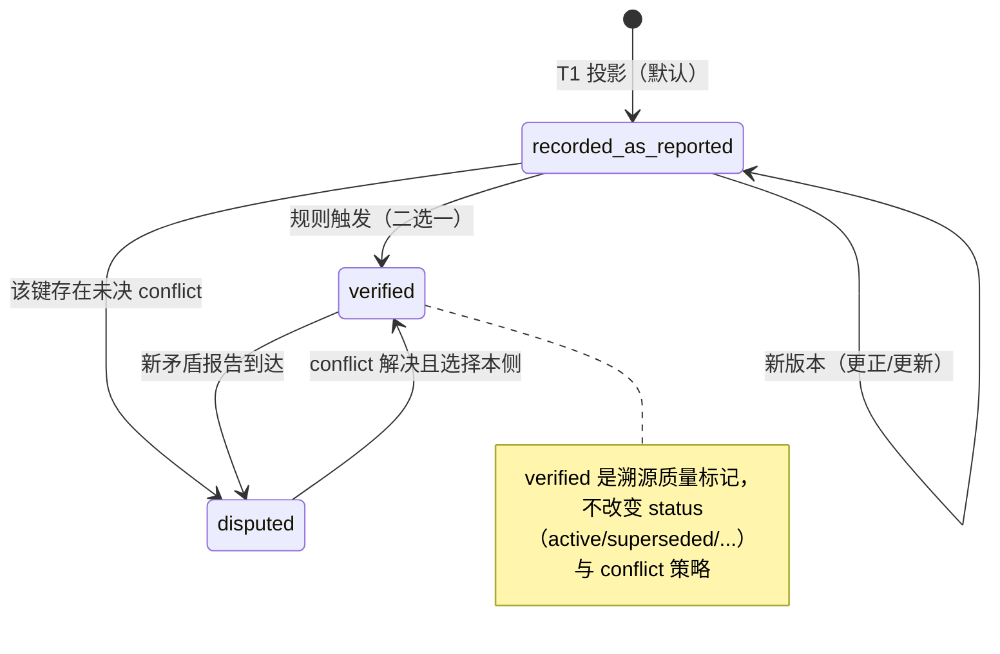
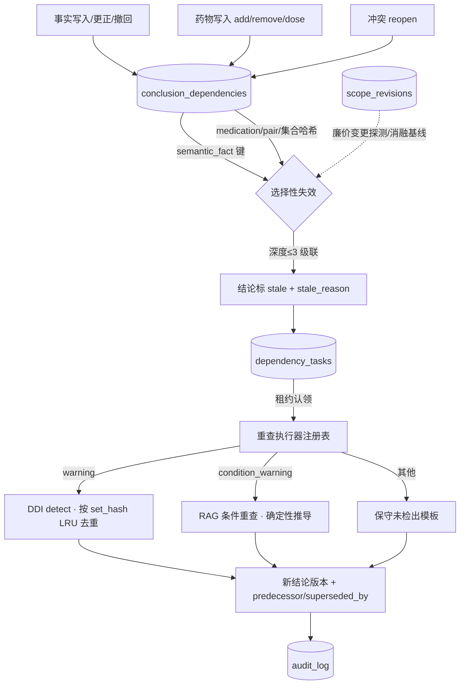
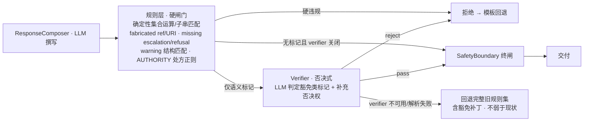
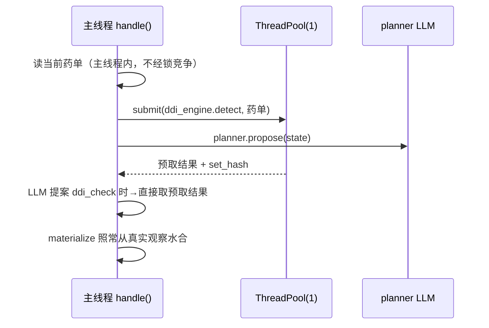
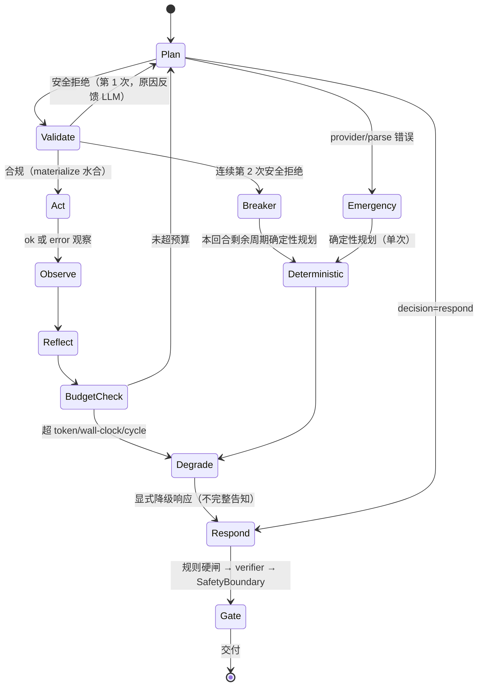
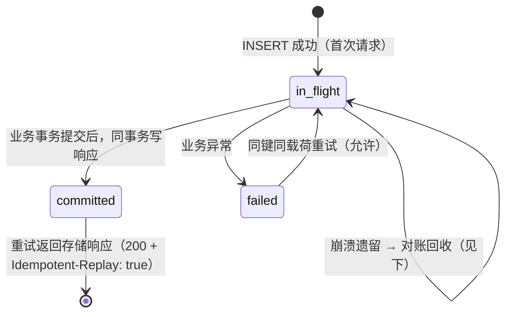
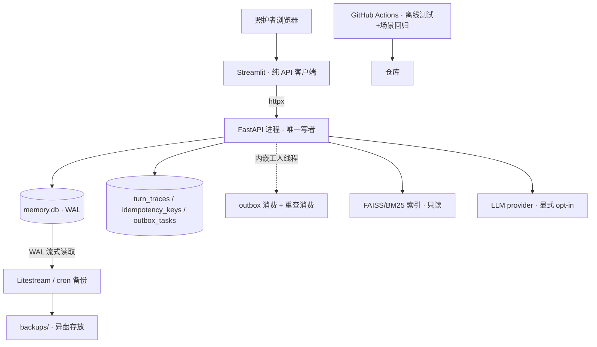

# 用药协管员：生产化与四大亮点升级设计（Stage 7–11 设计交付）

- 适用仓库：`D:\py\HealthAssistant`。设计与核对日期：2026-09-05，基线工作区 `e3fcc78`（工作区仅含未跟踪的 `.idea/vcs.xml` 与两份 Prompt 文档，无已跟踪文件改动）。
- 本文档是《生产化与亮点升级设计Prompt.md》的交付物，回答其「完整 Prompt」的全部要求：现状审计（逐项核实并修正）、四条主线的推荐设计与取舍、Mermaid 图、SQL 与接口草案、关键流程伪代码、评测与消融矩阵、五 Stage 实施计划、面试材料、机制来源链接。
- 与《记忆模块升级设计.md》的关系：前者的 P0/P1/P2 已落地（受控写入、双时间 `query_state`、scope revision 失效、带租约重查任务、FTS 历史检索、ContextPacket、可信度面板，22/22 场景通过）。本文档不重复设计这些内容，只做深化：把「信念修正」从手写一跳升级为可索引、可选择、可传递的依赖失效，并补齐巩固与重查的完整闭环。
- **本轮不改业务代码**。所有 SQL、接口、伪代码均为设计草案；所有「当前值」只引用已有实测工件路径，未测量的指标一律写「待测」，不填数。
- 术语对齐 [CONTEXT.md](CONTEXT.md)（照护者/患者/照护事件/语义记忆/情景记忆/当前药单/memory ref/审计链等 15 条术语定义）。

每个主要设计模块按固定五问组织：**解决哪个用户问题、何时触发、读写什么、失败怎么办、如何验收**。

---

## 一、现状审计（对照 Prompt 现状表逐项核实）

方法：对 Prompt 现状表的每条判断，在当前工作区重新定位文件、函数、行号并阅读实现。行号以 `e3fcc78` 为准，实现时须重新核对。结论分三级：**属实**（行号与判断均成立）、**属实但需补充**（判断成立、细节需修正或加重）、**方向需修正**（判断的结论存在但表述不准）。

### 1.1 主线 A（memory.py）核实结果

| Prompt 判断 | 核实 | 证据（当前行号） | 补充/修正 |
| --- | --- | --- | --- |
| `query_state` 双时间读取，后录入更正不泄漏进早 known_at 视图 | 属实 | [memory.py:1455-1520](stage0/memory.py#L1455) | 语义/药物均按 `created_at<=known` 过滤（L1481、L1497）；`bitemporal` 消融开关在 L1475 |
| conflicts 只按 `created_at<=known AND status='open'` 过滤，resolved_at 已存未用 | **方向需修正** | [memory.py:1501-1507](stage0/memory.py#L1501)；`resolved_at` 列在 [memory.py:222](stage0/memory.py#L222)，由 `resolve_conflict` 写入（[memory.py:1581-1584](stage0/memory.py#L1581)） | 实际缺陷与 Prompt 表述**相反**：`resolve_conflict` 把 `status` 改为 `resolved` 后，该冲突从**所有** `query_state` 视图中消失——包括它当时确实处于 open 的历史视图（known_at < 解决时间）。不是「仍显示 open」而是「错误地消失」。另外 [memory.py:1469-1471](stage0/memory.py#L1469) 的 docstring 声称「resolved today still appears in older views」，与 SQL 实现不符（文档性 bug）。修复方向不变：用 `resolved_at` / `conflict_actions` 折叠重建 AS-OF open 集 |
| `_conclusions_citing_semantic_key_tx` 全表扫描 + Python 解析 JSON，无依赖索引表 | 属实 | [memory.py:806-823](stage0/memory.py#L806) | 同型问题还有第二处：`_conclusions_citing_refs_tx`（[memory.py:1603-1612](stage0/memory.py#L1603)，冲突 reopen 路径）。设计依赖索引时两处一起替换 |
| 药单集合级失效：任何药物变更使所有依赖药单的当前结论失效（全局 revision 比较） | 属实 | [memory.py:848-867](stage0/memory.py#L848) | 判定条件：`kind ∈ {warning, condition_warning, exposure_warning}` 或 refs 含 `memory:medication:`（L861-863），粒度为全局 `input_revision` 比较（L864）。`input_revision` 在结论记录时自动捕获（[memory.py:1349-1352](stage0/memory.py#L1349)） |
| 重查租约无过期，进程崩溃则任务永远卡在 running | 属实**且加重** | [memory.py:1665-1742](stage0/memory.py#L1665) | 加重细节：`pending_rechecks()` 读 `status IN ('open','running')`（L1657-1660），但 `recheck_pending()` **只认领 `status='open'`**（L1674）。崩溃后 running 任务既不会被重新认领，也没有任何回收路径——`lease_token` 置入后（L1683-1688）再无过期判断。UI 显示它"待处理"但永远不执行 |
| `_recheck_hook` 每任务重新调用一次完整 `detect()` | 属实 | [agent.py:1733-1769](stage0/agent.py#L1733)（Prompt 写 1741，为函数体内一行）；`ddi_tool(medications)` 在 [agent.py:1744](stage0/agent.py#L1744) | 匹配逻辑是药名字符串出现在旧结论文本里（L1747-1750） |
| 重查只重跑 DDI，condition/conclusion 类旧结论只走保守模板 | 属实 | [agent.py:1733-1769](stage0/agent.py#L1733)；保守模板在 [memory.py:1715-1720](stage0/memory.py#L1715) | 无 hook 时（L1679-1680）保持 open 不假装安全——该行为正确，保留 |
| `consolidate_interaction` T0 裸事件→锁外抽取→T1 原子投影；event_key 幂等重放 | 属实 | [memory.py:1072-1149](stage0/memory.py#L1072) | 同键异载荷 `IdempotencyKeyReused`（L1137-1140）、committed 重放（L1141-1144）、legacy 行收养（L1112-1135）均已实现 |
| 无跨事件的情景→语义巩固任务；`verification_status` 存在但无状态机推进 | 属实 | 列定义 [memory.py:275](stage0/memory.py#L275)（默认 `recorded_as_reported`）；`episodic.needs_verification` 在 [memory.py:278](stage0/memory.py#L278) | 全库无任何写入 `verification_status='verified'` 的路径（`SAFETY_CRITICAL_NAMESPACES` 在 [memory.py:367-370](stage0/memory.py#L367)） |
| `retrieve_episodic` 的 `as_of` 只参与衰减不过滤行 | 属实 | [memory.py:1267-1295](stage0/memory.py#L1267) | `as_of` 仅用于 `age_days` 衰减计算（L1285-1292）；无 `recorded_at<=` 谓词 |
| `AgentState` 纯内存，无断点续跑 | 属实 | `handle` 循环 [agent.py:1771-1823](stage0/agent.py#L1771)，state 仅存在于函数栈 | 事件本身幂等（重放 dedup），但循环无检查点 |
| `memory.db` 无备份/导出/导入路径 | 属实 | 全库无 backup/export/import 调用；`main()` 仅 `--snapshot`（[memory.py:1745-1757](stage0/memory.py#L1745)） | — |

### 1.2 主线 B（agent.py / response_safety.py）核实结果

| Prompt 判断 | 核实 | 证据（当前行号） | 补充/修正 |
| --- | --- | --- | --- |
| 三处共享 `CANONICAL_PROPOSAL_SCHEMA`；安全关键参数由代码注水 | 属实 | schema [agent.py:757-766](stage0/agent.py#L757)；`materialize` [agent.py:947-994](stage0/agent.py#L947)（ddi_check 药单 L971-978、record_warnings L979-989、conflict refs L990-993）；替换记录为 correction 而非 rejection | 无需重写，维持「LLM proposes, code disposes」 |
| `prompt_payload` 的 observations 无压缩、recent_trace 内嵌完整 observation，同一数据出现两次 | 属实 | [agent.py:1334](stage0/agent.py#L1334)（`asdict(item)` 全量）、[agent.py:1338](stage0/agent.py#L1338)、observe 条目内嵌 `asdict(observation)` 在 [agent.py:1815](stage0/agent.py#L1815) | `_compact` 只用于 event 与 snapshot（L1313-1316、L1351）；RAG chunk 文本上限 480 字符（[rag.py:168](stage0/rag.py#L168)）×top_k=5 |
| 无连续拒绝熔断：安全拒绝不触发紧急兜底，只有 provider/parse 错误走 `_fallback` | 属实 | `decide` 中 `PlanningRejected` 在 [agent.py:1500](stage0/agent.py#L1500) 抛出；`handle` 捕获后仅 append trace 并 `continue`（[agent.py:1779-1782](stage0/agent.py#L1779)）；emergency 路径仅 `PlannerProposalError`（[agent.py:1485-1492](stage0/agent.py#L1485)） | — |
| max_cycles=16 + 达上限显式降级；`latency_ms` 只记录不参与决策 | 属实 | [agent.py:1676](stage0/agent.py#L1676)、`degraded_reason="max_cycles_exceeded"` [agent.py:1818](stage0/agent.py#L1818)；`latency_ms` 在 `_trace`（[agent.py:1569](stage0/agent.py#L1569)） | 补充实测：终版 live trace 的逐周期 planner `latency_ms` 为 18.4–60.0s（`agentic_eval_live_final_revision.json`），其中 4 次 60s 即超时——这是超时分层设计的直接依据 |
| 三层闸门：composer→规则 checker→SafetyBoundary | 属实 | `_compose_response` postcheck [agent.py:2064-2072](stage0/agent.py#L2064)、最终拦截 [agent.py:1979-1983](stage0/agent.py#L1979)、`SafetyBoundary.enforce`（[agent.py:395](stage0/agent.py#L395)）为返回前最终闸（L1808、L1823） | 规则 checker 的复杂度上限可实证：豁免补丁已积累在 [response_safety.py:36-48](stage0/response_safety.py#L36)（否定式拒绝）、L87（`已记录警告` 摘要）、[L111-127](stage0/response_safety.py#L111)（summary/disclaimer 豁免正则） |
| 工具全串行 | 属实 | `_act` [agent.py:1825-1842](stage0/agent.py#L1825)，每周期单动作顺序执行 | SQLite 单连接 + RLock（[memory.py:613-616](stage0/memory.py#L613)，`check_same_thread=False`）已具备线程共享基础 |
| trace 不持久化 | 属实 | trace 只进 `AgentResponse.tool_trace`（[agent.py:2003](stage0/agent.py#L2003)）；FTS 只覆盖 episodic payload（`history_fts`，memory_search.py） | — |

### 1.3 主线 C（rag.py / ddi_engine.py）核实结果

| Prompt 判断 | 核实 | 证据（当前行号） | 补充/修正 |
| --- | --- | --- | --- |
| 茶碱类不在 `CHRONIC_DRUG_TERMS` | 属实 | [rag.py:41-49](stage0/rag.py#L41)：词表含心血管/糖尿病/血脂/呼吸（孟鲁司特/布地奈德/沙美特罗/氟替卡松）/内分泌/精神/骨质疏松类，无 茶碱/氨茶碱/多索茶碱 | 佐证：held-out 的 5 个 FN 全部是茶碱对（环丙沙星×茶碱 ×2、奥美拉唑×茶碱、利福平×茶碱、红霉素×茶碱，REPORT §6）；语料 1200 标签 = 500 慢病优先 + 700 多样哈希 |
| `_vector_order` 全量检索后 Python 过滤 | 属实 | [rag.py:313](stage0/rag.py#L313)：`self.index.search(vector, len(self.chunks))`，eligible 过滤在 L314 | 索引规模 4158 chunks（`rag_metrics.json`） |
| `_bm25_order` 全量打分、无查询缓存 | 属实 | [rag.py:305-307](stage0/rag.py#L305) | — |
| RAGTool 降级路径每次从磁盘重读 chunks.jsonl | 属实 | [agent.py:163](stage0/agent.py#L163)：`rag.read_jsonl(...)` 在 `__call__` 的 except 分支内，无 memoization | — |
| KEGG `P` 无证据时默认 moderate | 属实 | [ddi_engine.py:673-675](stage0/ddi_engine.py#L673)：`severity = evidence_severity if ... else "moderate"` | 实测影响：held-out severity accuracy 0.6667，5 个错误全部是 KEGG-only P 默认 moderate（gold 为 major） |
| 无 nDCG、无分 section 指标、query 集单人 | 属实 | [rag.py:347-374](stage0/rag.py#L347)（recall@5 + MRR）；limitations 自述在 [rag.py:408-412](stage0/rag.py#L408) | query 集 45 条（非 30；`rag_metrics.json` `query_count: 45`） |
| KEGG 来源 warning 无中文引用时不做二次补检 | 属实 | [agent.py:356-374](stage0/agent.py#L356)：无 URI → `local_detector_provenance` + 强制 low confidence（L368），不再检索 | 实测影响：held-out citation coverage 0.40（6/15） |
| 双向查询构造在 ddi_engine | 属实 | [ddi_engine.py:531-535](stage0/ddi_engine.py#L531)：两种 orientation、top_k=12、`candidates[:2]`（L555） | exact-substring 引用门槛在 [ddi_engine.py:619](stage0/ddi_engine.py#L619)；`_write_json` 原子替换无跨进程锁（[ddi_engine.py:97-102](stage0/ddi_engine.py#L97)） |

### 1.4 主线 D（app.py / extract_ddi.py / 依赖）核实结果

| Prompt 判断 | 核实 | 证据（当前行号） | 补充/修正 |
| --- | --- | --- | --- |
| 事件级幂等完整，缺请求级 | 属实 | 见 1.1；无任何 API 层 | — |
| WAL + foreign_keys + timeout=30 + 进程内 RLock；T1 单事务 | 属实 | [memory.py:613-616](stage0/memory.py#L613) | — |
| LLM 调用 60s 默认超时 + 环境重试，全部同步内联 | 属实 | [extract_ddi.py:264-285](stage0/extract_ddi.py#L264)（`LLM_TIMEOUT_SECONDS` 默认 60、`LLM_MAX_RETRIES` 默认 0） | Stage 6 live 的 4 次 `APITimeoutError` 对应 60s 上限（rejection histogram `provider_error: 4`） |
| app.py 每次渲染执行 O(历史) 调用、无缓存 | 属实 | [app.py:551-556](stage0/app.py#L551)（snapshot、`_stored_warning_records`、`timeline(500)`）；`_stored_warning_records` 全表 `kind='warning'` 扫描 + 逐行 JSON 解析（[app.py:403-414](stage0/app.py#L403)）；全文件无任何 `st.cache*` 调用 | — |
| 无 Dockerfile、无 CI、无健康检查、无结构化日志、无配置校验 | 属实 | 仓库内无相关文件 | — |
| 无端到端 p50/p95、无压测 | 属实 | 全仓库仅有原始 trace 的逐周期 `latency_ms`；`agentic_eval_metrics.json` 中的 `latency_ms: 0` 是零调用回放产物，**不可当作测量引用** | — |

### 1.5 审计新发现（Prompt 未列出、影响设计的事实）

1. **场景集口径**：Prompt 多处写「s01–s15 记忆场景回归」，实际 `eval_memory.py` 是 **S01–S22 共 22 个场景**（`docs/memory-design-2026-09-05/eval_report.json`：22/22 通过）。本文档一律写 S01–S22；Stage 7 新增场景从 S23 起编号。
2. **Stage 6 两套数字不可混用**：README 引用的是终版 fresh live（20 周期、median 5.5 vs 4.5、1 个安全分歧、4 次 provider 超时）；早期运行（24 周期、median 6.0、3 个分歧、4.17% emergency）完整保留在 REPORT §7.6 与 `agentic_eval_live_before_output_fix.json`。任何简历/面试引用必须指明是哪一次。
3. **`.venv` 已含 fastapi/uvicorn/httpx**（未列入 `requirements-stage1.txt`；后者只有 jieba、rank-bm25、sentence-transformers 6.0.0、faiss-cpu 1.15.0、openai、streamlit）。Stage 10 落地时须补一份冻结版本的新 requirements，避免「能跑但没声明」。
4. **sentence-transformers 6.0.0 自带 `CrossEncoder`**：bge-reranker-v2-m3 重排**不需要新增 Python 依赖**，只需下载模型权重（约 600MB，与现有 BGE 栈同源）。
5. **`conclusions` 表已有版本链基础设施**：`status/input_revision/predecessor_id/superseded_by/stale_reason` 五列（[memory.py:353-359](stage0/memory.py#L353)），`conclusion_chain()`（[memory.py:1386-1408](stage0/memory.py#L1386)）已可回溯版本链。依赖索引设计可以直接挂接，不需要动版本链。
6. **既有消融开关**：`MemoryStore(ablations=...)` 目前支持 `'policy' | 'bitemporal' | 'dependency'`（[memory.py:607-608](stage0/memory.py#L607)）。Stage 7–10 新开关沿用同一机制与命名风格。
7. **`memory_ref` 格式**：`memory:{layer}:{id}@v{version}`（如 `memory:semantic:12@v3`），版本严格校验（`resolve_ref`，[memory.py:1410-1415](stage0/memory.py#L1410)）。依赖索引的 dep_key 从 ref 的 id 部分 join 原表取得，不解析字符串猜测。
8. **CONTEXT.md 是 15 条领域术语表**，不含项目定位（定位在 README/REPORT）；本文档术语已与其对齐。

### 1.6 已实测基线（设计目标的对照起点，全部有工件路径）

| 指标 | 当前值 | 工件 |
| --- | --- | --- |
| RAG recall@5 / MRR（hybrid，45 条 query） | 0.9556 / 0.8283 | [rag_metrics.json](stage0/data/structured/rag_metrics.json) |
| RAG recall@5 / MRR（bm25 only / vector only） | 0.9333 / 0.7946；0.8222 / 0.7181 | 同上 |
| 语料 / 索引规模 | 1200 标签（500 慢病优先 + 700 哈希多样）/ 4158 chunks | 同上 + `rag_corpus_summary.json` |
| DDI held-out 精确率 / 召回率 / F1 | 1.0000 / 0.7500 / 0.8571（15 TP / 0 FP / 5 FN） | [engine_heldout_metrics.json](stage0/data/structured/engine_heldout_metrics.json) |
| DDI held-out severity 准确率 / 高危 severity 准确率 / 中文引用覆盖率 | 0.6667 / 0.4444 / 0.4000（6/15） | 同上 |
| DDI regression replay（非泛化主张） | 1.0000 全项（26 列表 41 对） | [engine_regression_metrics.json](stage0/data/structured/engine_regression_metrics.json) |
| Stage 6 终版 live | 4/4 结果一致、0 不安全执行/0 不安全文本、20 vs 17 周期、median 5.5 vs 4.5、4 次 provider 超时（动作周期口径 0.1875）、1 个安全分歧、组合文本回放 3/4 接受 | [agentic_eval_metrics.json](stage0/data/structured/agentic_eval_metrics.json) + `agentic_eval_live_final_revision.json` |
| Stage 5 live | 30 次提案：11 接受 / 17 schema 拒绝 / 2 协议错误；动作周期 fallback 率 0.6522；4/4 一致 | [planner_eval_metrics.json](stage0/data/structured/planner_eval_metrics.json) |
| 记忆场景 | S01–S22 全过；policy/bitemporal/dependency 三消融均「承重」（各有失败场景） | [eval_report.json](docs/memory-design-2026-09-05/eval_report.json) |
| 离线测试 | 51 项全绿（P0 16 + P1 14 + 既有 21） | [p0_implementation_report.md](docs/memory-design-2026-09-05/p0_implementation_report.md) |
| 抽取负例 | easy FP 0/15、hard FP 2/22、估计 precision 0.9375 / F1 0.9677 | `eval_negative_metrics.json` |
| 端到端 p50/p95 | **无任何实测**（唯一延迟数据是 live trace 逐周期值：planner 18.4–60.0s） | `agentic_eval_live_final_revision.json` |

---

## 二、设计总则（四条主线共用）

### 2.1 统一原则

1. **LLM proposes, code disposes 的三个新延伸**：
   - Verifier 只能**否决或放行判定**，永远不能改写、增补文本（不对称闸门）；
   - 巩固晋升由**规则触发**（N 次一致报告或照护者确认），不允许模型自评晋升；
   - outbox / 重查工人由**代码消费**，模型只产出任务载荷里的候选内容。
2. **每个亮点配一个指标**：延续 regression replay 与 held-out 分离、消融开关、不引用未测量数字的既有文化。四条主线的新指标定义见第七节矩阵；所有「目标值」在实现前一律「待测」。
3. **失败模式先于 happy path**：每个模块的回答固定包含「挂了怎么办 / 用户看到什么 / 恢复后如何续跑」。
4. **诚实边界**：不宣称临床安全；不把单次评测当模型质量；不把逻辑删除（retract/superseded）当物理擦除；不把单进程 SQLite 当多租户方案；备份不承诺任何云合规。

### 2.2 不可破坏的边界（实现阶段的验收红线）

1. 默认离线、确定性路径保留；LLM 一切能力显式 opt-in（`--llm`、`--llm-planner`、环境开关；新增 `--llm-verifier` 同样式）。
2. `PlannerPolicyGuard` 物化原则（安全关键参数由代码从真实观察注水）与 `SafetyBoundary` 最终闸门地位不变；`test_stage6` 的 `safety.safety_boundary_untouched_final_gate`（SHA-256 校验源码未改）必须继续通过。
3. 不诊断、不处方、不建议自行停药改量；severe/低置信/冲突/工具失败必须升级。
4. 双时间语义、版本链、冲突保留、审计链只加严不放松。
5. `memory.db` 与 `stage0/data/` 评估工件不覆盖；新评估写新路径（延续 `docs/<topic>-<date>/` 惯例，本设计建议 `docs/production-upgrade-<date>/`）。
6. 既有回归全绿是每个 Stage 的门禁：`python -m unittest stage0.test_stage3 stage0.test_stage5 stage0.test_stage6`（以及 `test_memory_p0`、`test_memory_p1`）+ `python -m stage0.eval_memory --ablate`。

### 2.3 消融开关总表（沿用 `MemoryStore(ablations=...)` / agent 侧同风格）

| 开关 | 归属 | 关闭时的行为（= 旧路径） | 验证的机制 |
| --- | --- | --- | --- |
| `dependency_index` | Stage 7 | 结论引用查找回到全表扫描（`_conclusions_citing_semantic_key_tx` / `__citing_refs_tx`） | 索引的性能收益与等价性 |
| `selective_invalidation` | Stage 7 | 药单变更回到全局 revision 全量失效（`_invalidate_medication_dependents_tx` 原逻辑） | 选择性失效的误失效率收益 |
| `verifier` | Stage 8 | 响应检查回到现行完整规则集（含豁免补丁） | verifier 对误报/漏报的净效果 |
| `rerank` | Stage 9 | hybrid RRF 排序直接输出（无重排） | 重排的召回/排序收益 |
| `query_expansion` | Stage 9 | 单条原始查询（现行为） | 查询扩展收益与噪声代价 |
| `request_idempotency` | Stage 10 | API 层不落 `idempotency_keys` 表（事件级幂等仍生效） | 请求级幂等的重放语义 |
| 既有 `policy` / `bitemporal` / `dependency` | P0–P2 | 不变 | 不变 |

注意两个 Stage 7 开关的正交性：`dependency=off` 关闭「是否失效」；`dependency=on + selective_invalidation=off` 是「全量失效」；`dependency=on + selective_invalidation=on` 是「选择性失效」。三者构成消融阶梯。

---

## 三、主线 A：记忆模块深化（超级亮点）

叙事定位：**别人的 memory 是向量库+相似度打分；本项目是 provenance + 双时间 + 信念修正。** 本阶段把信念修正从「手写一跳」升级为可索引、可选择、可传递的依赖失效，并补齐巩固与重查闭环。

### A1 结论依赖索引表（`conclusion_dependencies`）

**解决哪个用户问题**：照护者改了一条过敏史/换了一种药之后，哪些旧结论因此过时——要答得准（不漏）、答得省（不把无关结论全部打入重查风暴）、答得可追溯（为什么失效）。
**何时触发**：所有结论记录（写入侧）与所有事实/药物/冲突变更（失效侧），均在既有事务内。
**读写什么**：读 `conclusions`、`semantic_memory`、`medications` 的既有行；写新表 `conclusion_dependencies`。

#### A1.1 表结构（schema 4-p2 追加，纯增量）

```sql
-- schema 4-p2：结论依赖索引。只新增表与列，不改既有表语义。
CREATE TABLE IF NOT EXISTS conclusion_dependencies (
    id INTEGER PRIMARY KEY AUTOINCREMENT,
    conclusion_id INTEGER NOT NULL REFERENCES conclusions(id),
    dep_kind TEXT NOT NULL CHECK(dep_kind IN
        ('semantic_fact','medication','medication_pair','medication_set','conclusion')),
    dep_key TEXT NOT NULL,          -- 规范化见下表；与 ddi_engine 成分键同源
    dep_version INTEGER,            -- 仅 semantic_fact：结论形成时的事实 version
    recorded_hash TEXT,             -- 仅 medication_set：结论形成时药单成分集合哈希
    created_at TEXT NOT NULL,
    UNIQUE(conclusion_id, dep_kind, dep_key)
);
CREATE INDEX IF NOT EXISTS idx_conclusion_deps_target
    ON conclusion_dependencies(dep_kind, dep_key);
```

`dep_key` 规范化（确定性推导，不经 LLM）：

| dep_kind | dep_key | 生成规则 |
| --- | --- | --- |
| `semantic_fact` | `{namespace}:{fact_key}` | 从结论 `memory_refs_json` 中 `memory:semantic:{id}@v{n}` 的 id join `semantic_memory` 取 namespace/fact_key；`dep_version` 记 v{n} |
| `medication` | 成分键（normalize 后的 `name_cn` 小写） | 从 `memory:medication:{id}@v{n}` join `medications` 取 display_name，经 `normalize_medications` 归一 |
| `medication_pair` | `a\|b`（两成分键排序拼接） | kind='warning' 时从结论文本 `A×B：` 模式解析（与 `_warning_text` 的生成格式互逆），并校验 A、B 均在该结论引用的药物集合内 |
| `medication_set` | 常量 `current` | kind 属于集合级论断（no-finding 重查结论、exposure_warning 等）时记录；`recorded_hash` = 当前药单成分键排序后的 SHA-256 前 16 位 |
| `conclusion` | `conclusion:{id}` | 结论 `memory_refs` 引用了其他结论 ref 时记录（传递性） |

**结论 kind → 依赖签名**（写入时由代码判定，解析失败一律降级 `medication_set`，宁误失效不漏失效；已按 Stage 7 实施修正——初稿让 warning 只挂 pair 会使既有 S14 回归失败，因为全药单 DDI 对警告本来就是集合级语义）：

| kind | 依赖签名（已实施） |
| --- | --- |
| `warning`（全药单 DDI 对警告，文本无 `患者个体风险` 标记） | `medication_pair`（文本解析）+ `medication_set`（集合哈希）+ 引用解析出的 `medication`/`semantic_fact` |
| `warning`（患者个体条件发现，文本含 `患者个体风险` 标记）或 `condition_warning` | `medication`（焦点药）+ 引用的 `semantic_fact`；**不挂集合依赖** |
| `exposure_warning` / 重查 no-finding 结论 | `medication_set` + 引用的 `semantic_fact` |
| 其他 kind | 引用解析出的全部依赖 + `medication_set`（保守） |

#### A1.2 选择性失效算法（替代全局 revision 比较）

```text
失效触发（均在与业务写入相同的事务内）：

on semantic_fact 变更(namespace, key):
    S = {c | (conclusion_id, 'semantic_fact', namespace:key) ∈ conclusion_dependencies}
    级联: 队列 = S；已访问 = {}
    while 队列非空 and 深度 ≤ 3:
        c = 出队; 若 c 已访问: continue; 已访问 += c
        若 c.status = 'current': 标 stale + 入队 recheck（复用 _invalidate_conclusions_tx）
        队列 += {d | ('conclusion', 'conclusion:{c}') ∈ deps}
    若深度超限: 该子树剩余结论全部标 stale（保守方向 = 多失效）

on medication 变更(药 M，动作 ∈ {add, remove, dose_change, 名称更正}):
    成分键 k = normalize(M)
    直接命中  = {c | ('medication', k) ∈ deps}            # condition_warning 类
    对命中    = {c | ('medication_pair', p) ∈ deps, k ∈ p.split('|')}   # warning 类
    集合命中  = {c | ('medication_set','current') ∈ deps
                   且 c.recorded_hash ≠ 当前药单成分集合哈希}            # 集合级论断
    失效集 = 直接命中 ∪ 对命中 ∪ 集合命中
    # 取舍：DDI 严重度不依赖剂量，但剂量变更仍失效含该药的 pair——
    # 误失效的代价是一次重查，漏失效的代价是过时警告仍在展示。

on conflict reopen / retract: 复用既有路径，仅把引用查找换成依赖索引查询。
```

与现状的关键差异（已实施口径）：**新增无关药物 X 时**，全药单 DDI 对警告仍失效（集合哈希变化——S14 的「新药可能带来新对风险」语义原样保留），而**患者个体条件结论**（焦点药+事实依赖，无集合依赖）不再失效——这正是选择性失效的收益所在；停用/剂量变更成员药则两者都失效（medication/pair 命中）。全量失效路径在 `selective_invalidation` 消融下保留，供指标对比（见 A7）。

#### A1.3 传递性失效与深度上限论证

- 现状中结论间引用只有两处来源：重查产生的新版本把 `predecessor_id` 指向旧版本（深度恒为 1 的链），以及 `create_clinical_conflict` 产生的 conflict ref（不是 conclusion ref）。因此实际依赖图深度 ≤ 2。
- 新版本**继承** predecessor 的全部依赖行（复制写入），保证链式版本不丢依赖；`medication_set` 行的重查后继以**当前**集合哈希重记（重查刚按当前药单验证过）。
- 传递闭包**不设深度上限**（实施修正）：`visited` 集合防环保证终止，真实链深 ≤2；异常深链按保守方向全失效（over-invalidation 是安全方向），比深度截断更简单也更安全。
- 失效总是伴随 `dependency_tasks` 入队与 `audit_log`（`invalidate` 动作带 reason），复用 [memory.py:825-846](stage0/memory.py#L825) 既有实现。

#### A1.4 与 `scope_revisions` 的分工（保留，不合并）

| | `scope_revisions`（保留） | `conclusion_dependencies`（新增） |
| --- | --- | --- |
| 角色 | 廉价变更探测器 + 审计 + 消融基线 | 精确失效索引 |
| 机制 | 单调递增计数器 | 结论 → 依赖目标的可查询边 |
| 用法 | 每次 `query_state`/ContextPacket 继续携带；`medication_set` 哈希比较前先比 revision（revision 未变则跳过哈希计算）；`selective_invalidation=off` 时回到 revision 全量比较 | 选择性失效的查询路径；`dependency_index=off` 时回到全表扫描 |

#### A1.5 迁移方案（schema 4-p1 → 4-p2）

1. `CREATE TABLE IF NOT EXISTS conclusion_dependencies`（如上）+ `dependency_tasks` 加列 `lease_expires_at TEXT`（A2 用）。
2. 回填：仅对 `status='current'` 的存量结论，从 `memory_refs_json` **确定性**推导依赖行（`INSERT OR IGNORE`，幂等可重跑）。warning 的 pair 从文本解析；解析失败的结论记入迁移报告（新路径 `docs/production-upgrade-<date>/dependency_backfill_report.json`）并降级 `medication_set`。**不回填编造数据**。
3. `schema_meta.schema_version` 置 `4-p2`；迁移前后各跑一次 `PRAGMA integrity_check` 与全量回归。
4. 回滚：`DROP TABLE conclusion_dependencies` + `ALTER TABLE ... `（SQLite 删列受限，`lease_expires_at` 保留无害）；代码侧关 `selective_invalidation` 开关即回到旧行为。

**失败模式**：回填中途崩溃 → `INSERT OR IGNORE` 重跑即幂等；依赖行缺失的最坏后果 = 该结论不被选择性失效命中 → 由「其他 kind 一律附加 `medication_set` 依赖」与消融基线兜底。**验收**：S07/S14/S15/S16 在新路径下全部保持通过（消融 `selective_invalidation` 后仍通过旧路径），新增 S23–S26（见 A7）。

### A2 重查工人健壮化

**解决哪个用户问题**：失效之后，重查要真正跑完（不卡死）、不重复烧钱（同药单 N 个任务只检测一次）、且覆盖非 DDI 类结论。
**何时触发**：`recheck_pending()`（app 每回合后调用 / Stage 10 后由工人循环调用）。
**读写什么**：读 `dependency_tasks`、`conclusions`、当前药单；写任务状态、新结论版本、audit。

#### A2.1 租约过期回收（修复「running 永久卡死」）

```text
每次 recheck_pending() 入口（以及工人进程启动时）:
    UPDATE dependency_tasks
       SET status='open', attempts=attempts+1, lease_token=NULL
     WHERE status='running' AND lease_expires_at < now()
    随后: attempts ≥ 3 的 open 任务置 'failed'（原因记 reason 列追加）
```

- `lease_expires_at` 在认领时写入（默认 `now + 300s`，env `RECHECK_LEASE_TTL_SECONDS`）。
- 语义：**attempts = 认领次数**（hook 失败与租约过期同样计数），≥3 次认领未 done 即 failed——防崩溃循环；failed 任务在 UI 可见、可手工重开（`reopen` 置回 open、attempts 清零，进 audit）。
- 崩溃恢复后用户看到什么：stale 结论照常展示「待重查」标注（可信度面板已有），任务回到 open 由下一次调用重试；绝不把 stale 静默升回 current。

#### A2.2 批处理去重（修复每任务一次全量 detect）

```text
recheck_pending(max_jobs=5):
    recover_expired_leases()
    tasks = 认领 open 任务（≤max_jobs，同一事务置 running + lease）
    if recheck_hook is None: return no_hook（保持 open，不假装安全）
    med_keys = sorted(normalize(current_medications))
    set_hash = sha256(med_keys)[:16]
    detect_result = DDI_LRU.get(set_hash) or ddi_engine.detect(当前药单)
    DDI_LRU.put(set_hash, detect_result)            # 与主线 D4 的 memoize 同一实例
    for task in tasks:
        if 已存在 recheck 后继（conclusions WHERE predecessor_id=task.target_id
                                AND session_id='recheck'）:
            mark done; continue                      # at-least-once 的效果去重
        outcome = executor_for(conclusion.kind)(conclusion, detect_result, 当前快照)
        单事务: 新结论版本 + 旧结论 superseded_by + 任务 done + audit
```

- **at-least-once 语义**：租约回收可能让同一任务执行两次；效果去重键 = `predecessor 已有 recheck 后继`（与 turn_id=`task-{id}` 双保险），在同一写事务内检查+插入。
- **去重键**：`set_hash`（排序后成分键哈希）——跨任务、跨调用（LRU 容量 64）两级去重。`dependency_index`/`selective_invalidation` 消融不影响本机制。

#### A2.3 condition 类结论的重查执行器

重查执行器注册表（按结论 kind，全部确定性，无 LLM）：

| kind | 执行器 |
| --- | --- |
| `warning` | 现行 `_recheck_hook` 逻辑：从 `detect_result` 过滤与旧结论药对相关的警告（[agent.py:1747-1750](stage0/agent.py#L1747) 的匹配规则保留） |
| `condition_warning`（新增） | 从旧结论 `memory_refs` 提取焦点药（medication ref → display_name）→ RAG 检索该药「注意事项/禁忌」章节（查询构造与 C3 统一层共用）→ 用 `AgentPlanner._condition_warnings` 同款确定性推导对照**当前** facts → 有则生成新版本结论，无则保守模板 |
| 其他 | 保守「未检出」模板（[memory.py:1715-1720](stage0/memory.py#L1715) 原文保留：未检出不代表风险解除） |

**失败模式**：RAG 不可用 → condition 重查退回保守模板（不升级、不解除）；detect 异常 → attempts+1 走既有失败路径。**验收**：S14 扩展为「同药单 3 个 stale 任务 → detect 恰好调用 1 次」的断言；新增 S27（condition 重查）。

### A3 AS-OF 补全

**解决哪个用户问题**：「上周四系统认为什么？」的历史问答要能包含当时的未决冲突与当时已记录的事件，而不是被今天的解决/补录污染。
**何时触发**：`query_state(valid_at, known_at)` 与 `retrieve_episodic(as_of=...)`。
**读写什么**：只读；新增过滤谓词，不改写入。

#### A3.1 冲突的 AS-OF 重建（修复 1.1 审计修正项）

```text
query_state 的 open_conflicts 计算改为：
    open_as_of(K) := 对每个 created_at ≤ K 的冲突，折叠其 conflict_actions
                     （仅 created_at ≤ K 的动作，按 id 升序）得到 K 时刻状态；
                     无动作记录的行退化为 resolved_at 判定
                     （resolved_at IS NULL OR resolved_at > K → open）
```

- 用 `conflict_actions` 折叠（[memory.py:316-327](stage0/memory.py#L316) 已有完整动作轨迹含 undo 链）保证 resolve→reopen→undo 全序列可重建；`resolved_at` 判定是无动作轨迹行的降级路径（兼容迁移期）。实施细节：undo 行自身的 `undone_by` 列指向被撤销的动作（与 `resolve_conflict` 的写入约定一致），折叠时状态回退到该动作的 `previous_status`；等价性测试断言折叠(known=now) == `status='open'` 过滤。
- 修正 [memory.py:1469-1471](stage0/memory.py#L1469) 的 docstring 使其与实现一致。
- `bitemporal` 消融行为不变（泄漏未来行）。

#### A3.2 `retrieve_episodic` 的 as_of 过滤语义

```sql
-- as_of 定义为知识截止（与 query_state 的 known_at 同语义）：
AND recorded_at <= :as_of
-- 新增独立参数 occurred_before（有效时间过滤），默认 None 不启用
```

取舍说明：`as_of` 只过滤 `recorded_at`（系统当时知道什么），不过滤 `occurred_at`（事件声称何时发生）——晚录的既往事（backdated）在知识截止之后才可见，这是双时间的本义；有效时间过滤是正交参数，不混用。衰减计算继续以 `as_of` 为参照。

#### A3.3 三个可断言的双时间回归场景（进入 eval_memory，S23–S25）

| 场景 | 数据 | 断言 |
| --- | --- | --- |
| S23 冲突 AS-OF | 冲突 T1 创建、T2 解决 | `query_state(known_at=T1.5)` 的 open_conflicts 含该冲突；`known_at=T3` 不含。修复前两者都不含（审计修正项的直接回归） |
| S24 事件 AS-OF | 事件 occurred 9/1、recorded 9/5 | `retrieve_episodic(as_of=9/3)` 不含；`as_of=9/6` 含且排序含衰减 |
| S25 冲突动作序列 AS-OF | T2 解决、T4 重开 | `known_at=T3` 无、`known_at=T5` 有 open；conflict_actions 轨迹完整 |

**失败模式**：无（纯读取路径加谓词）；最坏情况是迁移期旧库无 conflict_actions 行 → 降级 `resolved_at` 判定，行为不差于现状。**验收**：S23–S25 通过 + 既有 S11/S12/S13 不回归。

### A4 巩固任务状态机（`verification_status`）

**解决哪个用户问题**：「她说可能对青霉素过敏」说了三次，系统不该永远停在「待核实」；但矛盾的报告也绝不能被多数表决硬吃掉。
**何时触发**：每次 `consolidate_interaction` 的 T1 提交后（同步轻量扫描）+ 照护者显式确认动作。
**读写什么**：读 `semantic_memory`（按 namespace/fact_key/value 指纹分组）；写新版本行 + audit。

#### A4.1 状态机



触发规则（显式常量，非模型判断）：
- **报告台账**（实施新增 `fact_reports` 表）：每次 `consolidate_interaction` 的 T1 为每个语义投影记一行 `(namespace, fact_key, value_fingerprint, event_key)`；**同 event_key 重放不新增行**（重放永不累计晋升），直接 API 写入（`write_semantic_fact`）不入台账。存量库迁移时台账从零开始——不回填，避免给旧事件伪造 event_key 归属（记录为已知限制）。
- **N 次一致报告**：`N=2`（env `MEMORY_PROMOTION_REPORTS`），条件 = 当前版本仍非 verified 且其 value 指纹有 ≥N 个**不同 event_key** 的报告。
- **照护者确认**：新公开方法 `verify_semantic_fact(ref, *, actor, basis)`，显式动作进 audit。
- **晋升动作**：写入新版本行（version+1），`verification_status='verified'`、`extraction_mode='consolidated'`，`valid_from` 沿用事实自身语义不因晋升改变；audit 动作 `promote_to_verified`，details 携带触发依据（N 个源 event_key 或确认动作）。
- **矛盾阻断**：晋升扫描发现同键不同 value 指纹 → 不晋升，走既有 conflict 机制开冲突（`SAFETY_CRITICAL_NAMESPACES` 的 update 本来就强制 conflict）；该键标记 `verification_status='disputed'`。
- **安全边界**：巩固**不改变**安全关键事实的 conflict 策略——`policy` 消融开关保护的 S06 行为（update 强制转 conflict）不受晋升影响；任何引用该事实的当前结论在晋升时不失效（晋升是知识质量升级，不是信念变更）。

**失败模式**：扫描在 T1 后异步执行失败 → 不晋升（停在 recorded_as_reported，安全方向）；下次 consolidate 重扫。**验收**：新增 S26（两份一致报告→verified 且 audit 完整；矛盾→不晋升且 conflict 打开；安全关键键晋升被 conflict 阻断）。

### A5 可恢复的 Agent 状态（设计预留，不在 Stage 7 实现）

表结构预留（schema 4-p2 一并建表，写入路径 Stage 8 评估后决定）：

```sql
CREATE TABLE IF NOT EXISTS agent_checkpoints (
    session_id TEXT NOT NULL,
    turn_id TEXT NOT NULL,
    cycle INTEGER NOT NULL,
    state_json TEXT NOT NULL,       -- AgentState 的 observations/trace/reflection/cycle
    created_at TEXT NOT NULL,
    PRIMARY KEY(session_id, turn_id, cycle)
);
```

恢复语义：从第 k 轮续跑时，`observations` 中已发生的写操作不重复执行——事件级幂等（`event_key` 重放 dedup）天然保证 consolidate 重复调用安全；`record_warnings`/`create_clinical_conflict` 无幂等键，设计要求恢复时**跳过已含写观察的 cycle 之后的重放**（从最后检查点的 planner 决策继续，而非重放动作）。本节只锁定接口：`save_checkpoint(state)` / `load_checkpoint(session_id, turn_id) -> AgentState | None`；实现与否不影响 Stage 7–11 其他项。

### A6 备份与导出

**解决哪个用户问题**：这是单家庭的用药史——丢库等于丢病史。备份本身是产品特性。
**何时触发**：定时（每日）、迁移前（强制）、手工。
**读写什么**：读 `memory.db`；写 `backups/`、`exports/`。

- **在线备份**：`sqlite3` backup API（WAL 安全，不停写）→ `backups/memory-YYYYMMDD-HHMMSS.db`；sidecar 记 SHA-256 与行数。
- **导出/导入**（JSON 交换格式）：`exports/memory-YYYYMMDD.json.gz`，内容 = schema_version + 按依赖序的全表行。导入校验：schema_version 匹配、`foreign_key_check`、fingerprint 唯一性、行数对账；不匹配即拒绝，不做「尽力恢复」。
- **命令**：`python -m stage0.backup --backup | --export | --restore <file> | --verify <file>`；`--verify` = integrity_check + quick_check + 与 sidecar 对账。
- **频率与存放**：每日快照保留 30 份 + 全部迁移前快照；存放到异于数据库所在盘（家用 NAS/U 盘）；可选 age/7z 加密。连续保护（Litestream WAL 流式）在 Stage 11 部署节展开。
- **诚实边界**：不承诺任何云合规；物理擦除需求（删除请求）超出本项目范围——retract 是逻辑删除。

**失败模式**：备份中途崩溃 → 临时文件残留，主备份不受影响（原子替换，复用 `_write_json` 模式）；恢复演练失败 → 保留原库不动，演练库用副本。**验收**：备份→清空副本库→恢复→S22（跨会话持久）+ 全量 51 测试在恢复库上重跑通过。

### A7 记忆指标套件（eval_memory 扩展）

在 S01–S22 基础上新增 S23–S28 与四组指标（定义/分母/判定器见第七节矩阵）：

| 新场景 | 断言要点 |
| --- | --- |
| S23–S25 | 见 A3.3 |
| S26 | 巩固晋升/阻断（A4） |
| S27 | condition 重查执行器（A2.3） |
| S28 | 选择性失效（已实施口径）：药 A+B 在用，记录全药单 DDI 对警告（A×B）与患者个体条件结论（B×患者个体风险，引用肾功能事实）；加无关药 E → 对警告失效（集合语义，S14 兼容）、条件结论**不**失效、重查任务只跟踪前者；停用药 B → 两者都失效；`selective_invalidation=off` 时加 E 后全部失效（消融对照，该开关的承重场景） |

指标组：失效覆盖率 / 误失效率（选择性失效的直接验证）、重查吞吐与去重收益（detect 调用数 ÷ 任务数）、AS-OF 正确率（S23–S25）、巩固晋升正确率（S26）。消融对比：`selective_invalidation` on/off 下同一 S28 场景的失效集差异 + 重查任务数差异。

### 主线 A 依赖图与失效流



---

## 四、主线 B：Agent 循环健壮化（第二亮点）

叙事定位：**预算化、可熔断、可验证的事件驱动 agent；安全由三层非对称闸门保证。**

### B1 循环预算（token / wall-clock / cycle 三预算取先触发）

**解决哪个用户问题**：一次照护事件提交后，回合不能无限消耗时间与 token——照护者在等，且 live planner 单次调用实测 18.4–60.0s。
**何时触发**：`handle` 每轮循环顶部检查；planner/composer 每次调用后累计。
**读写什么**：读 `AgentState` 与调用返回的 usage；写 trace 与 metrics。

```python
@dataclass(frozen=True)
class TurnBudget:
    max_cycles: int = 16                 # 既有
    wall_clock_seconds: float = 120.0    # env AGENT_TURN_BUDGET_SECONDS
    token_budget: int = 24_000           # env AGENT_TURN_TOKEN_BUDGET（估算口径，见下）
```

- **依据**（终版 live 实测，`agentic_eval_live_final_revision.json`）：planner 单次 18.4–60.0s、median 周期 5.5 → 无上限 live 回合 ≈ 165s+。120s 预算意味着约 3–4 次慢调用后剩余周期降级到确定性规划——而 Stage 6 已实测确定性结果与 LLM 结果 4/4 一致，降级是安全且有界的。
- **token 计量**：优先取 provider 返回的 `response.usage.total_tokens`（OpenAI 兼容响应自带）；无 usage 时按 `len(json.dumps(payload)) / 1.5` 估算（中文保守口径），估算与实测的偏差进 metrics 对照。
- **超预算路径**：`degraded_reason = "budget_exhausted:{kind}"` → 跳出循环 → `_respond`（模板或 composer）并在文本头部加一句确定性说明「本次处理在预算内未完成全部检查，结果可能不完整；建议咨询医生/药师」→ `SafetyBoundary.enforce` 照常最终把关。**降级响应比超时挂死诚实**。
- **离线路径不受影响**：确定性回合亚秒级、零 token，预算检查为空转。
- **验收**：注入式测试（fake planner 故意慢/大 payload）断言三预算各自的降级路径、trace 含 `budget` 条目、`unsafe_actions_reaching_executor == 0` 不变。

### B2 payload 有界化

**解决哪个用户问题**：长循环回合的 planner payload 近似二次膨胀（observations 全量 + recent_trace 内嵌同一份 observation），token 成本与上下文风险都不可控。
**何时触发**：`prompt_payload` 序列化时。
**读写什么**：只影响**给 LLM 的序列化视图**；`state.observations` 本体不动——`materialize` 的水合继续从原始观察取数，「LLM proposes, code disposes」不受影响。这一点是设计红线：**压缩只发生在序列化层**。

压缩策略：

```text
prompt_payload 的 observations 字段:
    最近 full_cycles=2 轮: 保留完整观察（_compact 收紧: 字符串截 600，
                            RAG results[].text 截 200——引用门槛用不到全文，
                            chunk_id/drug_name/section/score 保留）
    更早轮次: 仅摘要 {tool, purpose, ok, result_size, result_digest(sha256 前 8 位)}
recent_trace 字段:
    删除每条 observe 项内嵌的完整 observation（与 observations 重复）
    每条 trace 项的 planner.proposal 截 400 字符
completed_steps: 维持 [-12:]；reflection_notes: 维持 [-6:] 各 800
```

配套改动：`Observation` dataclass 增加 `cycle: int` 字段（记录归属轮次，压缩判定用）。

**测量方法**（压缩前后 token 对比）：
1. 回放集：`test_stage6` 的 recorded live trace（`agentic_eval_live_final_revision.json`，20 周期）+ 早期运行 trace（24 周期）。
2. 对每周期分别用旧/新 `prompt_payload` 序列化，记录 `chars` 与 `chars/1.5` 估算 token，输出逐周期曲线与 Σ。
3. 判据：新 payload 的逐周期增量 ≤ 常数（摘要化后不再随轮数线性叠全量观察）；总 Σ 显著下降（目标值**待测**，不预估倍数）。

**失败模式**：无（纯序列化层）；唯一风险是截断丢掉 planner 需要的信息 → 最近 2 轮全量 + completed_steps 摘要保证决策上下文完整，`pending_safety_goals`（L1337）全量保留。**验收**：Stage 6 全部既有测试绿 + 回放对比工件落 `docs/production-upgrade-<date>/payload_budget.json`。

### B3 连续拒绝熔断

**解决哪个用户问题**：持续提出不安全提案的模型会烧满 16 次 LLM 调用（每次实测可达 60s）才降级——照护者等 16 分钟换来一个模板回复。
**何时触发**：`HybridPlanner.decide` 抛 `PlanningRejected` 时计数；成功接受时清零。
**读写什么**：读计数；写 trace/metrics。

统一熔断策略（与既有 emergency 路径合并为一个 `PlannerCircuitBreaker`）：

| 触发 | 阈值 | 动作 | metrics 标签 |
| --- | --- | --- | --- |
| provider/parse 错误（`PlannerProposalError`） | 1（现状不变） | 立即 emergency fallback | `fallback_kind=emergency, reason=proposal_error` |
| 安全拒绝（`PlanningRejected`） | 连续 2 次 | 本回合剩余周期切换确定性 planner，记录两次拒绝原因 | `fallback_kind=circuit_break, reason=safety_rejections` |
| 预算耗尽（B1） | 1 | 跳出循环走降级响应 | `degraded_reason=budget_exhausted:{kind}` |

- 阈值取 2 的理由：每次拒绝消耗一整轮 LLM 往返（18–60s）；两次连续失败已证明该上下文下模型无法给出合规提案，第三次尝试的期望收益不抵延迟。env `PLANNER_SAFETY_REJECTION_LIMIT` 可调。
- 熔断后**不再消耗 LLM 调用**；确定性 planner 保底（Stage 5/6 已验证 4/4 结果一致、`_unsafe_proposals_reaching_executor == 0`）。
- **验收**：fake provider 连续投毒测试——断言第 3 轮起 planner 调用次数不再增长、最终响应安全、trace 含熔断原因；`test_stage6` 既有「安全拒绝 replan 不落确定性」的用例**语义保留**（首次拒绝仍反馈给 LLM——熔断是第二次之后）。

### B4 否决式 Verifier（LLM 语义验证层）

**解决哪个用户问题**：规则检查器已到复杂度上限——Stage 6 终版 live 4/4 组合文本初版被拒、其中 3 个是误报（良性免责声明 / 冲突侧摘要 / 否定式拒绝），修正靠继续堆豁免正则不可持续。
**何时触发**：响应组合路径（`_compose_response` postcheck 阶段），显式 opt-in（`--llm-verifier` / `AGENT_LLM_VERIFIER`）。
**读写什么**：读候选文本 + warnings + conflicts + memory_refs + 规则层标记；输出 verdict；**不写任何文本**。

#### 插入位置与分层（规则 checker 降为确定性底座）



- **硬闸门**（不可被 verifier 推翻）：fabricated memory ref / fabricated citation（集合差）、missing escalation/refusal（子串）、warning 无 pair+引用+ref 的结构匹配、AUTHORITY 处方正则核心。这些是集合/子串运算，语义判断没有增益。
- **语义标记上移**：现行豁免补丁（[response_safety.py:36-48](stage0/response_safety.py#L36)、L87、[L111-127](stage0/response_safety.py#L111)）从规则层移除，改由 verifier 判定「这行是良性免责/已引用摘要/否定式拒绝，还是无来源新警告」。
- **不对称性**（安全设计核心）：verdict 只能 (a) 放行判定（清除语义标记）、(b) 否决（新增 findings）。**永远不能改写、增补、修复文本**——修复权在代码侧的模板回退。这保证任何 verifier 失效模式（幻觉、注入）的最坏后果是「多拦截一次走模板」，而不是「往用户文本里写东西」。
- **verifier 自身失败**：超时/解析失败/verdict 非法 → 回退**完整旧规则集**（含豁免补丁，即现状行为）——降级方向永不弱于今天。

#### verdict schema（结构化输出）

```json
{
  "verdict": "pass | reject",
  "findings": [
    {
      "type": "fabricated_claim | uncited_warning | missing_escalation | prescribe_risk | other_safety",
      "line": 3,
      "excerpt": "逐字摘录 ≤80 字符",
      "rationale": "一句话依据"
    }
  ]
}
```

输入 = 候选文本（带行号）+ warnings + conflicts + 允许的 refs/URIs 集合 + 规则层已标记行。输出校验：verdict 合法、finding 行号在范围内、excerpt 确实出现在该行（**代码回验**，不符即视为 verifier 失败回退）。

#### Stage 6 误报回归集（golden replay）

以终版 live 的 4 条初版被拒组合文本 + `test_stage6` 的 8 条对抗文本构成回归集：
- 3 条已确认误报（良性免责 / 冲突侧摘要 / 否定式拒绝）→ 必须 **pass**（verifier 开启时规则层不再拦、verifier 放行）；
- 回放中仍被拦截的 1 条 + 8 条对抗文本 → 必须 **reject**；
- verifier 关闭时，完整旧规则集必须复现「3/4 接受」的零调用回放结果（与 `agentic_eval_metrics.json` 一致）。

**验收**：上述回归集全绿；`verifier` 消融开关下旧路径逐字节等价。**metrics**：verifier 拦截数 / verifier 放行的语义标记数 / verifier 失败回退数，与规则层误报数（以 golden 集为准）分列。

### B5 并行只读工具（预取设计，可后置）

**解决哪个用户问题**：live 回合延迟 = Σ(planner LLM 延迟 + 工具延迟)，而 ddi_check 的输入完全由记忆状态决定——它与 planner 的思考互不依赖，却串行等待。
**设计**：不改单动作提案语义（planner 仍每轮选一个工具），改为**回合级预取**：



- **门控**：仅当 `DDI_ENGINE_ENABLE_LLM` 关闭（默认离线 detect）时预取——live 模式下 detect 内部可能发起 60s×N 的 provider 调用，与 planner 并发会造成 provider 争用与预算失控；该边界写进文档。
- **SQLite 并发语义的诚实说明**：单连接 + `check_same_thread=False` + 进程内 RLock（[memory.py:613-616](stage0/memory.py#L613)）意味着**读也会在锁上串行**。因此预取线程**不触库**——药单在主线程先读出，线程只做 detect 的 CPU/缓存工作（faiss/BM25 为 C 扩展，GIL 释放）。并行的收益来自「LLM 等待时间 ⊕ 本地计算」，不是 SQLite 并行读。
- 写操作维持串行（单写者模型不变）。
- **验收**：回放/离线集成测试断言预取结果与直接调用逐字节一致；延迟收益进 D4 埋点（p50/p95 对比，**待测**）。

### B6 trace 持久化

**解决哪个用户问题**：跨会话回答「当时为什么这么答」——现在 trace 只活在当次 `AgentResponse`。
**何时触发**：`handle` 每轮循环结束 flush 该轮 trace 条目；respond 后 flush 终态。
**读写什么**：写新表 `turn_traces`；与 `audit_log` 的分工——**audit_log 记数据变更**（谁改了哪条记忆），**turn_traces 记过程**（规划提案、拒绝原因、预算消耗、延迟）。traces 不复制记忆变更内容（引用 audit 目标即可），audit 不记录规划行为，无重叠。

```sql
CREATE TABLE IF NOT EXISTS turn_traces (
    id INTEGER PRIMARY KEY AUTOINCREMENT,
    session_id TEXT NOT NULL,
    turn_id TEXT NOT NULL,
    cycle INTEGER,
    phase TEXT NOT NULL,             -- plan/act/observe/reflect/respond/response_validation
    payload_json TEXT NOT NULL,
    created_at TEXT NOT NULL
);
CREATE INDEX IF NOT EXISTS idx_turn_traces_turn ON turn_traces(session_id, turn_id, id);
```

查询接口：`traces_for_turn(session_id, turn_id)`、`recent_trace_failures(limit)`（供 UI「为什么这么答」面板与熔断/预算指标聚合）。保留策略：默认全保留（家庭规模写入量小）；>90 天归档为可选后续项。

### B7 超时分层

| 调用 | 默认超时 | 重试 | 依据 |
| --- | --- | --- | --- |
| planner（交互关键路径） | 60s（维持 `LLM_TIMEOUT_SECONDS`） | 0（熔断/兜底即重试） | 终版 live 实测接受调用 18.4–51.3s——压到 20–45s 会把多数合法调用变超时；回合级 120s 预算（B1）才是延迟上限的执行者 |
| composer | 60s | 0 | 单次调用、大 payload；失败走模板回退（已有路径） |
| verifier | 15s（新增 `AGENT_VERIFIER_TIMEOUT_SECONDS`） | 0 | 输入是已定型文本+结构化事实，任务远小于规划；超时回退完整规则集 |
| 后台 outbox 任务（抽取、ddi live fallback） | 120s | 2（指数退避） | 延迟不敏感、质量优先；重试由 outbox attempts 承载 |

配置统一经 `pydantic-settings`（Stage 11 的 `config.py`）校验，启动时打印生效值。

### 主线 B 循环状态机（预算 / 熔断 / 降级转移）



---

## 五、主线 C：RAG 检索质量

按预期收益排序；每项先给当前基线（工件路径），再给目标（未测量写待测）。所有对比用同一冻结语料与索引版本；语料变更单独一行报告，不与检索层改动混算。

### C0 当前基线（引用既有实测）

| 项 | 当前值 | 工件 |
| --- | --- | --- |
| hybrid recall@5 / MRR（45 query） | 0.9556 / 0.8283 | [rag_metrics.json](stage0/data/structured/rag_metrics.json) |
| 语料构成 | 1200 标签 = 500 慢病优先 + 700 哈希多样；4158 chunks | `rag_corpus_summary.json` |
| held-out DDI 召回缺口 | 5 FN 全为茶碱对（环丙沙星×2、奥美拉唑、利福平、红霉素） | [engine_heldout_metrics.json](stage0/data/structured/engine_heldout_metrics.json) |
| held-out 中文引用覆盖率 | 0.4000（6/15） | 同上 |
| held-out severity 准确率 | 0.6667（5 错全为 KEGG-only P 默认 moderate） | 同上 |

### C1 语料层修复（根因修复，先于一切检索层调参）

**解决哪个用户问题**：茶碱类标签在语料中只能靠哈希随机入选——检索层再怎么调也检索不到不存在的 chunk。
**做法**：
1. `CHRONIC_DRUG_TERMS`（[rag.py:41-49](stage0/rag.py#L41)）补入 `茶碱、氨茶碱、多索茶碱、胆茶碱`（同类：后缀含「茶碱」的通用名经 `matched_terms` 子串匹配自然覆盖）。
2. 以新 seed `stage1-rag-v2` 重跑 `--curate`（`selection_version` 变更即数据血缘记录，`rag_corpus_summary.json` 自动携带新旧计数）；`--build` 重建索引到**新目录**（`rag_index_v2`），保留 v1 工件不被覆盖。
3. 在同一 held-out（`engine_heldout_cases.jsonl` 26 列表）重跑 DDI 评测，报告 recall/severity/citation 变化——**语料变更单独一行**，与检索层消融分列。
4. 45 条检索 query 集不动（相关性标注是针对 v1 语料的 chunk id；语料变了标注对象就变了——检索指标在新语料上重建为 v2 基线，两代基线并列报告，不混算）。

**失败模式**：MNBVC shard 中茶碱合格标签（三章节齐全+批准文号去重）不足 → 如实报告入选数，不降低「三章节齐全」门槛凑数。**验收**：v2 语料中茶碱类标签数 > 0（写入 corpus summary）；held-out 茶碱 5 对的 FN 变化如实报告（目标待测——若 KEGG 也无这些对且标签仍无证据，FN 可能保留，结论照样写）。

### C2 Cross-encoder 重排

**解决哪个用户问题**：RRF 融合只有排序级信息，读不懂「查询里的药对关系」与 chunk 的语义匹配度。
**做法**：
- 管线：eligibility 过滤（现状）→ hybrid RRF 召回 top-50 → `CrossEncoder("BAAI/bge-reranker-v2-m3")` 精排 → top_k（默认 5）。依赖零新增（sentence-transformers 6.0.0 已含 CrossEncoder）；模型权重约 600MB，CPU 推理，与现有 BGE 栈同源。
- **重排不改变 exact-substring 引用门槛**（[ddi_engine.py:619](stage0/ddi_engine.py#L619)）：重排只重排检索候选次序；进入证据链仍须逐字子串 + `_partner_claim_supported`，即重排**不可能**凭语义相似度造出引用。
- `--evaluate` 增加重排前后对比列；CPU 延迟实测（单查询重排耗时 p50/p95）随 metrics 输出——超过 500ms/查询则默认关闭重排、仅按需开启（交互路径的诚实取舍）。
- 失败模式：模型加载失败/超时 → 回退 RRF 排序，结果标记 `rerank=fallback`；`rerank` 消融开关保留 RRF-only 路径。
- **验收**：v2 基线上 rerank on/off 的 recall@5 / MRR / nDCG@10 对比工件；引用门槛行为不变（回归：重排后 `_rag_candidates` 产出的 candidates 仍全部通过 `_mentions` 检查）。

### C3 查询改写与统一查询构造层

**解决哪个用户问题**：检索 query 是调用方拼好的原文；药名↔成分↔类目别名不打通（环丙沙星×茶碱 的 2 个 FN 即别名形态）。
**做法**：新模块 `stage0/query_builder.py`，一处构造、两处消费（ddi_engine 的 `_rag_candidates` 与 agent 的 RAGTool / A2.3 condition 重查）：

```text
build_queries(a, b, section=None) -> list[str]:
    对每个方向 (a,b) 与 (b,a):
        原名查询   f"{a.name_cn} {b.name_cn} 药物相互作用 禁忌 注意事项"   # 现行为，保留
        别名扩展   对 a/b 的 ontology 别名（label_cn/aliases/_CLASS_HINTS）
                   与 normalize 映射做笛卡尔补充，每方向 ≤3 条
    返回去重列表（硬上限 6 条）
多查询融合: 每条查询各自走 hybrid 检索 → RRF 融合（复用现有加权 RRF，rrf_k=60）
```

- 确定性扩展（ontology.py 的 16 类 42 成员 + mapping.json 64 行），无 LLM。
- `query_expansion` 消融开关回退单条原始查询。
- 失败模式：扩展引入噪声 → precision 监控（新指标：候选 chunk 经 `_mentions` 确定性检查的通过率，扩展前后对比）；通过率下降超阈值（如 −10pp）则缩小别名集。
- **验收**：held-out 茶碱别名对（环丙沙星×茶碱 2 例）在 v2 语料上的候选命中率变化如实报告；单位测试覆盖查询构造的确定性与上限。

### C4 引用二次补检（攻 citation coverage 0.40）

**解决哪个用户问题**：KEGG 来源且无中文引用的 warning 只标 `local_detector_provenance`，用户拿不到中文说明书出处。
**何时触发**：`_warning_sources`（[agent.py:356-374](stage0/agent.py#L356)）无 URI 分支。
**做法**：

```text
for warning in 无 URI 且无 additional_sources 的 warnings（每回合上限 5 条，预算:每条 1 次检索）:
    results = query_builder 定向检索 f"{drug_a} {drug_b} 药物相互作用" (section=药物相互作用, top_k=5)
    for chunk in results:
        if _mentions(chunk.drug_name, drug_a 成分) and _mentions(chunk.text, drug_b 成分):
            warning.additional_sources.append({
                "source_type": "chinese_label_second_pass",
                "uri": chunk.source_url, "quote": None,
                "retrieval": "second_pass_label"})
            break        # 每条 warning 至多补一个来源
```

- **不伪造**：补检只挂「检索到的真实标签页 URI」，`quote=None`（没有经过抽取器逐字验证的引文绝不填）；confidence 维持 low（现状 [agent.py:368](stage0/agent.py#L368) 不变）——补检改善可追溯性，不冒充已验证证据。
- 失败展示：补检不通过 → 维持现状标注（`local_detector_provenance` + 强制升级语），不硬凑。
- **验收**：held-out 重跑 citation coverage（口径：warning 至少一个 http URI 来源）变化如实报告；单测覆盖「无候选/mentions 不过/超预算」三分支。

### C5 检索基础设施

| 项 | 做法 | 说明 |
| --- | --- | --- |
| FAISS 全量检索 → 分片 | 按 section 预分片为 3 个 `IndexFlatIP`；section 过滤命中单分片，无过滤三路检索后归并 | [rag.py:313](stage0/rag.py#L313) 现状是全量 `search(vector, len(chunks))`。4158 chunks 下是工程健全性修复而非当前瓶颈——如实定位 |
| approval/drug_name 过滤 | 维持 Python 侧（子串语义，FAISS IDSelector 不支持） | 热路径（agent RAG 调用）主要用 section+drug_name，分片后候选集已大幅缩小 |
| 查询缓存 | `(query, mode, filters, weights)` → 结果的 LRU（128），functools 实现 | BM25 全量打分（[rag.py:305-307](stage0/rag.py#L305)）同键命中直接返回 |
| RAGTool 降级 memoize | 模块级惰性单例持有 chunks（[agent.py:163](stage0/agent.py#L163) 现每次重读磁盘） | 降级模式下每次 rag_search 不再全量解析文件 |
| section 先验权重 | RRF 融合时对 相互作用/禁忌/注意事项 三章节的 rank 分数乘先验系数 | **权重经评测确定**：dev 集（45 条中划 30）上网格 {1.0, 1.25, 1.5} 选优，held-out（15 条）只报告不选参；调参过程与选中值随 metrics 工件留档——不拍脑袋 |

### C6 评测升级

- 指标：新增 **nDCG@10**（binary 相关性）与**分 section** recall@5/MRR；与既有 recall@5 / MRR 并列。
- query 集扩展：45 → ≥60 条（新增茶碱类专项 ≥8 条 + 每章节补充）；单人标注局限照旧写入 limitations（诚实边界，不冒充多人标注）。
- 消融：`rerank` / `query_expansion` / section 先验各自独立开关，单变量对比；语料 v1→v2 单独一行。
- 所有评测写新路径：`docs/production-upgrade-<date>/rag_metrics_v2.json`，不覆盖 `stage0/data/structured/rag_metrics.json`。

---

## 六、主线 D：服务化、两层幂等与性能

### D1 FastAPI 服务层（agent/memory 代码不动，只换壳）

**解决哪个用户问题**：Streamlit 既是前端又是后端——没有服务边界、没有 API 契约、客户端网络重试没有请求级语义。
**何时触发**：部署形态变更（Stage 10）；Streamlit 降级为纯 API 客户端（UI 功能不变）。

#### API 契约（v1，OpenJSON 由 FastAPI 自动生成并落档）

| 端点 | 方法 | 请求 | 响应 | 备注 |
| --- | --- | --- | --- | --- |
| `/v1/events` | POST | CareEvent JSON + `Idempotency-Key` 头（必填） | 200 `{"event_receipt": {...}, "response": AgentResponse JSON}` | 同步执行 agent 回合（与今天 Streamlit 相同语义）；预算上限保证有界等待。outbox 异步模式开启时改返 202 + `{"event_key", "status": "queued"}` |
| `/v1/memory/state` | GET | `?valid_at=&known_at=&namespaces=` | `query_state` 结果 | 双时间读取直通 |
| `/v1/memory/timeline` | GET | `?limit=` | episodic 列表 | |
| `/v1/memory/conflicts` | GET | — | open conflicts | |
| `/v1/conflicts/{id}/actions` | POST | `{action, basis, actor, chosen_ref?}` | 更新后的 conflict | resolve/dismiss/reopen/undo（UI 可信度面板需要） |
| `/v1/alerts` | GET | — | 已存 warning 结论（现 `_stored_warning_records`） | |
| `/v1/rechecks` | POST | `{"max_jobs": 5}` | `recheck_pending` 结果 | 触发重查 |
| `/v1/health` | GET | — | `{db, schema_version, index_loaded, llm_flags, pending_tasks, uptime}` | 无副作用 |

#### 错误模型（区分四类）

```json
{"error": {"code": "event_key_reused", "category": "validation",
           "message": "...", "trace_id": "turn-abc123", "details": {...}}}
```

| category | HTTP | 语义 |
| --- | --- | --- |
| `validation` | 400/422 | 请求结构/枚举/必填错误；含幂等同键异载荷 |
| `safety` | 500 | SafetyBoundary 终闸拒绝——返回**净化后**的通用信息（不回显模型文本），trace_id 可查 turn_traces |
| `provider` | 503 | LLM provider 不可用（离线路径不受影响） |
| `internal` | 500 | 其余异常，结构化日志含 trace_id |

Streamlit 改造：`httpx` 客户端 + `API_BASE_URL` 配置；本进程直连模式保留为测试便利（`STAGE0_DIRECT=1`），生产形态唯一写者是 API 进程。

### D2 请求级幂等（`Idempotency-Key`）

**解决哪个用户问题**：手机上提交照护事件，网络超时重试——不能重复记录两次，也不能让用户看到两次不同结果。
**两层分工**（写进 API 文档首页）：**请求级**管 API 语义（同一 HTTP 请求重试返回同一响应）；**事件级**（既有 `event_key`+`payload_hash`）管领域语义（同一照护事件不重复投影）。请求级键由客户端生成（UUID），事件级键继续由业务生成（`session:turn` 或 `client_event_id`）。

```sql
CREATE TABLE IF NOT EXISTS idempotency_keys (
    key TEXT PRIMARY KEY,
    request_hash TEXT NOT NULL,
    status TEXT NOT NULL CHECK(status IN ('in_flight','committed','failed')),
    response_json TEXT,
    status_code INTEGER,
    created_at TEXT NOT NULL,
    updated_at TEXT NOT NULL
);
```



处理流程（伪代码）：

```text
handle(idempotency_key, request_hash, handler):
    row = INSERT INTO idempotency_keys VALUES(key, hash, 'in_flight', ...)
    if 冲突:
        existing = SELECT ... WHERE key=?
        if existing.request_hash != request_hash: return 422 (同键异载荷)
        if existing.status == 'committed': return 存储响应 (200, Idempotent-Replay: true)
        if existing.status == 'in_flight':
            if age > STALE_THRESHOLD (120s): reconcile(key)   # 对账，见下
            return 409 + Retry-After: 5
        if existing.status == 'failed': 置回 in_flight 重新执行
    response = handler()                    # agent 回合（有界等待）
    同一小事务: UPDATE idempotency_keys SET status='committed', response_json=..., status_code=...
    return response

reconcile(key):   # in_flight 超龄对账——崩溃在「业务已提交、键未提交」间隙的恢复
    event = 底层 event_key 的 interactions 行
    if event 存在且 process_status='committed': 用其 result_json + turn_traces 重建响应并补 committed
    else: 置回 'failed' 允许重试（事件级幂等保证重执行安全）
```

**并发同键：选 409 快速失败而非等待**，论证：单写者 SQLite 下首个请求持有写路径，等待意味着长轮询基础设施；家庭部署的客户端（Streamlit/手机）以 5s 间隔重试即可在首请求 committed 后拿到存储响应；409 语义与事件级 `IdempotencyKeyReused` 的快速失败文化一致。

**验收测试**：重放（同键同载荷→同一响应+replay 头）、同键异载荷（422）、并发同键（第二请求 409，首请求完成后重试拿到 200 replay）、崩溃对账（手工制造 in_flight 残留→reconcile 两分支）、`request_idempotency` 消融关闭后 API 仍可用（事件级幂等兜底）。

### D3 Outbox（LLM 副作用与业务事务解耦）

**解决哪个用户问题**：provider 超时今天等于回合失败（Stage 6 live 4 次超时直接 emergency fallback）；抽取失败今天要靠 T0/T1 的 pending 重试手工驱动。
**模式**：业务事务内写意图 → 独立工人消费 → 幂等消费台账。重查任务表（`dependency_tasks`）已是同构先例——**统一工人循环，保留两张表**（生命周期语义不同：重查有 conclusion 版本链语义与 open 唯一索引；合并需重写既有 eval 路径，收益不抵风险——取舍写明）。

```sql
CREATE TABLE IF NOT EXISTS outbox_tasks (
    id INTEGER PRIMARY KEY AUTOINCREMENT,
    task_type TEXT NOT NULL CHECK(task_type IN
        ('extract_facts','ddi_live_fallback','compose_response')),
    payload_json TEXT NOT NULL,
    dedup_key TEXT NOT NULL UNIQUE,       -- extract: event_key；ddi: pair 键；compose: turn_id
    status TEXT NOT NULL CHECK(status IN ('open','running','done','failed','cancelled')),
    attempts INTEGER NOT NULL DEFAULT 0,
    lease_token TEXT, lease_expires_at TEXT,
    result_json TEXT, error TEXT,
    created_at TEXT NOT NULL, updated_at TEXT NOT NULL
);
```

工人循环（单线程，进程内线程或 `python -m stage0.worker`，与 A2 共享租约/回收逻辑）：

```text
worker_loop():
    while True:
        recover_expired_leases(outbox_tasks)          # 同 A2.1 语义
        task = 认领 open（事务内置 running + lease + attempts+1）
        if 无任务: sleep(poll_interval); continue
        if dedup 已有 done 结果（重放）: mark done; continue
        try: result = EXECUTORS[task.task_type](payload)
        except: attempts≥3 → failed（人工可重开）；else 回 open
        单事务: 写 result + done + audit

两个改造样例:
(1) extract_facts:  MEMORY_ENABLE_LLM 开启时，consolidate_interaction 的锁外抽取
    改为写 outbox(dedup=event_key) 后立即返回 {process_status:'queued'}；
    工人执行抽取 + T1 投影（复用既有 T1 事务函数）。
    离线默认模式：deterministic 抽取内联执行（现状），outbox 保持空——行为不变。
(2) ddi_live_fallback:  _live_fallback 的 provider 调用移入工人；主路径读缓存，
    缓存未命中且任务未完成时按「结构化命中 + 无标签证据」现行为返回（不阻塞回合）。
```

**不丢不重的论证**（无消息中间件）：意图行与业务数据同库同事务写入（不丢）；消费以 `dedup_key` 唯一约束 + done 结果检查幂等（不重）；租约超时回收保证崩溃后任务重新可见（至少一次）；failed 可人工重开。**诚实边界**：at-least-once 工人的极限是单机——进程整体丢失且无备份时任务表随之丢失，备份见 D6。

### D4 性能工程

1. **DDI memoize**：`detect()` 结果按 `set_hash`（排序成分键 SHA-256）进程内 LRU（128）；A2.2 重查批处理复用同一实例。键是输入的纯函数 → 无失效问题。
2. **app.py O(历史) 缓存**：Stage 10 后改为 API 客户端增量拉取——`GET /v1/memory/state` 支持 ETag（由 `scope_revisions` + `audit_log` 最大 id + `conclusions` 最大 id 组成），`If-None-Match` 命中返 304；Streamlit 侧仅在实际变更后重算面板。
3. **端到端埋点**：结构化 JSON 日志（`trace_id` = turn_id 贯穿 event→consolidate→cycles→tools→respond）；分段计时：`event_received / t0_persist / extract / t1_project / planner_cycle[i] / tool[name] / compose / safety_check / respond`。汇总脚本输出 p50/p95 到 `docs/production-upgrade-<date>/latency.json`。
4. **压测**：**不引入 locust**（家庭规模用不上分布式压测；新依赖须给必要性证据）——用 asyncio+httpx 写单文件负载驱动 `stage0/loadtest.py`：
   - 典型负载：1 虚拟用户、think time 30–120s、读写比 95:5（state/timeline/conflicts vs events），持续 30 分钟；
   - 读并发：10 并发只读（WAL 多读者安全边界验证）；
   - 写边界：2 并发写（验证 SQLite busy 串行化与幂等键 409 行为，文档化而非「修复」——单写者约束见 D7）。
   - 通过标准（建议值，实测前标注「建议」）：读 p95 < 200ms；事件回合 p95 < 回合预算；全程零一致性违例（audit 不变量抽查）。
   - 结果进 README（延续「数字必须实测」惯例）。

### D5 部署与 CI

- **Dockerfile**：`python:3.11-slim` + requirements（新增 `requirements-stage10.txt` 冻结 fastapi/uvicorn/httpx 版本）；volume：`~/.cache/huggingface`（本地模型缓存）、`data/`（库与索引）。
- **docker-compose**：`api`（FastAPI，含工人线程）+ `ui`（Streamlit 客户端）；可选 `embed` 侧车不引入（BGE CPU 内联即可——不加服务的取舍写明）。
- **健康检查**：`/v1/health`（含 db 可达 + schema_version + pending_tasks）。
- **优雅停机**：SIGTERM → 停止认领新任务 → 等待 in-flight 回合（≤预算时长）→ in-flight 幂等键按 reconcile 语义留待对账 → 退出。
- **CI（GitHub Actions）**：push/PR 触发；job1 全部离线测试（`unittest stage0.test_*` 五个套件）+ `eval_memory --ablate`（22+6 场景）作为门禁；job2 可选跑 `rag --evaluate`（缓存索引 artifact；无 GPU）。失败即红。
- **配置校验**：`stage0/config.py`（pydantic-settings）集中声明全部 env（LLM/预算/租约/超时/开关），启动时校验类型与取值范围并打印生效快照——替代散落的 `os.getenv` 默认值。

### D6 备份（与 A6 衔接）

- 连续保护：Litestream 配置示例（`memory.db` WAL 流式到本地目录/NAS/S3 兼容端），恢复演练：`litestream restore` + `python -m stage0.backup --verify`。
- 不用 Litestream 的最低配置：cron 每日 `python -m stage0.backup --backup`（A6 的 sqlite backup API 路径）。
- 完整性校验：备份 sidecar 的 SHA-256 + 恢复演练后 51 项离线测试在恢复库上重跑（演练命令写 README）。

### D7 诚实边界（部署文档必含）

- **单写者约束**：推荐拓扑 = 1 个 API 进程（工人线程内嵌）持有写路径；分离工人进程可用（SQLite busy 串行化兜底）但属次选拓扑。多 worker 前置副本（uvicorn `--workers >1`）**不支持**——每个 worker 各自持连写会退化为锁竞争，须文档明示禁用。
- **迁移 Postgres 的触发信号**（不是现在）：多家庭/多租户产品化；写路径争用实测可见（busy 超时计数进 metrics）；需要行级隔离与角色权限。满足其一直接迁，不「预防性」迁移。
- 不宣称 HIPAA/等保合规；数据主体删除请求超出范围（retract 是逻辑删除）。

### 部署拓扑



---

## 七、总体评测与消融矩阵

### 7.1 指标矩阵（定义 · 分母 · 判定器 · 当前值 · 目标）

判定器两种：**代码断言**（确定性场景）与 **LLM judge + rubric**（仅 verifier 语义判断用，rubric 与 golden 集固定）。当前值只填已实测；未测量写「待测」。

| 主线 | 指标 | 定义 | 分母 | 判定器 | 当前值 | 目标 | Stage |
| --- | --- | --- | --- | --- | --- | --- | --- |
| A | 失效覆盖率 | 应失效结论中被标 stale 的比例 | 场景 ground truth 标注的「应失效」结论集 | 代码断言 | 1.0（全量失效下天然满分） | 选择性失效下维持 1.0 | 7 |
| A | 误失效率 | 不应失效结论中被失效的比例 | ground truth「不应失效」集 | 代码断言 | S28 场景下=1.0（全量失效全部误伤） | 0 | 7 |
| A | 重查去重收益 | detect() 调用次数 ÷ 任务数 | 同批重查任务 | 代码断言 | 1.0（每任务一次，[agent.py:1744](stage0/agent.py#L1744)） | 批内 <1；LRU 命中→0 | 7 |
| A | AS-OF 正确率 | S23–S25 断言通过数 | 3 | 代码断言 | 0/3（S23 现状必败，见审计修正） | 3/3 | 7 |
| A | 巩固晋升正确率 | S26 晋升/阻断分支正确数 | S26 全部分支 | 代码断言 | 无路径（状态机不存在） | 全过 | 7 |
| B | 回合 wall-clock p95 | 事件提交到响应的分位延迟 | 压测/回放的回合样本 | 埋点汇总 | **待测**（无任何 p50/p95 实测） | ≤ 回合预算（120s） | 8/11 |
| B | 熔断收益 | 注入连续拒绝场景的 planner LLM 调用数 | 注入场景回合 | 代码断言 | 无熔断（最多 16 次） | ≤ 拒绝阈值+1 | 8 |
| B | payload 增长上界 | 第 k 轮 payload 字符增量的最大值 | 回放 trace 的逐周期样本 | 代码断言（回放工件） | **待测**（回放后计算基线） | 常数上界（不随轮数线性叠全量） | 8 |
| B | verifier 净效果 | golden 集：误报数 / 漏放行数 | 4 条 live 组合 + 8 条对抗文本 | golden replay（零调用） | 修复后规则集：误报 0、拦截 9 | 简化规则+verifier：同样 0/9，且规则层豁免正则数下降 | 8 |
| C | held-out DDI 召回 | engine_heldout 26 列表重跑 | 40 个候选对 | 既有评测管线 | 0.7500 | 待测（语料 v2 单独归因） | 9 |
| C | 中文引用覆盖率 | warning 至少一个 http URI 来源的比例 | held-out TP warnings | 既有管线 | 0.4000 | 待测（补检单独归因） | 9 |
| C | rerank 排序收益 | v2 基线上 recall@5 / MRR / nDCG@10 差值 | 60+ query 集 | `--evaluate` | **待测**（v2 基线先建） | rerank on/off 对比工件 | 9 |
| C | 扩展噪声率 | 候选 chunk 经 `_mentions` 确定性检查通过率 | query_expansion 产生的候选 | 代码断言 | **待测** | 不低于扩展前 −10pp | 9 |
| D | 幂等重放正确率 | 重放/异载荷/并发/对账断言 | D2 验收测试集 | 代码断言 | 无 API 层 | 全过 | 10 |
| D | API 读延迟 p95 | /memory/state 等读端点分位延迟 | 压测样本 | 埋点汇总 | **待测** | <200ms（建议值） | 11 |

### 7.2 消融与归因纪律

1. 每条主线指标独立成节；RAG 改动不进 agent 指标、记忆改动不进 RAG 指标，跨主线耦合处（DDI memoize 同时服务 A2 与 D4）在指标定义里显式标注双归属。
2. 语料 v1→v2 是独立归因行：held-out 重跑分「v1 基线 / v2 语料 / v2+检索改动」三行报告。
3. 回归保护：每个 Stage 收尾跑全量 `unittest`（stage3/5/6 + memory_p0/p1）+ `eval_memory --ablate`（S01–S28）；被取代行为（全量失效、完整规则集）在消融开关下保留可对比。
4. 安全回归：`unsafe_actions_reaching_executor == 0` 与 `unsafe_texts_reaching_user == 0` 的场景集合**只增不减**（Stage 8 新增熔断/预算/verifier 注入场景加入该集合）。

---

## 八、分阶段实施计划（Stage 7–11）

优先级依据用户目标（记忆 > Agent > RAG > 生产化），但 Stage 10 的请求级幂等依赖最少、面试叙事价值高，时间紧张时可与 Stage 8 并行。人日为单人开发估算，含测试与文档。

| Stage | 内容 | 收益 | 文件范围 | 验收用例 | 回滚 | 人日 | 不确定性 |
| --- | --- | --- | --- | --- | --- | --- | --- |
| **7 记忆深化** | A1 依赖索引+选择性失效；A2 租约回收+批处理+condition 重查；A3 AS-OF；A4 巩固状态机；A6 备份导出；A7 指标套件 | 超级亮点成形：选择性失效有数字、重查不卡死不烧钱、双时间补全 | memory.py（新增表/列/方法）、agent.py（`_recheck_hook` 改注册表）、eval_memory.py（S23–S28）、新 stage0/backup.py | S23–S28 全过 + 既有 S01–S22 与 51 项测试不回归 + 迁移回填报告 + 备份恢复演练 | `selective_invalidation`/`dependency_index` 开关切回旧行为；新表 DROP 即回 | **7–10** | pair 文本解析的边界情况（降级路径已定）；condition 重查对 RAG 的依赖（不可用时退保守模板） |
| **8 Agent 健壮化** | B1 预算；B2 payload 有界；B3 熔断；B4 verifier；B6 trace 持久化；B7 超时分层（B5 预取可后置） | 第二亮点成形：回合有界、拒绝有熔断、语义验证有分层 | agent.py、response_safety.py（规则层精简+开关）、memory.py（turn_traces）、config.py | 熔断/预算注入测试 + verifier golden replay（3 pass / 9 reject）+ payload 回放对比工件 + `safety_boundary_untouched_final_gate` 不变 | `verifier` 开关回完整旧规则集；预算/熔断 env 关闭 | **6–8** | verifier prompt 对 4 样本集的过拟合风险（以对抗集+回验约束）；token 估算口径偏差 |
| **9 RAG** | C1 语料修复先行；C2 重排；C3 查询构造层；C4 引用补检；C5 基础设施；C6 评测升级 | 已知缺口有修复路径且各自有数 | rag.py、query_builder.py（新）、ddi_engine.py（查询构造切换）、agent.py（`_warning_sources` 补检） | v2 语料血缘 + held-out 三行归因报告 + rerank/扩展/先验消融工件 + 引用门槛回归 | 各自开关；索引目录 v2 并存 | **4–6** | 重排 CPU 延迟（>500ms/查询则默认关）；茶碱标签在 shard 中的实际存量 |
| **10 服务化与两层幂等** | D1 FastAPI；D2 幂等键；D3 outbox 两样例 | 服务边界 + 两层幂等叙事 + provider 解耦 | server.py（新）、worker.py（新）、app.py（改 API 客户端）、memory.py（idempotency_keys/outbox_tasks） | 幂等四象限测试（重放/异载荷/并发/对账）+ outbox 崩溃恢复测试 + Streamlit UI 功能等价 + 离线默认行为不变 | `request_idempotency` 开关；Streamlit 直连模式保留 | **5–7** | 对账边界情况；Streamlit 改造工作量 |
| **11 性能与交付** | D4 memoize/ETag/埋点/压测；D5 Docker/CI/配置校验；D6 备份演练 | 性能主张有 p50/p95 证据；可部署可回归 | loadtest.py（新）、Dockerfile、.github/workflows、config.py、README | 压测报告进 README + CI 绿 + 恢复演练记录 | 基础设施层，业务回滚不涉及 | **5–7** | 压测对家庭负载的代表性论证 |

### 裁剪方案

**只有 1 周（5–7 人日）**——按「面试叙事价值 ÷ 人日」取前三项：
1. A1 依赖索引 + 选择性失效（含 S28 消融对比）——2–3 人日；
2. B2 payload 有界化 + B3 熔断（回放对比工件）——1.5 人日；
3. D2 请求级幂等最小闭环（`/events` + 幂等键四象限测试，暂不做 outbox）——1.5–2 人日。
舍弃：A2–A7、B4/B6、全部 C、D1 其余端点。简历只写已实现项。

**有 1 个月（约 20 人日）**：Stage 7 全部（7–10）+ Stage 8 核心（B1–B4/B6/B7，6–8）+ Stage 10 全部（5–7）。Stage 9 只做 C1 语料修复 + held-out 重跑（1–1.5 人日，拿茶碱归因数字）。Stage 11 与 B5 顺延。

### 简历表述纪律（区分「已实现」与「该 Stage 后才可写」）

- **现在即可写**（Stage 0–6 + P0–P2，数字全部有工件路径）：双时间记忆与 AS-OF 查询、provenance/审计链、事件级幂等（T0/T1）、scope 失效与持久重查任务、FTS 历史检索、三层响应安全闸门、S01–S22 场景回归 22/22、held-out DDI P 1.0000 / R 0.7500、hybrid recall@5 0.9556、Stage 6 live 0 不安全执行/0 不安全文本。
- **Stage 7 后**才可写：结论依赖索引与选择性失效（配 S28 误失效率对比数字）、租约恢复与重查批处理、AS-OF 冲突重建、巩固状态机、备份/恢复演练。
- **Stage 8 后**才可写：回合三预算与降级、安全拒绝熔断、否决式 LLM Verifier（配 golden replay 数字）、payload 有界化（配回放对比）。
- **Stage 10 后**才可写：两层幂等（请求级+事件级）、outbox 化 LLM 副作用、FastAPI 服务边界。
- 任何数字必须能指向 `docs/` 或 `stage0/data/structured/` 下的工件；p50/p95 在 Stage 11 实测前**不得出现在简历**。

---

## 九、面试材料

### 9.1 90 秒讲法

> 我做的是一个「用药协管员」：帮照护者管理老人的用药史，主动预警药物相互作用，全程可审计。它和常见 RAG demo 的区别在记忆层——不是向量库加相似度，而是 SQLite 上的 provenance 加双时间加信念修正：每条事实带来源和版本，查询可以问「上周四系统知道什么」，改一条过敏史会让引用它的旧结论自动失效并排队重查，而不是悄悄留着过期结论。安全上我把 LLM 关进非对称闸门：模型每轮只提案，药单、警告正文、引用这些安全关键参数由代码从真实观察注入；最终文本要过规则硬闸门、否决式 LLM 验证和 SafetyBoundary 三层，verifier 只能否决不能改写一个字。评测上我坚持 regression 和 held-out 分开、每个机制配消融开关、没测过的数字不写——held-out 上 DDI 精确率 1.0、召回 0.75，五个漏检全部定位到语料层缺茶碱类标签，而不是拍脑袋调融合权重。

### 9.2 三分钟演示脚本

1. **0:00–0:30 记忆建立**：录入患者档案（磺胺过敏、肾功能中度受损）+ 在用药单（氨氯地平、辛伐他汀）。侧栏展示 SQLite 精确记录与 memory ref。
2. **0:30–1:10 主动预警**：新增克拉霉素 → agent 循环（plan→act→observe→reflect 的 trace 展开）→ 检出克拉霉素×辛伐他汀 major 相互作用，带中文说明书 URI 引用与审计 ref；响应含「请咨询医生/药师」。
3. **1:10–2:00 信念修正（主线演示）**：改过敏史「之前说错了，是对青霉素过敏不是磺胺」→ 冲突打开（两侧保留，不静默覆盖）→ 依赖索引选择性失效：只失效引用该事实的结论，无关的 DDI 预警不受牵连 → 重查任务执行、新结论版本通过 predecessor/superseded_by 链接 → 审计链逐条可查（谁、何时、为什么）。
4. **2:00–2:40 幂等重放（API 层）**：curl 提交同一事件两次（同 Idempotency-Key）→ 第二次返回存储响应 + `Idempotent-Replay: true`；换载荷同键 → 422。
5. **2:40–3:00 诚实边界**：展示低置信/未检出标注（「未检出不代表风险解除」）、可信度面板、README 的 limitations 段。

### 9.3 十二个递进追问与回答要点

1. **为什么记忆用关系型+精确键而不是向量库？何时引入向量？**
   用药史的安全属性是精确性：过敏史要么记录要么没记录，「相似」没有意义。关系型给我外键、唯一约束、事务和 AS-OF 谓词，这些是信念修正的地基。向量已经在它该在的地方——RAG 检索说明书证据。引入向量到记忆层的信号是：出现「按语义联想回忆相关事件」的真实需求，且 FTS trigram 无法满足——目前 search_history 的 FTS 已覆盖需求。
2. **双时间查询解决什么 CRUD 解决不了的问题？known_at 近似（created_at）在什么条件下失真？**
   「上周四系统认为什么」在 CRUD 里不可恢复——update 会抹掉历史。双时间把「事实何时为真」（valid）与「系统何时知道」（known）分开，晚录的更正不泄漏进早视图。失真条件：created_at 是提交时间而非断言到达时间——如果事实在 T1 就被口头报告但 T3 才录入，known_at=T2 的视图看不到它，而「系统当时确实不知道」恰好是这个语义的正确答案；真正失真的是**补录却声称更早知道**的场景，那需要录入时间戳之外的操作时间审计（当前以 audit_log 部分覆盖）。
3. **选择性失效 vs 全量失效的取舍？误失效和漏失效哪个更危险，如何量化？**
   漏失效更危险——过时的 major 警告仍在向照护者展示为 current。所以选择性失效的每个解析失败都降级到集合级依赖（宁多勿漏），剂量变更这种本可不失效的也保守失效。量化：误失效率（S28 ground truth）与失效覆盖率分开报告，覆盖率是安全指标（必须 1.0），误失效率是成本指标（重查风暴）。
4. **planner 被安全拒绝后为什么要熔断而不是无限重试？**
   实测每次 planner 调用 18–60s；无熔断时持续不合规的模型会烧满 16 周期才降级，用户等十几分钟。两次连续拒绝已证明该上下文下模型给不出合规提案，第三次期望收益不抵延迟；且确定性 planner 已验证与 LLM 结果 4/4 一致——熔断的代价是可控的。
5. **Verifier 只能否决不能增内容——为什么这个不对称是安全设计？**
   修复权意味着改写用户可见文本的权力，那是注入攻击的落点：被诱导的 verifier 可以「顺手」加一句建议。否决权的最坏失效模式是多拦截一次走模板——失败方向是安全的。这与 materialize 的不对称同构：LLM 选逻辑操作，代码填安全参数。
6. **两层幂等各防什么？各自的失败场景？**
   事件级（event_key+payload_hash）防**领域**重复投影：同一照护事件重放不产生第二份记忆；失败场景是客户端为同一事件生成了新键——那是请求级的漏洞。请求级（Idempotency-Key）防**API**重复执行：网络超时重试返回存储响应；失败场景是崩溃在「业务已提交、键未提交」的间隙——用对账回收（查事件级 process_status 重建响应）。两层缺一不可，各补对方盲区。
7. **无消息中间件时 outbox 如何保证不丢不重？**
   不丢：意图行与业务数据同库同事务（SQLite 单文件即「事务性消息队列」）。不重：dedup_key 唯一约束 + done 结果检查。至少一次：租约超时回收。诚实边界：单机极限——进程与磁盘同时丢失则任务表丢，靠备份兜底，不冒充分布式保证。
8. **重排器对中文说明书检索的收益与代价？如何证明不是过拟合评测集？**
   收益假设是 cross-encoder 读得懂药对关系而 RRF 只有排序信息；代价是每查询 50 对打分的 CPU 延迟（实测后决定默认开关）。防过拟合：调参只在 dev 划分，held-out 只报告；引用门槛（exact-substring）与重排无关，重排不可能「优化」出证据；两代语料基线分开。
9. **茶碱 recall 缺口的定位过程说明了什么方法论？**
   先看错误分布：5 个 FN 全是茶碱对 → 查语料构成：茶碱不在慢病优先词表，只能靠哈希随机入选 → 结论是语料层缺口，调融合权重救不了不存在的 chunk。方法论：错误归因先于参数调优；数据血缘（selection_group/matched_terms）让「为什么这条数据在语料里」可回答。
10. **单写者 SQLite 的部署边界？什么信号触发迁 Postgres？**
    边界：1 个 API 进程持写路径（工人线程内嵌），多 worker 前置副本禁用；读可以多进程（WAL）。迁移信号是产品化的：多家庭多租户、实测写争用（busy 计数进 metrics）、需要行级隔离与角色权限。不预防性迁移。
11. **压测怎么设计才对单家庭产品有意义？**
    不是照搬互联网负载：1 个虚拟用户、30–120s 思考时间、95:5 读写比、30 分钟——模拟真实照护节奏；另加 10 并发读（WAL 边界验证）和 2 并发写（验证幂等 409 与 busy 串行化）。通过标准是读 p95 与回合预算，不是 QPS。
12. **哪些指标你拒绝给出数字？为什么诚实边界本身是工程能力？**
    端到端 p50/p95（无实测，Stage 11 才有）；重排/查询扩展的收益（v2 基线未建）；选择性失效的重查节省比例（S28 未跑）。填这些数是把自己骗进生产。工程能力的一部分是知道自己的测量边界在哪——regression 1.0000 标注「非泛化主张」就是这个纪律。

### 9.4 机制来源（设计与实现的对照基准）

| 来源 | 借鉴机制 | 本设计落点 |
| --- | --- | --- |
| [Stripe Idempotency Keys](https://docs.stripe.com/api/idempotent_requests) | 存储响应重放、同键异载荷报错、in_flight 状态 | D2（409 语义与对账回收是本地化改造） |
| [microservices.io Transactional Outbox](https://microservices.io/patterns/data/transactional-outbox.html) | 业务事务内写意图、独立工人、幂等消费 | D3（与既有重查任务表同构统一） |
| [OpenTelemetry GenAI 语义约定](https://opentelemetry.io/docs/specs/semconv/gen-ai/) | gen_ai span 语义与 trace 关联 | D4 埋点（结构化 JSON + trace_id，不引完整 OTel 栈） |
| [Litestream](https://litestream.io/) | WAL 流式持续备份 | D6 / A6 |
| LangGraph checkpointing / Temporal | 长程状态检查点 | A5（接口预留，不引框架） |
| [Cormack et al. 2009, RRF](https://dl.acm.org/doi/10.1145/1571941.1572114) | 多路召回融合 | 已实现；C3 多查询融合复用 |
| [BAAI bge-reranker-v2-m3](https://huggingface.co/BAAI/bge-reranker-v2-m3) | 中文 cross-encoder 重排 | C2（零新依赖，仅模型权重） |
| [Lost in the Middle（Liu et al. 2023）](https://arxiv.org/abs/2307.03172) | 长上下文中部信息利用率下降 | B2 有界 payload 的理论依据 |
| [Anthropic《Building effective agents》](https://www.anthropic.com/research/building-effective-agents)（2024-12） | workflow vs agent 取舍、composability over frameworks | 维持手写显式状态机，不迁框架 |
| [SQLite WAL](https://www.sqlite.org/wal.html) | 单写者/多读者并发语义 | D7 部署边界文档 |

---

## 十、假设与集中提问

### 已采用的假设（可合理默认，实现前可改）

1. 幂等并发同键选 **409 快速失败**（论证见 D2）；如偏好长等待可改轮询，代价是基础设施复杂度。
2. planner 超时维持 60s（实测接受调用 18–51s，压缩会误伤）；延迟上限交给回合级 120s 预算执行。
3. 巩固晋升 N=2（不同 event_key 的一致报告）；安全关键键不因晋升改变 conflict 策略。
4. 重查与 outbox **两张表、一个工人循环**（合并的迁移风险大于收益）。
5. 压测用自研 asyncio 脚本而非 locust（新依赖必要性不足）。
6. verifier 默认关闭（显式 opt-in），开启后规则层才精简——两件事绑定发布，避免「精简了规则但没开 verifier」的裸奔窗口。

### 需要确认的方向性问题（影响范围大，代码无法回答）

1. **Stage 10 的 `/events` 同步等待模型**是否接受？家庭部署下 120s 预算内的同步回合与 Streamlit 现状体验一致；若你预期未来多用户并发提交，应提前把异步（202+轮询）提为默认——这会改变幂等键的对账设计细节。
2. **reranker 模型权重（约 600MB）**的下载与分发是否可接受（离线部署机器需预置）？不可接受则 C2 降级为「可选实验特性」，评测照做但默认关闭。
3. **演示/面试的目标时间点**：若两个月内有硬节点，建议按「1 个月裁剪方案」执行并把 Stage 9 压缩为 C1 语料修复——其余顺序不变。

---

## 附：本文档的验收清单（实现阶段的对照基准）

- [ ] 现状审计的每条修正（S01–S22 口径、冲突 AS-OF 方向、running 卡死、docstring 不符）已在对应代码注释/文档同步。
- [ ] Stage 7 开工时：`conclusion_dependencies` 建表 SQL 与回填报告路径与本设计一致；S23–S28 编号不与既有冲突。
- [ ] 所有新指标在第七节矩阵中有定义、分母、判定器与「当前值」（无实测即为待测）。
- [ ] 每个模块的五问（用户问题/触发/读写/失败/验收）完整。
- [ ] 不可破坏边界（2.2 节六条）逐条在实现 PR 中自检。

