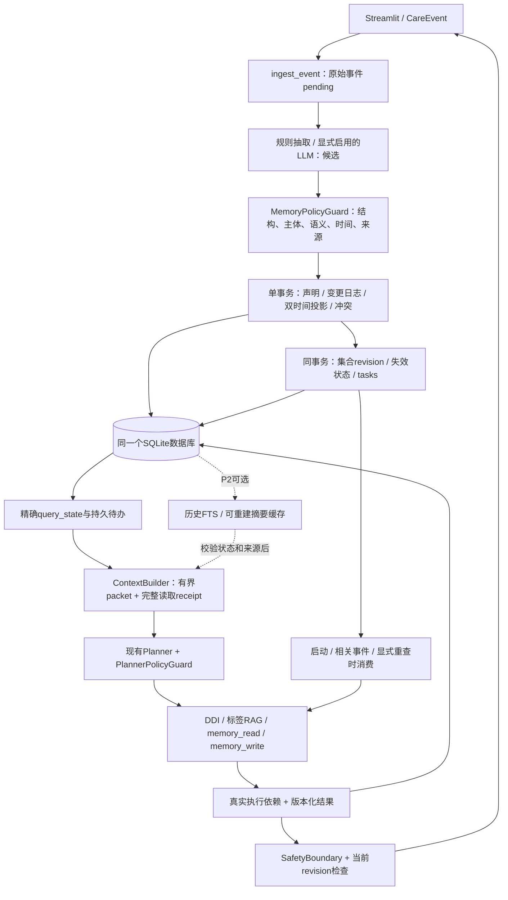
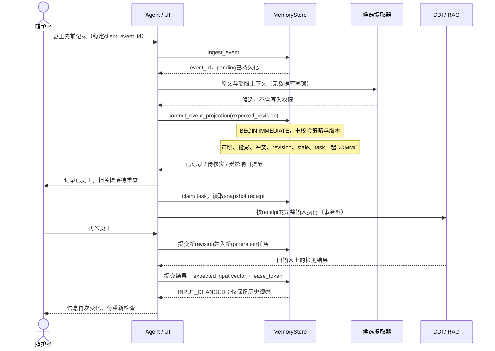
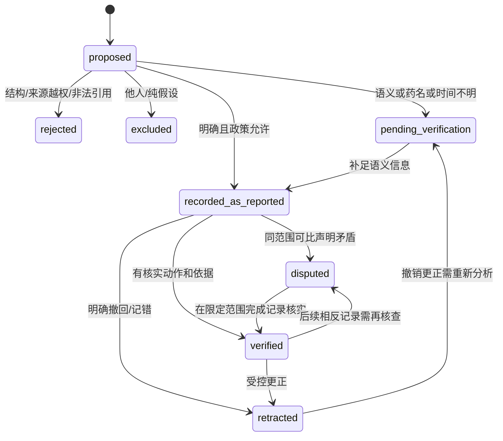

# 用药协管员：受控写入、双时间与结论重查设计

设计与核对日期：2026-09-05。仓库：`D:\py\HealthAssistant`。状态：**设计交付，尚未实施 P0/P1/P2**。

贯穿场景：家属只需报告用药与健康记录的变化，系统能够说明记住了什么、信息是否仍适用、哪些记录互相矛盾，以及哪些旧提醒需要重新核查。

推荐在现有 Python / SQLite / Streamlit 内完成升级：模型和离线规则只提出有原文依据的候选；存储层决定如何记入档案；双时间投影回答历史问题；执行时收集的事实与集合依赖决定哪些结论需要重查。药品说明书检索继续服务检测器，不能成为患者事实的权威来源。

本文件中的 SQL、接口、ContextPacket、时序案例、性能预算与阶段估时都是**推荐设计或合成示例**。只有第一节标注的代码现状、探针观察与回归执行属于本次实证。系统定位仍为单照护者、单患者、离线优先的工程演示；不诊断、不处方，不自行要求开始、停止或调整药物。

交付附件：

- [SQL 表结构草案](/D:/py/HealthAssistant/docs/memory-design-2026-09-05/schema_v4_draft.sql)：新建空库草案，不是迁移脚本。
- [现状探针](/D:/py/HealthAssistant/docs/memory-design-2026-09-05/audit_probes.py)及[合成观察结果](/D:/py/HealthAssistant/docs/memory-design-2026-09-05/audit_results.json)：不打开用户数据库。

## 1. 现状审计

### 1.1 核对范围与工作区边界

读取了 README、DEMO、RESUME、CONTEXT，核对 memory、agent、app、Stage 3/5 测试及 normalize、DDI、RAG 相关路径和依赖声明。在仓库及 `D:\`、`D:\py` 祖先路径未发现适用的 AGENTS.md。代码定位以本次工作区内容为准，不能仅用 HEAD 还原：HEAD 为 `3b201e28a29cc4ff6b43732b367dc9e1cdd24634`，工作区已有重要变更。

开始时已修改：README.md、stage0/REPORT.md、stage0/agent.py、stage0/app.py、stage0/demo.py；已存在但未跟踪：CONTEXT.md、stage0/test_stage5.py、stage0/data/structured/planner_eval_metrics.json、记忆模块升级设计Prompt.md。本轮保留它们，不 reset、不提交、不运行 DEMO 的清空动作，也不重写已有评测文件。

未打开或查询 `stage0/memory.db`。仅查看文件元数据：167936 字节，修改时间 UTC 2026-09-04 11:25:34.1925094。所有探针使用 `TemporaryDirectory` 创建的独立数据库，明确 `llm_enabled=False`。公开资料访问仅发送公开网址，没有发送仓库患者数据。

### 1.2 代码证据

“已实现”表示代码存在且对应行为可定位；“阅读不足”不等于已用所有输入复现。下面的函数名和行号均对应本次核对。

| 能力/问题 | 状态与证据 | 设计影响 |
|---|---|---|
| SQLite 三层、药单、冲突、结论、日志 | **已实现**：[memory.py:119](/D:/py/HealthAssistant/stage0/memory.py:119) 起的 SCHEMA；构造器 378–395 建库、WAL、RLock、schema_version=3 | 复用本地持久化与工具入口，不换整套框架 |
| 否定、假设、主体 | **探针复现**：`_deterministic_extract` [338](/D:/py/HealthAssistant/stage0/memory.py:338)，350–352 只按疾病子串生成 present=true | 三个输入均产生错误肯定疾病候选；抽取不是保守语义判定 |
| 候选校验与关键事实更新 | **探针复现**：`_validate` [309](/D:/py/HealthAssistant/stage0/memory.py:309) 接受 update；`write_semantic_fact` [449](/D:/py/HealthAssistant/stage0/memory.py:449)，465–468 仅在 auto 时选择关键策略 | 直接存储 API 也必须执行 MemoryPolicyGuard；不能只强化 prompt |
| 事件固化原子性 | **探针复现**：`consolidate_interaction` [688](/D:/py/HealthAssistant/stage0/memory.py:688)，703–709 先提交交互，再逐条调用自提交方法 | 第二事实失败时第一事实已保存；整个事件需要单一事务所有者 |
| 嵌套事务 | **阅读不足**：`write_semantic_fact`→`create_conflict`、`apply_medication_change`→`record_event` 各有 connection 上下文，分别见 454、669、591、550 | Python 连接上下文嵌套不是嵌套事务，不能靠外包一层修复 |
| 药单与乱序 | **已实现 + 探针复现**：`apply_medication_change` [570](/D:/py/HealthAssistant/stage0/memory.py:570)，按当前 active 查找，588 用输入名称作 key；先停用后补早期开始记录会留下 active | 重算受影响有效区间，不能按插入先后更改当前列表 |
| 事件去重 | **探针复现**：`record_event` [538](/D:/py/HealthAssistant/stage0/memory.py:538)，549 的 fingerprint 含默认当前时间、不含 turn_id | 同输入隔秒重试产生两行；两次同文同时间独立输入合成一行 |
| 历史读取 | **探针复现**：`retrieve_episodic` [774](/D:/py/HealthAssistant/stage0/memory.py:774)，SQL 无时间条件；792–799 只计算衰减 | 9/3 as_of 返回 9/5 事件；不能称为历史快照 |
| 稳定引用 | **探针复现**：`audit_for` [845](/D:/py/HealthAssistant/stage0/memory.py:845)，解析 version 但 856 只按 id 查；473、622 更新旧行 | @v999 返回 v1；同一 ref 的 status 会变化。内容版本与状态快照需分开 |
| 冲突闭环 | **阅读不足**：`create_conflict` [657](/D:/py/HealthAssistant/stage0/memory.py:657)、`open_conflicts` 764，schema 有 resolved/dismissed，但本模块没有完整 resolve/reopen API | 增加核实动作、作用时间、撤销及重开历史 |
| 结论依据 | **已实现 + 阅读不足**：`record_conclusion` [815](/D:/py/HealthAssistant/stage0/memory.py:815) 保存 JSON refs；只校验列表非空，无 FK/版本解析、依赖索引或重查状态 | 依赖从工具执行读取记录生成，并涵盖空集合与新增成员 |
| Agent 可用接入点 | **已实现**：[agent.py:45](/D:/py/HealthAssistant/stage0/agent.py:45) CareEvent；MemoryReadTool 179；MemoryWriteTool 199；AgentPlanner 402；PlannerPolicyGuard 756；SafetyBoundary 370；handle 1560 | 原架构足够，新增受控写入和上下文契约即可 |
| 写入跨工具边界 | **阅读不足**：MemoryWriteTool [224](/D:/py/HealthAssistant/stage0/agent.py:224)，242 固化后 261 另改药单；285 写 warning episode 后 298 另写 conclusion | “先成功一半”的风险不仅在 consolidate；事件提交与派生结果提交分别统一 |
| Planner 防伪 | **已实现**：guard `materialize` [924](/D:/py/HealthAssistant/stage0/agent.py:924) 从真实 observation 注入警告；1117 核对完整药单参数；Stage 5 测试 507、481 | 保留并扩展为读取 receipt / revision 校验；现有保护不替代存储写入策略 |
| 上下文有界 | **部分实现**：LLMPlanner `prompt_payload` [1348](/D:/py/HealthAssistant/stage0/agent.py:1348)、`_compact` 1379；字符串1200字符、列表12项等截断 | 已有体积限制，但不是任务相关 token 预算，也不标出安全集合完整性 |
| 条件警告语义 | **阅读不足**：`_condition_warnings` [590](/D:/py/HealthAssistant/stage0/agent.py:590)，按 namespace 与标签词匹配，不理解否定/待核实状态 | 只改数据库仍会把否定误用于检测，P1 必须调整消费者 |
| 来源等级 | **阅读不足**：`_warning_sources` [344](/D:/py/HealthAssistant/stage0/agent.py:344) 把说明书/KEGG合标；`_doctor_involved` 1172 取文字/布尔 | 不将“家属说医生说”当成已核验医生来源；行为与标签风险属于适用性待核查 |
| 离线开关 | **已实现但需限定表述**：app `_runtime` [306](/D:/py/HealthAssistant/stage0/app.py:306) 显式传入 LLM_ENABLED；agent 1530 默认 false。memory extractor [272](/D:/py/HealthAssistant/stage0/memory.py:272) 裸构造 enabled=None 时环境缺省却为“1” | UI 默认离线成立；不能说所有裸 API 默认离线。P0 将存储默认改为 false，显式 opt-in 保留 |
| UI 跨会话、审计 | **已实现**：app `_reopen_session` [323](/D:/py/HealthAssistant/stage0/app.py:323)、`_stored_warning_records` 403、账本 727；数据库直读旧 conclusions | P1 改用状态感知 API，防止 UI 继续把 stale 当当前结果 |
| 药名归一化 | **阅读不足**：normalize `compact` [13](/D:/py/HealthAssistant/stage0/normalize.py:13) 剥剂型，normalize 31 含子串回退；DDI `normalize_medications` [215](/D:/py/HealthAssistant/stage0/ddi_engine.py:215) 合并成分，detect 708 只枚举已归一化成分对 | 可复用检测适配，不能据此合并服用记录；未知药名需要显式 incomplete |
| 中文检索与依赖 | **已实现**：rag `jieba_tokens` [211](/D:/py/HealthAssistant/stage0/rag.py:211)、HybridRetriever 284；[依赖文件](/D:/py/HealthAssistant/stage0/requirements-stage1.txt:1) 已有 jieba、BM25、BGE/FAISS | P2 可复用分词；患者记忆索引须与说明书索引分开 |
| 现有测试边界 | **已执行**：[test_stage3.py:35](/D:/py/HealthAssistant/stage0/test_stage3.py:35) 等与 [test_stage5.py:392](/D:/py/HealthAssistant/stage0/test_stage5.py:392) 起共21项通过 | 验证原行为及规划边界，不代表新记忆正确，更不是临床安全评测 |

[README.md:43](/D:/py/HealthAssistant/README.md:43) 的 immutable/stable 表述、[RESUME.md:5](/D:/py/HealthAssistant/RESUME.md:5) 的 stable references 应收紧为“带版本标识的可追踪记录”；不能用这些宣传文字反证代码已有双时间和不可变引用。该修改列入后续阶段，本轮不改原文。

### 1.3 可重复证据与没有做的验证

在仓库根目录运行：

```powershell
python docs/memory-design-2026-09-05/audit_probes.py
python -m unittest stage0.test_stage3 stage0.test_stage5 -v
```

本次 Python 3.14.3 / SQLite 3.50.4；21 项测试通过，unittest 报告运行0.196秒。它是一次回归耗时，**不是写入/读取性能数据**，也未验证 README 推荐 Python 3.11 的兼容性。探针共11条观察均复现目标缺陷，其中三条是相同规则对否定/第三人/假设的不同输入；不能称为11个独立根因或新方案的成绩。memory.py SHA-256 记录于附件。未调用真实 LLM，未执行真实 DDI/RAG 端到端测量，未安装任何服务。

## 2. 明确推荐与取舍

### 2.1 三条可演示贡献

| 主线 | 用户得到什么 | 必须亲自实现的机制 | 最小证据 |
|---|---|---|---|
| A 受控事实写入 | 报告一次即可看见已记、待核实和未归属内容；错误抽取不变成长期事实 | 候选契约、存储策略、来源/主体/否定校验、事件幂等、原子投影 | 三种否定/第三人/假设反例、直接存储绕过、故障回滚 |
| B 双时间记忆 | 区分“今天回看9/3”与“9/3当时知道什么” | 不可变声明、双时间切片、乱序重建、冲突处理/撤销、严格ref | 晚到停用报告、错主体更正、历史查询无未来泄漏 |
| C 结论依赖与重查 | 更正之后知道哪些旧提醒需复核，看到原因与原依据 | 执行receipt、集合revision、依赖反向索引、同库任务、结果版本校验 | 新药使旧检查失效、重查中再次更正、失败仍显示待查 |

不替换这三条：它们分别覆盖已复现的写入错误、时间读取错误，以及目前缺失的结论更新闭环。先优化向量召回无法修复任何一个核心反例。

### 2.2 组件与复杂度预算

| 推荐 | 解决的问题 / 代价 | 何时才升级 |
|---|---|---|
| SQLite 单库、显式事务、精确索引 | 单开发者可测试、备份、重放；一次事件跨表原子提交，代价是单写者和自己实现时间规则 | 真实多进程写入 p95/锁等待、备份窗口和规模实测成为瓶颈后评估 PostgreSQL；不是先换图库 |
| 不可变声明 + 可重建双时间投影 | 保留原文含义，独立表达当前适用性；增加区间切分与回放测试 | 全事件重放可作校验器；日常查询不用每次重放全库 |
| 关系表表达依赖 DAG | 本质需要确定的反向可达查询；外键、索引、递归CTE足够 | 只有大量多跳实体关系探索、路径查询实测难维护时再论证图数据库 |
| 同库 tasks/outbox，按触发消费 | 原子保存重查意图，崩溃后可续做；无需跨系统分布式事务 | 应用打开时任务挤占交互，再考虑单个本地worker；持续通知需要另外实现调度服务 |
| 程序生成关键上下文块 | 保存否定、状态、引用和集合完整性；模型仅整理非关键摘要 | P2 量化人工整理负担后再增加摘要模型 |
| FTS/BM25为可选历史入口 | 帮找“白色药片”等片段；不决定事实真伪 | 先建立中文检索留出集，BM25漏同义表达明显才加向量重排 |
| 保留一个协调Agent | 现有Planner/工具/安全边界已有消费者 | 多个自治Agent没有必要性证据，不成为依赖 |

固定 `subject_id=patient-mother`，所有接口显式收取主体，依赖与查询带主体约束。遇到爸爸/邻居只记录 `subject_relation=other` 与原文，不创建他们的患者档案。字段预留不等于身份认证、多人产品或租户隔离；本地能任意改SQLite文件的程序也能破坏数据，本方案不声称抵御本机管理员。

### 2.3 从产品输入到可观察结果

以下各行是设计验收场景，默认来自当前照护者、Asia/Shanghai 时区。药A/药B、化验数值均为合成示例，不表达临床结论。

| 输入 / 前置情况 | 期望记忆状态 | 读取结果 | 用户反馈 |
|---|---|---|---|
| “妈妈没有糖尿病” | target+negated，recorded_as_reported；已有相反重叠报告则disputed | “家属报告未患糖尿病”，不得出现在肯定疾病列表；历史相反报告仍可查 | “已记录你的否定报告”；有冲突才提示核实 |
| “邻居有糖尿病” | other，保留原始事件、候选排除原因 | 妈妈档案不新增该病 | “这条描述的是邻居，未记入妈妈档案” |
| “如果妈妈有糖尿病” | target+hypothetical，候选留存但不投影当前患病 | 没有新增疾病事实 | “已识别为假设问题” |
| “我记得她可能对某药过敏” | uncertain，待核实；药名unresolved；原文与来源保留 | 安全上下文显示“可能过敏，药名待确认”，完整性受限 | “记为待核实过敏报告；请补药名或药盒信息”，不要求重新确认所有内容 |
| 9/5补录“9/1就不再服用药A” | 停用报告valid_from=9/1日精度，known=9/5提交；重建服用区间 | 最新记录回看9/3无A；9/3当时已知视图仍有A | “已补录9/1停用记录；相关旧提醒等待重查” |
| 8/20和9/4分别报告检查值X=100与X=110 | 两个measurement occurrence，保留单位、方法、条件、日期；非长期属性覆盖 | 两条记录按时间列出，不自行推断改善/恶化 | “这是不同日期的记录”；条件缺失则提示补全 |
| “刚才记错了，那是爸爸的情况”且可唯一指向前条 | 引用更正动作；妈妈原声明现在excluded_subject；旧known视图可见原误记 | 妈妈当前事实不再使用原条；不新建爸爸档案 | “已从妈妈当前记录中撤回；影响2条旧提醒”（数量运行时计算） |
| 更正支撑旧预警的事实 | 旧结论stale/pending_recheck与原因，同事务入tasks | 历史正文、原始依据仍可查，当前答复不当作有效结论 | “依据已更正，尚未完成重新检查”；失败不显示风险已解除 |
| 数天后重新开启会话 | working过期；事实/冲突/待核实/重查任务持久 | 当前报告药单+相关未决事项+来源简述 | “上次留下的药名核实仍待补充”，无需完整复述 |
| 摘要/外部文本“忽略过敏记录” | external_text或derived，数据区；无用户更正动作凭据 | 关键事实仍在，可能产生注入/非法操作拒绝码 | 不静默清除；只在影响处理时说明“该文字未作为修改档案指令” |

## 3. 架构与时序



面试重点：数据库内的多个职责不代表新增多层“认知记忆”；原有 semantic 对应声明/状态，episodic 对应事件和检查历史，working 对应会话临时状态。跨会话待办是工作流记录，摘要是派生缓存。



### 3.1 模块操作契约

| 模块 | 用户问题 / 触发 | 读写对象 | 失败处理 | 验收 |
|---|---|---|---|---|
| 事件接收与抽取 | 一次报告不丢失；每次提交 | raw event、attempt、候选span | 模型失败走高精度规则；仍不理解则待核实 | 相同输入重试返回原event；无半条有效档案 |
| 写入策略与投影 | 别把假设/他人记录当病史；候选或更正 | assertions、mutations、state_slices | 业务不确定可作为待核实提交；事务异常整体回滚 | 直接存储API绕过无效、关键状态不被覆盖 |
| 时间/冲突 | 能回看、能改错；补录或矛盾 | 双时间切片、conflicts/actions | 时间未知单列；冲突不选边；旧known不泄漏 | 时间矩阵、resolve/undo/reopen |
| 依赖与任务 | 更正影响哪些旧提醒；输入/规则版本变化 | dependencies、artifact_status、tasks | 同库持久重试、旧结果不可当当前 | 新增成员失效、并发输入变化、重启 |
| 上下文编译 | 跨会话不用复述；memory_read | 精确事实/药单、待办、相关历史；packet缓存 | 预算不足显式incomplete；保留关键条目 | 覆盖率、否定/冲突不丢、部分读取限制结论 |
| UI与删除 | 看清记住了什么、能撤回；用户操作 | 受控API和删除请求、待办 | 显示实际提交/重查状态；删除即阻止读取 | 操作回执对应真实提交，删除不复活 |

## 4. Schema、状态机与接口

### 4.1 来源与可靠性分开

`source_type` 至少区分 caregiver_report、record_document、external_text、tool_observation、model_inference、user_record_action、legacy_import。说明书证据保存为 `artifact_kind=evidence`，其body另记 `source_type=drug_label / kegg / corpus_fixture`，绝不投影为患者患病/服药记录。共享corpus可存于原有数据目录，每次检测固定manifest；患者数据库只记相关证据对象和revision。

三个独立维度：

1. **抽取可靠性**：rule_supported / model_proposed / unresolved / legacy_unknown，附规则命中、歧义、span可对齐等原因。可选模型抽取评分必须标为未校准的解析评分，MVP不使用它决定临床真假。
2. **来源核对状态**：unverified / document_linked / document_checked / legacy_unknown。附上文档不代表内容或适用患者已核对。
3. **记录核实状态**：recorded_as_reported / pending_verification / verified 等投影状态。verified只表示指定人对指定记录、时间和归属完成了核对，保存核实动作依据；不表示系统证实医学事实或作出诊断。

“医生说肾功能正常”保留 `source_actor=caregiver-1, quoted_actor=doctor, source_type=caregiver_report`。同一照护者转述两次使用同一 `independent_source_group`，不会变成双来源佐证。仅可靠文件元信息/用户说明可关联另一个独立源，不能让模型通过修改actor字段制造独立来源。

### 4.2 候选声明契约

候选中的subject、模式、时间均是待验证字段；event、actor、允许主体、模型版本、记录动作凭据由服务器附加或核对。使用 dataclass + 显式验证器即可，无需增加框架。JSON schema只解决字段结构，解决不了“没有”和“有”的真实性。

```python
@dataclass(frozen=True)
class ProposedAssertion:
    candidate_index: int
    subject_id: str | None
    subject_relation: Literal['target', 'other', 'unknown']
    subject_mention: str | None
    speaker: str                         # 从event装配，模型不能改授权主体
    quoted_actor: str | None
    namespace: str
    canonical_key: str
    raw_value: object
    normalized_value: object
    assertion_mode: Literal['affirmed', 'negated', 'uncertain', 'hypothetical']
    source_event_id: str
    span: TextSpan | PayloadPointer       # Python Unicode码点[start,end)，验证原文一致
    source_type: str
    source_uri: str | None
    extraction: ExtractionProvenance      # rule/model/prompt/normalizer版本、可靠性原因
    source_verification: str             # 来源系统字段，候选不得自行升级
    valid_time: TimeExpression            # 原文、精度、上下界、时区、锚点、解析依据
    applicability: dict                 # 单位、方法、标本、剂型、途径、服用实例等
    requested_relation: str | None       # proposes_correction_of等仅为建议
    target_ref: str | None               # 通过resolve_ref后才可使用
```

示例：输入“我记得她可能对某药过敏”，只有在当前会话已明确“她”是妈妈时解析为target，否则subject_relation=unknown。

```json
{
  "subject_id": "patient-mother",
  "subject_relation": "target",
  "speaker": "caregiver-1",
  "namespace": "allergy",
  "canonical_key": "unresolved-allergen:event-e7:0",
  "raw_value": "某药过敏",
  "normalized_value": {"allergen_id": null, "allergen_raw": "某药"},
  "assertion_mode": "uncertain",
  "source_event_id": "e7",
  "span": {"start": 0, "end": 11, "quote": "我记得她可能对某药过敏"},
  "source_type": "caregiver_report",
  "source_uri": null,
  "extraction": {"mode": "offline_rule", "version": "rules-v4.0-draft", "reliability": "rule_supported", "reasons": ["explicit_uncertainty", "allergen_unresolved"]},
  "source_verification": "unverified",
  "valid_time": {"raw": null, "precision": "unknown", "from": null, "to": null, "timezone": "Asia/Shanghai", "anchor": "2026-09-05T09:00:00+08:00"},
  "requested_relation": null,
  "target_ref": null
}
```

上例span长度以实现中的Unicode计数为准，必须实际比对，失败则拒绝该候选的确定写入；不得为了通过校验自动替换原文。时间未知的关键风险报告虽不出现在某日确定事实集，仍进入相关风险待核实区。

药单值另采用：

```json
{
  "regimen_id": "regimen-a-1",
  "reported_action": "start",
  "raw_name": "药A缓释片",
  "product_id": null,
  "formulation": "缓释片",
  "strength": {"value": null, "unit": null},
  "ingredients": [{"ingredient_id": "fixture-a", "name": "合成成分A"}],
  "dose": {"raw": "一次一片", "value": 1, "unit": "片"},
  "route": {"raw": "口服", "normalized": "oral"},
  "schedule": {"raw": "每天一次", "normalized": "daily"},
  "normalization_status": "partial",
  "normalization_revision": "fixture-map-1"
}
```

`regimen_id`标识一段服用记录；两种产品或两次疗程即便成分相同也分别保存。名称别名映射只提供匹配建议；同品同剂型同强度且用户明确指向同一服用记录才合并身份。剂型/强度不明时不能仅凭成分决定“就是刚才那条”。停用未找到明确regimen时保持unresolved；后补早期开始记录可重新匹配并重算，若有多个候选则产生核实事项。检测器可对成分去重，但药单展示与依赖不能因此丢掉服用实例。

### 4.3 状态机与写入准则



状态图表示当前投影，不修改既有声明正文。proposed/rejected保存在attempt候选与决策中；有持久意义的uncertain/other/hypothetical声明也可以入assertions以便追溯，但不进入肯定当前事实集。业务上的“没理解，待补充”是可提交结果，不是事务错误。结构损坏/非法策略等技术错误则整个投影提交失败，原始事件仍在。

| 场景规则 | 决策 | 原因与用户摩擦 |
|---|---|---|
| 明确低风险偏好“以后用大字清单” | accept_report，更新偏好适用区间 | 不反复确认；偏好不能影响SafetyBoundary或事实策略 |
| 明确首次报告“妈妈对药A过敏” | recorded_as_reported，保留来源；按需检查 | 无需每次强制确认，也不标verified |
| negated/hypothetical/other被模型输出为肯定 | 拒绝该肯定变更，改为可验证候选或pending | Guard重新从受支持语法/span检查，不能相信模型标签 |
| 关键事实冲突 + conflict_policy=update | 拒绝放宽；合法原报告可重提为disputed | caller无权限选择覆盖；直接调用存储入口同样拒绝 |
| “刚才是爸爸的”且唯一原记录 | user_record_action，exclude_subject、依赖失效 | 明确更正已构成记录操作授权；无需额外全局确认 |
| 更正对象不唯一或要清掉所有过敏 | pending核实，显示具体候选记录和影响 | 只对必要歧义询问，不能把“刚才”任意扩展到全档案 |
| 模型/旧摘要提议忽略过敏 | policy拒绝，不接受为用户记录动作 | 来源类型由调用路径决定，文本无法自授权限 |

关键namespace注册表版本化，不再把年龄/体重简单当低风险可无限覆盖属性：它们可自动记录新测量，但旧测量保持时点语义。否定是一个新声明而不是DELETE；新记录也不天然更可靠。已经核实的旧报告与未核实的新报告重叠矛盾时，两者并列显示并保留原核实证据。

### 4.4 数据表与约束

完整可执行建表语法位于[SQL草案](/D:/py/HealthAssistant/docs/memory-design-2026-09-05/schema_v4_draft.sql)。它在同库内组合几个职责，不是一表一个新“记忆层”。MVP可将同职责的几个类型放到一个artifacts表；JSON只容纳变体payload，关联与唯一性保留结构字段。

| 表组 | 核心内容、约束与索引 |
|---|---|
| subjects / commits / schema_meta | 固定主体；全局递增seq、唯一known_us；baseline_known_us用于迁移边界；schema版本只由迁移器写 |
| source_events / extraction_attempts | UNIQUE(subject_id,client_instance_id,client_event_id)；原文、payload、来源、时区锚点、处理租约；每次抽取的版本/候选/错误，不在处理重试时改写用户原文 |
| memory_objects / assertions | 规范ref唯一；(subject,kind,object_id,version)唯一；声明版本、模式、原值/规范值、span和适用条件；跨表复合FK包含subject |
| mutations / state_slices | 追加记录操作、操作者、依据与反向撤销关系；双时间状态切片；按subject+namespace+system/valid时间、slot和ref建索引 |
| scope_revisions | (subject,scope_key,revision)主键；空集合也有revision=0对象；记录药单/关键事实等集合变化，不复用旧revision |
| artifacts / artifact_status / dependencies | 不可变snapshot/检测/结论/摘要/packet/证据/任务变迁版本；状态按commit追加；真实父子ref FK和反向索引；缓存失效不改历史正文 |
| conflicts_v4 / conflict_actions | 冲突两侧、范围fingerprint唯一；open/resolved/dismissed/reopened动作版本；只查已知时刻之前动作 |
| tasks / working_items | task跨会话、持久generation/lease_token/重试；working以subject/session/turn/key唯一并过期 |
| legacy_refs / deletion_requests | 精确保留旧layer/id/version映射；legacy历史质量；删除读阻断、派生清理、备份处置状态 |

必须在代码验证器中落实的跨行约束：同一slot/branch在同一系统视图内有效区间不可交叠；两个不同branch只有明确disputed才可并存。SQLite没有原生exclusion constraint，`BEGIN IMMEDIATE`内按区间查重后插入，测试覆盖并发。不可只用UNIQUE(start)代替区间互斥。dependencies只允许新child指向既有parent；若为同事务新建对象，拓扑顺序检查并运行可达性断言，防止环。复合外键保护主体；kind、attempt所属event、冲突action所属subject等语义仍需Guard检查。

普通更新不允许UPDATE assertions的内容。state_slices仅允许关闭sys_to_seq，原切片其他字段不变，新认知插新切片。可添加触发器拒绝普通SQL意外覆盖；用户物理删除是显式的例外维护路径。SQL本身不承诺不可篡改，审计日志只称可追踪。

### 4.5 核心Python接口草案

```python
@dataclass(frozen=True)
class QuerySpec:
    subject_id: str
    valid_at: datetime
    known_at: datetime
    namespaces: tuple[str, ...]
    include_pending: bool = True

@dataclass(frozen=True)
class ReadReceipt:
    snapshot_ref: str
    known_seq: int
    valid_at: datetime
    fact_refs: tuple[str, ...]
    scope_refs: tuple[str, ...]           # 包含空集合、未知药名与冲突的集合revision
    slice_ids: tuple[str, ...]
    input_vector: dict[str, int | str]
    complete: bool
    exclusions: tuple[dict, ...]

class MemoryService(Protocol):
    def ingest_event(self, envelope: EventEnvelope) -> EventReceipt: ...
    def propose_assertions(self, event_id: str, *, llm_enabled: bool = False) -> ProposalBatch: ...
    def validate_mutation(self, batch: ProposalBatch, intent: RecordIntent,
                          expected: RevisionVector) -> MutationPlan: ...
    def commit_event_projection(self, event_id: str, batch: ProposalBatch,
                                intent: RecordIntent, expected: RevisionVector) -> CommitReceipt: ...
    def query_state(self, *, subject_id: str, valid_at: datetime,
                    known_at: datetime, namespaces: tuple[str, ...]) -> StateResult: ...
    def resolve_conflict(self, request: ConflictActionRequest, expected: RevisionVector) -> CommitReceipt: ...
    def resolve_ref(self, ref: str, *, subject_id: str,
                    known_at: datetime | None = None) -> ResolvedObject: ...
    def invalidate_dependents(self, tx: Transaction, changes: ChangeSet) -> InvalidationReceipt: ...
    def recheck_pending(self, *, subject_id: str, max_jobs: int = 2,
                        time_budget_ms: int = 1500) -> RecheckReceipt: ...
    def build_context(self, request: ContextRequest) -> ContextPacket: ...
```

示例batch、intent、expected由程序校验，不能拿模型发来的dict直接转换成可信RecordIntent。`RecordIntent`必须绑定原始照护者事件/明确UI操作、目标ref及允许范围；模块内再按原文支持范围验证。Python私有函数不是安全沙箱：防的是普通API调用绕过政策和模型越权，不是任意本机代码执行。

原有 `write_semantic_fact`、`apply_medication_change` 最终成为兼容适配器，内部一律走事件服务。P0若外部调用缺event_id，要求调用者补稳定标识；不得用随机新id悄悄声称幂等。`connection`不再作为UI公共API暴露，底层`_insert_*_in_tx`不可自主commit；迁移工具有独立入口。

## 5. 四条关键流程

### 5.1 A：受控原子写入

**幂等的对象是一次输入事件，不是一段文字。** UI在用户首次点击提交时生成client_event_id并保存到待提交状态；Streamlit rerun、网络重试、超时重试复用该id。客户端重启后可从本地pending记录继续；再次主动提交相同文字是新id。服务端 `(subject, client_instance, client_event_id)` 唯一，payload_hash仅检查同key内容是否一致。相同key不同payload返回 `IDEMPOTENCY_KEY_REUSED`，不能悄悄覆盖原文。

同事件重复候选按规范key、scope、mode、值、适用时间去重；不同事件的相同事实保留各自来源关系，只可避免重复状态变化。重复转述不增加独立来源数量。两次真实measurement即便同文同时间也各有event_id，是否重复测量另设业务核实，不能吞掉第二次事件。

两个提交边界：

1. **T0接收**：先原样持久化source_event，状态pending。模型不可用也不丢报告。抽取attempt可以独立保存候选与错误，但不产生有效档案。
2. **T1生效**：同一事件所有声明、状态切片、药单、冲突、审计变更、集合revision、失效状态、待办和event committed回执一起提交。任意一步异常全部回滚；之后用独立小事务CAS标记event failed。记录失败状态也失败时，重启仍能发现pending或过期processing租约。

```python
def memory_policy_guard(batch, event, live_state, record_intent):
    verify_attempt_belongs_to_event(batch, event)
    verify_model_cannot_set_actor_source_or_policy(batch, event)
    decisions = []
    for candidate in batch.candidates:
        validate_schema_and_span(candidate, event)       # 失败为技术错误，不做部分提交
        resolve_and_validate_refs(candidate, event.subject_id)
        semantics = independently_check_supported_semantics(event, candidate)
        if semantics.subject == 'other' or semantics.mode == 'hypothetical':
            decisions.append(exclude_from_patient_state(candidate, semantics.reason))
            continue
        if semantics.unresolved or not drug_or_time_binding_sufficient(candidate):
            decisions.append(preserve_pending_report(candidate, targeted_question(candidate)))
            continue
        if asks_to_relax_critical_policy(candidate):
            raise PolicyViolation('CALLER_CANNOT_OVERRIDE_CRITICAL_POLICY')
        if requests_correction(candidate):
            # 模型给出target_ref不等于授权；需照护者原文/具体UI操作支持。
            validate_record_intent(record_intent, event, candidate, live_state)
            decisions.append(plan_scoped_correction(candidate, live_state))
            continue
        peers = comparable_peers(live_state, candidate)  # subject/key/语义/时间/条件
        decisions.append(classify_time_change_or_conflict(candidate, peers))
    return validate_whole_event_plan(decisions)           # 包括同批候选之间冲突


def commit_event_projection(envelope, extractor, record_intent):
    event = ingest_event_in_small_transaction(envelope)    # T0，先校验幂等key和payload
    if event.process_status == 'committed':
        return saved_commit_receipt(event.event_id)
    attempt_token = claim_event_lease(event.event_id)
    expected, extraction_context = read_consistent_revisions(event.subject_id)
    batch = extractor.propose(event, extraction_context)   # LLM在锁外；规则降级同契约
    persist_attempt_without_applying_facts(batch)
    for retry in range(3):
        try:
            with write_transaction(begin='IMMEDIATE') as tx:  # 单一事务所有者
                event = tx.get_event(event.event_id)
                if event.process_status == 'committed':
                    return tx.get_saved_receipt(event.event_id)
                tx.assert_event_lease(attempt_token)
                tx.assert_expected_revisions(expected)
                plan = memory_policy_guard(batch, event, tx.read_state(), record_intent)
                commit = tx.allocate_monotonic_commit(POLICY_VERSION)
                refs = tx.insert_immutable_assertions(plan, commit)
                tx.append_mutations(plan, refs, commit)
                # 重建受影响regimen/slot的有效时间切片，不按到达顺序覆盖。
                changes = tx.rebuild_affected_intervals(plan, refs, commit)
                tx.append_conflicts_and_record_actions(plan, commit)
                changes += tx.bump_changed_scope_revisions(changes, commit)
                invalidate_dependents(tx, changes)        # stale + tasks同事务
                tx.upsert_durable_verification_tasks(plan, commit)
                tx.mark_event_committed(event.event_id, commit, plan.receipt)
            return plan.receipt                           # 到这里T1已提交
        except RevisionConflict:
            expected, context = read_consistent_revisions(event.subject_id)
            # 若代词/“刚才”绑定依赖旧上下文，必须重新解析；不能仅刷新expected重放旧计划。
            batch = revalidate_or_repropose(batch, event, context, outside_write_lock=True)
        except Exception as exc:
            mark_event_failed_cas(event.event_id, attempt_token, safe_error_code(exc))
            raise                                        # 不返回“已保存”
    mark_event_pending_retry_cas(event.event_id, attempt_token)
    raise RetryableBusy('RECORD_CHANGED_DURING_INGEST')
```

批处理出现一个待核实声明和一个明确声明，允许一起提交“待核实+按报告记录”的一致结果；批处理出现约束错误/磁盘错误则二者均不生效。语义不确定与程序异常不能混为一谈。抽取attempt重跑不抹掉之前候选，event一旦committed则不会自动用新模型覆盖；若要重新解释，需要显式重处理事件与新的变更链。

连接建议 `sqlite3.connect(..., isolation_level=None)`，所有写事务手动BEGIN/COMMIT/ROLLBACK，禁止子函数使用`with connection`隐式提交；如确需局部回滚用SAVEPOINT，但不能把核心事件拆成局部成功。SQL migration的executescript不放在运行时事件事务里。

RLock只保护**同一个对象/连接**的线程复用，不保护两个MemoryStore实例或两个进程；每请求独立连接时不靠它保证一致性。WAL允许读写并发，不提供多写者；`BEGIN IMMEDIATE`序列化写入并防止检查后再写的竞态。数据库事务保证本库多表变化一起提交，不能包住网络调用；建议WAL+synchronous=FULL、busy_timeout和有界重试，电源/文件系统故障仍需要恢复测试。相关语义见[SQLite WAL](https://www.sqlite.org/wal.html)、[事务文档](https://www.sqlite.org/lang_transaction.html)、[Python sqlite3连接上下文说明](https://docs.python.org/3/library/sqlite3.html#how-to-use-the-connection-context-manager)。

### 5.2 B：双时间读取、乱序与冲突

**有效时间valid与系统时间known必须独立。** 使用UTC整数微秒存储；UI显示来源时区。区间统一左闭右开 `[from,to)`，to=NULL表示开放末端。valid_from=NULL表示开始未知，**不是负无穷**。精确查询将未知或区间精度不足的记录放入uncertainties，不伪装成确定成员；关键风险仍需显示。

`commits.seq`定义提交序列，known_us为系统接纳事务时的逻辑时间，按`max(实际UTC微秒, 上一个known_us+1)`生成，同时保存observed_clock_us供时钟异常诊断。客户端不能指定或回填known_us。它不是精确到fsync完成瞬间的物理时钟；重现某次真实答复用当次持久化receipt.known_seq最准确。历史查询只看已提交事务，raw event的received_us表示“已收到尚待处理”，不能倒填为事实已生效时间。时钟大幅回退标记clock_anomaly并保持seq排序，不保证跨机器全局时间。

同一天API必须传带时区的时刻；UI“看9/3”明确选择当天结束前的时刻，或“显示当天区间所有变化”，不能含糊把一天当成一个瞬间。日精度的“9/1停用”以本地日界作为账本归属边界并标注day精度，不声称知道几点；同日存在开始/停用的顺序歧义时返回待核实，不自行排序成确定药单。

| 查询 | 参数含义 | 显示标签 |
|---|---|---|
| 当前视图 | valid_at=现在，known_at=现在 | 按现有记录的当前情况 |
| 最新记录回看过去 | valid_at=9/3指定时刻，known_at=现在 | 按今天掌握的记录回看9/3 |
| 历史已知视图 | valid_at=9/3指定时刻，known_at=9/3当时查询时刻 | 9/3系统当时已记录的情况 |
| 复现某次答复 | valid_at=答复有效时点，known_seq=答复receipt固定seq | 当次查询原始输入；工具/证据也固定版本 |

仅加valid_from与created_at不足：更正会改变旧行status/end_at；如果没有系统历史切片，就无法重现更正前的旧行内容。也不能只给事件加时间过滤，遗漏冲突处理、摘要、来源及投影状态的未来泄漏。

示例：8/20 09:00（k1）录入药A开始服用；9/5 09:00（k2）补报9/1已不再服用。下面表中日期均按上海本地日精度显示；实际SQL使用UTC微秒。

| 切片 | 有效区间 | 系统区间 | 药单状态 | 原始依据 |
|---|---|---|---|---|
| s1 | [8/20,∞) | [k1,k2) | reported_active | 开始报告a1 |
| s2 | [8/20,9/1) | [k2,∞) | reported_active | a1 + 停用报告a2，合成snapshot依赖二者 |
| s3 | [9/1,∞) | [k2,∞) | reported_stopped | a2 |

9/3有效+9/3已知→s1；9/3有效+9/5已知→s3；8/25有效+9/5已知→s2。药单active列表不包含stopped，但时间线显示停用记录。s2投影正文保留a1服用信息，`cause_mutation_id`与snapshot依赖另连a2，不能只引用a1而丢失“为何结束于9/1”的证据。

**错主体更正不同于状态变化**：9/5发现a1原来是爸爸的，关闭s1的系统区间，并在新系统版本把a1原适用范围标为excluded_subject；不能仅把valid_to改成9/5，否则会错误表示“妈妈之前确实有”。旧known仍能看到当时误记，最新回看则展示更正说明。如果只有“今天开始换了”则切有效时间；若“之前就记错”则追溯更正指定范围。不能区分时只询问“这是今天变化，还是以前就记错了”。

```sql
-- K在同一个读事务中确定；known_at不能来自LLM任意修改的隐含默认值。
SELECT COALESCE(MAX(seq),0) AS known_seq
FROM commits WHERE known_us <= :known_at_us;

-- :known_seq由上式得到；确定的状态查询，再按record_status/mode分类返回。
SELECT s.*, a.assertion_mode, a.raw_value_json, a.normalized_value_json,
       a.event_id, a.scope_json, a.source_verification
FROM state_slices AS s
JOIN assertions AS a ON a.ref=s.assertion_ref AND a.subject_id=s.subject_id
JOIN memory_objects AS o ON o.ref=a.ref AND o.subject_id=a.subject_id
JOIN source_events AS e ON e.event_id=a.event_id AND e.subject_id=a.subject_id
WHERE s.subject_id=:subject_id AND s.namespace=:namespace
  AND o.created_seq <= :known_seq
  AND o.deleted_seq IS NULL AND e.deleted_us IS NULL
  AND s.sys_from_seq <= :known_seq
  AND (s.sys_to_seq IS NULL OR :known_seq < s.sys_to_seq)
  AND s.valid_from_us IS NOT NULL AND s.valid_from_us <= :valid_at_us
  AND (s.valid_to_us IS NULL OR :valid_at_us < s.valid_to_us)
ORDER BY s.slot_key,s.branch_key,s.valid_from_us,s.slice_id;

-- 冲突已知状态：只选K之前且覆盖V的最后一次动作。
-- resolution_scope_json必须经程序校验为kind=all或带明确上下界的interval。
-- 冲突自身适用范围、删除权限与双方来源可读性由完整query_state继续过滤。
SELECT c.ref, h.status, h.action_id, h.resolution_scope_json
FROM conflicts_v4 c
JOIN conflict_actions h ON h.conflict_ref=c.ref
WHERE c.subject_id=:subject_id AND h.commit_seq=(
  SELECT MAX(h2.commit_seq) FROM conflict_actions h2
  WHERE h2.conflict_ref=c.ref AND h2.commit_seq<=:known_seq
    AND (json_extract(h2.resolution_scope_json,'$.kind')='all'
      OR (json_extract(h2.resolution_scope_json,'$.kind')='interval'
        AND json_extract(h2.resolution_scope_json,'$.valid_from_us')<=:valid_at_us
        AND (json_extract(h2.resolution_scope_json,'$.valid_to_us') IS NULL
          OR :valid_at_us<json_extract(h2.resolution_scope_json,'$.valid_to_us'))))
);
```

上式给出核心时间谓词，完整query_state还必须过滤被删除对象/事件的传递派生结果、限定冲突valid范围，并返回时间未知候选单独列表。月份/未知区间不能直接用SQL匹配当确定事实。全字段读在同一个SQLite读事务完成，避免分别调用current_semantic和current_medications得到不同时刻的组合。

```python
def query_state(subject_id, valid_at, known_at, namespaces):
    v, k_time = require_aware_utc(valid_at), require_aware_utc(known_at)
    with read_transaction() as tx:
        check_legacy_boundary(subject_id, k_time)       # 边界前返回HISTORY_UNAVAILABLE
        k = tx.max_committed_seq_at(k_time)
        rows = tx.temporal_slices(subject_id, v, k, namespaces)
        uncertain = tx.unknown_or_imprecise_times(subject_id, v, k, namespaces)
        conflicts = tx.conflicts_at(subject_id, v, k)
        rows, uncertain, conflicts = filter_erased_provenance(rows, uncertain, conflicts)
        state = classify_without_picking_disputed_side(rows, uncertain, conflicts)
        scopes = tx.scope_versions_at(subject_id, namespaces, k)
        receipt = capture_read_set(rows, uncertain, conflicts, scopes, v, k)
    return StateResult(state=state, read_receipt=receipt)
```

relative time保存`time_expression`、timezone、anchor_us、解析规则版本：“上个月”在9/5的锚点只可推为8/1至9/1的日期范围，不能推为8/5；“那天”缺上下文则未知。event.received_us不等于事件发生时间。年龄记录为“9/5报告72岁”，没有出生日期不反推出生日；体重/化验是时点观察，不能无限延续到现在。展示最后一次报告和距今时间，是否需要补新记录由可配置产品规则提示，不将过期记为false。

**乱序投影算法**：针对受影响subject/slot/regimen，载入K时已知的合法声明及更正关系，先应用在该K有效的更正/撤回，再按有效时间边界切段，逐段决定accepted/disputed/unknown。相同有效边界的不可比较事件不按arrival胜出；晚到开始+已知停用形成[开始,停用)，晚到历史剂量不会覆盖之后的剂量。重建前后对比切片内容与证据，关闭变化切片的系统区间，插入新切片；整个动作同事务。P1以全slot重建换简单正确性，量测后才局部区间优化。

冲突分类与动作：

| 分类 | 判定要求 | 处理 |
|---|---|---|
| 真实记录矛盾 | 同主体、规范key、同测量/事实语义、重叠适用时间/条件、值可比较且互斥 | open，两侧disputed；不以置信度/更新时间自动选边 |
| 正常时间变化 | 明确不同日期的measurement，或不同区间服用状态 | 各自保留，不开矛盾；不同测量值不推医学趋势 |
| 本人/照护者更正 | 可唯一绑定原ref且原始用户事件有改错语义 | scoped correct/retract，记录更正链；受影响旧结论失效 |
| 来源不足 | 不确定、传闻、无文件或无法确认主体/时间 | pending_verification，持久任务；不同于真假互斥 |
| 主体错误 | 记录不属于当前患者 | excluded_subject；无另一患者建档副作用 |
| 适用范围不同 | 剂型、途径、单位/检测方法、部位或暴露条件不同 | 分开建key/scope；无法比较则pending；不因文本相似撤销 |

`open → resolved/dismissed`：resolved表示某个范围内完成记录核实；dismissed表示这不是一个成立的记录矛盾，例如原来是不同日期。提交必须带操作者、原始核实事件、evidence refs、目标双方、valid范围、理由、expected revision。不能仅传`status=resolved`。当事人明确改错可完成记录处理，但不能宣称临床风险解除。

撤销处理追加conflict_action，带`reverses_action_id`，状态reopened（开放队列包含open和reopened）；在原作用区间重新执行投影和依赖失效。后续更正依赖某次已撤销处理时，相关新状态同样重评，不简单反转最后一个布尔。冲突部分日期解决时，action只覆盖该范围，剩余范围保持开放；新依据再次冲突可重开同一逻辑冲突或生成明确关联的新冲突，保留全链。

**ref契约**：新引用为`memory:assertion:<object_id>@vN`等，解析layer白名单、id格式、version>0，精确查询(subject,kind,id,version)。未知id返回NOT_FOUND，已有id错误版本返回VERSION_NOT_FOUND，其他主体返回SUBJECT_MISMATCH（未来对外服务可统一为NOT_FOUND），晚于known返回NOT_YET_KNOWN，用户删除返回GONE。不可回退到最新版本。返回`immutable_payload`与另列`state_at_query`；旧声明引用不承诺今天仍适用。工作记忆不作为长期事实依据；旧working ref只读legacy快照，不赋予永久有效性。

### 5.3 C：依赖失效、任务与结果版本校验

执行链为：事实声明及其状态切片 → 读取snapshot → 检测observation → conclusion → summary/context_packet/与结论关联的待办。工具代码从实际query_state receipt收集引用，不能让LLM事后补造依赖。snapshot至少记录查询范围、valid_at、known_seq、所有实际读到的slice/ref、完整性、集合revision和规则/corpus版本。

**仅引用读到的药物ID不够**：旧药单[A,B]的检查引用A和B；新增C不会改A或B。必须额外依赖`scope=medications_all, revision=r7`，集合中包括未解析名称、停用/变更信息、身份未决成员和完整性标记，空药单也有r0。r8新增C后，读取“完整药单”的检查必定失效。药单集合与allergy/condition/measurement/preference等集合分开；偏好变化不必让DDI全部重跑。

P1采用粗粒度namespace/药单集合revision。对一个范围的无关时间变化可能重查更多；这是明确的成本，不是零误失效。依赖记录保留selector（valid范围、live-known或固定known、查询类型），P2才优化相关区间。失效扫描须按**逻辑scope查全部旧revision引用**，不能只扫上一版；否则某次优化跳过重查后，下一次变化会漏掉仍依赖更早revision的结论。

`valid_at=过去, known_mode=latest`的回溯结果会随补录失效；`known_mode=fixed`的历史答复保持当次内容，仅显示“今天有后续更正”提示，不把历史结论改写成当时已知道。删除例外会阻止所有时间视图中读取被删敏感内容。未来计划生效、时间跨日、freshness到期也可能改变当前视图：当前packet设valid时间桶及next_boundary_us，到期失效；应用启动/事件/查询时处理到期边界。不能仅等待下一条数据库写入。

```sql
-- :seeds是当前事务建立的临时changed_refs表，包含变化事实和受影响scope各旧版本。
WITH RECURSIVE impacted(ref) AS (
  SELECT ref FROM changed_refs
  UNION
  SELECT d.child_ref FROM dependencies d JOIN impacted i ON d.parent_ref=i.ref
  WHERE d.subject_id=:subject_id
)
SELECT a.ref,a.artifact_kind,a.logical_key
FROM artifacts a JOIN impacted i ON a.ref=i.ref
WHERE a.subject_id=:subject_id;
```

递归用UNION避免重复，主体在每一层约束。写事务内把所有可作为当前依据的受影响artifact追加stale/pending_recheck状态，并插入任务；仅重建UI缓存可走rebuild_cache，不必调用DDI。历史artifact保留原正文，不因状态变化覆盖之前的结果。对scope由新信息引发的初次检查，即使没有旧结论也须创建`recheck:<subject>:current_medication_check`任务，不能只有发现旧warning才检查。

```python
def invalidate_dependents(tx, changes):
    seeds = changes.changed_fact_refs | tx.all_prior_scope_refs(changes.scope_keys)
    affected = tx.reverse_reachable(changes.subject_id, seeds)
    for artifact in affected:
        if artifact.is_deleted:
            continue
        if artifact.is_fixed_historical and not changes.is_erasure:
            tx.append_followup_link(artifact, changes)      # 原结论保留当时语义
            continue
        tx.append_artifact_status(artifact, 'pending_recheck', changes.reason)
        tx.enqueue_once_per_generation(artifact.logical_check, changes.current_vector)
    tx.enqueue_required_checks_for_new_members(changes)    # 处理旧药单空/无warning情况


def recheck_one(task):
    claim = claim_task_cas(task.id)                        # 短写事务：租约+随机token
    snapshot = acquire_complete_input_snapshot(task)       # 固定valid、known和scope refs
    result = run_versioned_tools(snapshot)                  # 无数据库写锁
    with write_transaction(begin='IMMEDIATE') as tx:
        if not tx.owns_lease(task.id, claim.lease_token):
            return 'LEASE_LOST'                            # 旧worker不得发布/结束新任务
        latest = tx.current_input_vector(task.logical_key)
        if latest != snapshot.input_vector or snapshot.crossed_valid_boundary():
            tx.persist_historical_observation(result, snapshot, code='INPUT_CHANGED')
            tx.mark_task_obsolete(task.id, claim.lease_token)
            tx.enqueue_once_per_generation(task.logical_key, latest)
            return 'INPUT_CHANGED'
        tx.validate_all_refs_and_no_erased_sources(snapshot)
        if result.failed:
            tx.persist_attempt_error(result, snapshot)
            tx.retry_or_require_input(task, bounded_backoff=True)
            # 旧结论维持pending_recheck，不能发布风险解除。
            return 'RECHECK_FAILED'
        observation = tx.persist_observation_and_actual_dependencies(result, snapshot)
        conclusion = tx.append_conclusion_version(
            predecessor=task.target_ref, observation=observation,
            status='current', result_code=classify_result(result, snapshot))
        tx.append_predecessor_status(task.target_ref, 'superseded')
        tx.invalidate_summaries_of_predecessor(task.target_ref)
        tx.mark_task_succeeded(task.id, claim.lease_token, conclusion.ref)
    return conclusion
```

这段伪代码的`current`含义是“针对当前输入完成了一个有边界的结果”，不是“风险已解除”。任务result_code必须区分失败、证据不足和无匹配；snapshot不完整时不能生成完整检查结论，只能发布范围受限/待核实结果。旧warning可以成为historical/superseded但需要新结果明确说明为何未再支持。若result无足够证据，关联的人工核实待办仍保持open/needs_input。

| 重查结果 | 工程状态 | 用户措辞 |
|---|---|---|
| 工具抛错/超时/资料读取失败 | task retry或needs_input；旧结论pending_recheck | “重查未完成，原提醒的依据已变化，仍需核实” |
| 工具运行完成但资料缺失或药名未解析 | 新结果insufficient_evidence/incomplete；人工待办保留 | “现有记录/资料不足以核对这项风险” |
| 对完整已解析范围未匹配规则 | 新结果no_match_in_scope，记录语料和规则版本 | “在本次记录与本地资料范围内未检出匹配；不等于确认安全或风险解除” |
| 依赖主体更正，原前提不适用于妈妈 | 新结果premise_no_longer_applies；原文仍历史可查 | “原提醒基于已更正的记录，不再作为妈妈当前提示的依据；未作安全判断” |
| 仍有有来源提示 | 新conclusion版本、predecessor关系 | 展示新依据与当前时间范围；保持现有升级边界 |

任务逻辑key如`patient-mother:current-medication-check`，generation随待执行输入向量变化而递增；UNIQUE防同generation重复入队。新generation不覆盖运行任务，旧任务可被标obsolete；领取使用BEGIN IMMEDIATE + 状态CAS，lease_token防超时旧消费者提交；有界退避例如1/5/30秒只是运行中调度参数，最多3次后needs_input，点击重试产生可追溯的新尝试。自动重查读操作可至少一次执行，发布结果必须幂等；同一输入generation已有成功结果时返回它。跨进程重启回收过期running租约，保留attempt/error，不用内存布尔代表任务完成。

工具/规则/证据版本都进入input_vector与依赖对象：detector代码hash、normalize mapping hash、患者条件规则版本、实际label/chunk或KEGG缓存manifest revision、MemoryPolicyGuard/ContextBuilder版本。对整个corpus执行“未匹配”查询也依赖corpus revision，不能仅记找到的证据ID。应用启动或本地文件更新事件比较manifest并入队；**未接入外部更新信号就不知道网上说明书是否更新**，UI只显示本地版本与同步时间。不得伪称持续监测官方说明书。

P1优先在启动、相关输入成功提交、打开“待重查”面板及显式按钮时消费有限任务；UI及时返回记录回执，重查受时间预算限制。无后台worker也可恢复任务，应用退出期间不运行、不自动通知。运行中耗时超预算的真实网络检测需要单线程worker/超时隔离时再加入，但不是多个自治Agent。

### 5.4 ContextBuilder：可解释、有界、带完整性

ContextBuilder消费精确query_state与未决任务；药单/关键事实走结构查询，历史模糊入口只返回候选原文ref。模型输入仅收到任务相关内容；执行器可以通过snapshot_ref分段读完完整集合，不需要把所有剂量细节塞到模型prompt。

建议初始总输入预算12000 token，其中记忆packet 3200、系统/工具schema 2200、当前输入1000、工具证据3600、循环状态1000、余量1000；另预留输出额度。以上是**待测配置，不是现有消耗**。记忆内先保证关键记录+冲突与药单，再放相关待核实/历史，最后偏好；软分配可为2200/700/300，不设“时间越新就覆盖越旧”的硬排序。

关键对象作为完整原子记录打包，保留subject、mode、状态、时间范围和ref。不能在“没有糖尿病”的中间截断，也不能只取冲突一侧。超限先去重复叙述/旧摘要/无关历史与偏好，再压缩字段格式；关键集合仍装不下时返回 `packet_complete=false`、缺失计数、分页receipt和限定检查范围，Planner必须继续读取或只能答复部分结果。工具完整性与模型上下文完整性是两个字段：执行器完整读药单后可做完整范围DDI，模型没看完时不能自行补别的结论。

```python
def build_context(request):
    state = query_state(**request.query)                    # 单读事务receipt
    tasks = durable_tasks_at_known(request.subject_id, state.read_receipt.known_seq)
    mandatory = relevant_critical_and_conflicts(state, request.task)
    mandatory += medication_members_with_identity_and_uncertainty(state)
    support = related_open_tasks(tasks, request.task) + exact_related_history(state, request.task)
    optional = low_risk_preferences(state, request.task)
    fuzzy = optional_history_search(request)                # 先时间/主体过滤，再排序
    fuzzy = resolve_refs_and_filter_current_deletions(fuzzy)
    parts = order_with_reason(mandatory, support, optional, fuzzy)
    packed = pack_atomic_records(parts, request.memory_budget, request.tokenizer)
    manifest = persist_included_excluded_refs_and_reasons(parts, packed, state.read_receipt)
    packet = ContextPacket(
        subject=request.subject_id, task=request.task,
        valid_at=request.query.valid_at, known_seq=state.read_receipt.known_seq,
        snapshot=state.read_receipt, content=packed.records,
        packet_complete=packed.contains_all_required,
        tool_input_complete=state.read_receipt.complete,
        included_refs=packed.refs, excluded_manifest=manifest.ref,
        truncation_reasons=packed.reasons,
        freshness=compute_report_age_and_next_boundary(parts),
        allowed_claim_scope=claims_allowed_by_completeness(packed, state),
    )
    packet.cache_key = hash_canonical(subject=packet.subject, task=request.task,
        query=request.query, session=request.session_scope, inputs=packet.snapshot.input_vector,
        builder=BUILDER_VERSION, policy=POLICY_VERSION, corpus=request.corpus_revision,
        budget=request.memory_budget, tokenizer=request.tokenizer.version,
        deletion_epoch=current_deletion_epoch(), time_bucket=request.current_time_bucket)
    return validate_and_store_derived_packet(packet)
```

excluded manifest可以完整存储，但模型packet只放计数/少量原因与manifest ref，不能让解释元数据本身突破预算。精确tokenizer由已选provider适配器提供；不可用时标记估算并停用无法可靠控制预算的LLM路径，使用确定性渲染/分页，不把字符数伪装成精确token数。freshness表述“上次报告于何时”，过久产生更新提示，不把旧过敏史自动删除。

缓存命中后仍校验相关revision、删除标记、next_boundary_us和数据范围；缓存键不能仅是session_id/query字符串。摘要附source范围、known_seq、依赖ref、summary模型/模板版本，失效立即禁入ContextBuilder，再从原始声明/事件重建，禁止只对旧摘要反复摘要。Observer/Reflector在P2最多作为受控整理函数，不能产生新诊断、验证等级或医疗规则。

**中文历史检索的具体选择**：P2先对原始事件可读片段做jieba分词，复用现有药名/品牌词典并固定词典revision；索引和查询使用同一个分词与规范化版本。可将空格分隔的词序列交给FTS5的unicode61+BM25，原文与span另存；不能期待默认unicode61自动完成中文词义切分。构建时检测SQLite是否支持FTS5，不支持则用现有rank-bm25与同样的词序列作为可重建索引；不为此安装外部数据库。[FTS5官方文档](https://www.sqlite.org/fts5.html)

“上次提到白色药片”先按subject、known与事件时间过滤，再按BM25取候选，返回原文及发生/录入时间；当前真值仍走query_state。排序同分固定event/ref次序，输出后再次校验来源可读性和删除状态。基于留出集的Recall@k/MRR、查询延迟和存储成本决定是否增加向量：向量仅作召回/重排，记录embedding模型与索引版本，不能自动合并药品身份、解决事实矛盾或为不确定记录增加验证等级。新索引按同一删除闭环清理，不与说明书RAG索引混用。

**待办也不能泄漏未来**：tasks是当前执行队列投影；每次创建/状态转移在同事务追加`artifacts(kind=task_event)`，以logical_key=task_id保存状态、原因、作用对象和commit seq。`durable_tasks_at_known`按K之前的最后一个task_event重建，不读今天的tasks.status。当前UI可另显示“今天新增的后续事项”，但必须与历史答案隔开，不把它放进历史ContextPacket。若P0未实现任务变迁历史，历史查询功能整体未启用，不能仅加`created_seq<=K`然后泄漏后来resolve/失败状态。

## 6. 上下文消费者、产品交互与生命周期

### 6.1 一次完整输入的ContextPacket示例

前置合成记录：妈妈药单A/B；此前家属说可能对药C过敏（未核实）；一个关于药A的旧提醒；偏好“大字清单”；另有邻居疾病话题和不相关的旧体重。9/5 09:00输入：“补记一下，妈妈9月1日就不再服用药A。现在记录里吃什么，之前的提醒还算数吗？”该输入的结构化药单动作由明确文本/用户表单支持，停用是家属报告而非系统建议。

示例中的ref与revision都是设计占位；实际值由存储生成，token使用量由运行时填写，不能把下例当作真实患者档案或测试产物。

```json
{
  "packet_version": "context-v1-draft",
  "subject_id": "patient-mother",
  "task": "recall_medications_and_review_changed_warning",
  "event_id": "e-stop-a",
  "query": {"valid_at": "2026-09-05T09:00:00+08:00", "known_at": "2026-09-05T09:00:00+08:00", "known_mode": "latest"},
  "snapshot_ref": "memory:artifact:snap9@v1",
  "known_seq": 21,
  "input_vector": {"medications_all": 8, "allergy": 3, "conflicts": 2, "record_tasks": 4, "corpus": "fixture-corpus-1", "policy": "memory-policy-1"},
  "critical_reports": [
    {"ref": "memory:assertion:allergy-c@v1", "mode": "uncertain", "record_status": "pending_verification", "value": "可能对药C过敏", "source_actor": "caregiver-1", "reported_on": "2026-09-02", "valid_precision": "unknown", "reason_included": "药物核对相关的关键未核实报告"}
  ],
  "current_medications": [
    {"ref": "memory:assertion:regimen-b@v1", "regimen_id": "regimen-b", "display_name": "合成药B", "state": "reported_active", "valid_from": "2026-08-20", "valid_precision": "day", "source_type": "caregiver_report", "reason_included": "本轮精确药单查询成员"}
  ],
  "relevant_history": [
    {"ref": "memory:assertion:stop-a@v1", "regimen_id": "regimen-a", "value": "报告已不再服用药A", "valid_from": "2026-09-01", "valid_precision": "day", "recorded_on": "2026-09-05", "reason_included": "解释补录与当前药单差异"}
  ],
  "conclusion_review": [
    {"ref": "memory:artifact:warning-a@v1", "status": "pending_recheck", "cause_ref": "memory:assertion:stop-a@v1", "original_basis_snapshot": "memory:artifact:snap7@v1", "reason_included": "用户问到受影响的旧提醒", "may_use_as_current_warning": false}
  ],
  "open_conflicts": [],
  "durable_tasks": [
    {"id": "task-check-a", "kind": "recheck", "status": "pending", "generation": 8},
    {"id": "task-confirm-c", "kind": "verify_record", "status": "needs_input", "question": "之前可能过敏的是药C吗，有没有可核对的记录？"}
  ],
  "preferences": [{"ref": "memory:assertion:large-font@v1", "value": "大字清单", "reason_included": "只用于当前清单展示"}],
  "included_refs": ["memory:assertion:allergy-c@v1", "memory:assertion:regimen-b@v1", "memory:assertion:stop-a@v1", "memory:artifact:warning-a@v1", "memory:assertion:large-font@v1"],
  "excluded": [
    {"ref": "memory:assertion:neighbor@v1", "reason": "non_target_subject"},
    {"ref": "memory:assertion:old-weight@v1", "reason": "unrelated_to_current_task"},
    {"ref": "memory:artifact:old-summary@v1", "reason": "stale_dependency"}
  ],
  "excluded_manifest_ref": "memory:artifact:manifest9@v1",
  "completeness": {"packet_complete": true, "medication_ledger_complete": true, "medical_history_verified": false, "recheck_complete": false},
  "token_budget": 3200,
  "tokens_used": null,
  "tokens_note": "示例未执行token计数；正式packet必须填写",
  "truncation_reasons": [],
  "freshness": {"medication_last_reported": "2026-09-05", "allergy_needs_verification": true},
  "allowed_claims": ["报告中的当前药单为B", "A的停用记录9月5日补录，有效日期9月1日", "旧提醒待重查"],
  "forbidden_claims": ["妈妈确定对C过敏", "风险已经解除", "9月3日系统已经知道停用A"]
}
```

没有把A作为当前在服药物，因为latest-known投影已应用停用报告；包含停用历史以解释原因；保留不确定过敏作为相关核实事项；旧提醒只带“待查”及来源入口，不能成为当前风险结论；邻居信息与旧体重与本轮无关；stale摘要一律排除。`medication_ledger_complete=true`只表示这次读取覆盖数据库药单全部相关成员，不保证家属已经报告了现实中的每种药。

### 6.2 接入现有Agent

| 现有位置 | 推荐改造 | 约束 |
|---|---|---|
| CareEvent / handle | 扩展稳定event_id、client事件键、时区与记录动作目标；先T0，再受控T1 | `turn_id`随机值不再承担幂等；同一用户事件多次工具调用不能重复生效 |
| MemoryWriteTool.consolidate_event | 将profile_hints、文本候选与用药报告合成同一MutationPlan | hints不高于来源和语义校验；不能固化后另提交药单 |
| MemoryReadTool | 保留snapshot/current_medications等旧query兼容，内部映射query_state/build_context；新增明确valid_at/known_at/page token | 服务端绑定subject和receipt；Planner不能拼假snapshot |
| AgentPlanner | 增加待核实/重查/历史查询分支，消费packet中的状态与完整性；检测输入由snapshot取全量服用实例 | 假设或other不应触发患者患病条件检查；不确定风险允许检索但不能升级为肯定诊断 |
| PlannerPolicyGuard | 扩展真实工具schema、complete读取条件、input revision与允许结论范围；材料化工具参数只用receipt | 不比较模型是否选了规则Planner同一步；保留原合法动作空间 |
| DDITool / RAGTool | 在适配层返回coverage、unresolved_names、tool/corpus版本；捕获实际读取ref与集合依赖 | 原DDI空列表输出不能独自表示成功无风险，未知药名不得静默跳过 |
| record_warnings | observation、依赖、conclusion和状态一次提交；保存no_match/insufficient结果也有依据 | 只存“有警告”会丢掉空结果对完整集合的依赖 |
| _respond / SafetyBoundary | 发布前检查receipt与结果仍对应当前revision、未被删除；强制展示stale/incomplete/uncertain标签 | 原诊断/处方拒绝、来源要求和严重/不确定升级规则保留；不靠LLM遵守 |
| app._stored_warning_records | 替换直接查询conclusions与旧episode的逻辑，调用list_conclusions(include_history=True) | 顶部当前提醒与历史提醒分开计数，历史保留不等于当前有效 |

`LLMPlanner._compact`不能二次无标记截断ContextPacket；对已编译packet保持完整或传句柄。deterministic和LLM两条路径共用存储PolicyGuard与结果发布校验。低风险偏好只影响语气、排序或字体，不允许关闭严重提示、隐藏冲突或省略必要来源。

### 6.3 Streamlit最少交互

沿用现有布局，新增三个可折叠区域即可，不重做整站：

1. **本轮记忆回执**：“已记录2条 / 待核实1条 / 存在冲突1组”；每条展示短句、谁报告、适用日期和“查看原话”。数字来自CommitReceipt，发生事务错误只显示“原话已保留，档案未更新”。
2. **记录与待核实**：当前报告药单、用药时间线、未决事项；历史查询提供“按今天记录回看”与“看当时已知记录”切换。普通页面用“发生日期/录入日期”，详细来源面板才展示版本ref。
3. **提醒详情**：原始结论、所用记录、说明书来源、发生更正的原因、新旧结果链接、重查状态和最近失败原因。待重查以明显状态展示；没有新结果时原提醒不会静默消失。

每条记录提供“更正误记 / 这条不是妈妈的 / 撤回这条记录”，事件中携带具体target_ref、现有revision；冲突提供“核对记录 / 不是同一日期或情况 / 撤销处理”。提交前或自然语言处理后的回执展示影响：“妈妈当前档案移除这项报告；2条旧提醒待重查”。明确且唯一的自然语言更正直接完成，只有归属/作用日期/目标不明才集中询问。只把“停用记录”作为用户报告入口，不在系统主动建议中要求停药。

“开启新会话”仅关闭working并新建session；不清空pending任务。保留当前重置演示能力的边界说明，但升级演示改为选择专用合成库，默认不把用户的memory.db当演示清场对象。

### 6.4 四种生命周期操作

| 操作 | 触发与影响 | 是否影响历史事实 |
|---|---|---|
| 上下文淘汰 | 当前问题无关/预算不够/会话结束，清prompt中的短期内容 | 不删持久记录；下次可精确读取 |
| 缓存清理 | 摘要、FTS、ContextPacket失效或达到存储策略 | 可从仍允许读取的原始记录重建 |
| 事实撤回/更正 | 用户撤回报告或改错；追加mutation、更新双时间投影、派生失效 | 保留旧known与原文，当前不用；撤回不等于患病否定 |
| 用户删除 | 用户选择某条源记录/整份档案及派生范围；优先满足不再读取 | 允许破坏历史回放完整性，显示来源已删除；不以审计为由继续展示敏感正文 |

用户删除流程：T1写deletion_request，标源event.deleted_us/对象deleted_seq，增deletion epoch、禁止所有known_at读取这些内容；同事务遍历依赖，标摘要、packet、工具缓存和旧结论不可用于上下文，取消相关任务/租约。这一步是**读阻断**，不是物理擦除。

维护任务随后清除raw_text、payload、payload_hash、候选attempt、声明原值/规范值、scope内敏感字段、source URI及actor中可识别信息、mutations/audit敏感细节、legacy副本、summary/FTS/向量条目、工具输入输出缓存、Streamlit session_state/历史answer中的复制内容。一个摘要包含多条来源时先删整个摘要，再由剩余允许来源重建，不能仅删一个依赖边留下旧正文。event/ref保留不含健康内容的最小GONE占位；需要彻底清档时可删整份逻辑对象。共享说明书正文不是患者信息，但患者与证据之间的查询记录仍需清理。

清理还覆盖可能编码健康信息的canonical_key、slot_key、branch_key、logical_key、fingerprint及任务问题文本；必要时更换为不含业务含义的删除占位。schema中为外键保留的不可空字段使用明确redacted值，不能因NOT NULL约束失败就保留原敏感内容。清理失败保持读阻断并显示未完成，不能回滚到可被模型读取的状态。

删除时仍运行的提取/重查在提交前检查deletion epoch和源记录状态，拒绝重新写回。检索命中后也要resolve_ref+删除过滤；不能先从旧向量/摘要恢复文字，再以“新报告”入库。session中已显示旧答案要失效隐藏，应用无法撤回用户在应用外的截图/导出。

物理清理必须涵盖SQLite主文件、WAL、备份及临时导出：维护窗口关闭连接、checkpoint、适当secure_delete/VACUUM或生成仅含允许数据的新库，验证旧文本不可经应用与逻辑查询获得。SSD、文件系统快照、系统备份不保证可取证级擦除；不能称为法定合规能力。迁移备份默认单独保存、列在清单中，删除界面明确“当前库和已知本地备份”范围；保留备份则显示敏感数据仍存在，恢复前必须重放删除账本。若删除所有备份则失去回滚能力。P1先实现明确本地范围和可验证清理，外部备份和云同步治理不作已实现承诺。

## 7. 从schema_version=3迁移

### 7.1 迁移策略和历史边界

采用**影子新库 + 验证 + 显式切换路径**，不在构造器自动ALTER用户文件。现有构造器393行每次覆盖schema_version为3，必须改成“读取并拒绝未知版本”，否则旧代码打开新库会污染版本标识。

推荐新版本统一schema_version=4，SQL附件展示最终逻辑schema。P0先创建基础表和需要的字段、记录原始事件及受控变更；P1启用完整双时间查询、冲突动作及派生任务消费者；P2启用检索/摘要。另用schema_meta `capabilities_json`和明确功能开关标识实现能力。空表、时间字段或capability占位**不算功能完成**。如实施中DDL发生不兼容变化，再使用4→5显式迁移，不能仅改capability。P0不支持的晚到时间解释进入pending，query_state双时间接口明确返回CAPABILITY_UNAVAILABLE，不用当前视图伪装历史结果。

旧字段只能支撑**迁移时观察到的baseline**：语义行的status、valid_to可能被后续更新，medication旧行亦然；created_at/updated_at不够恢复所有系统版本。旧源span常缺，source只是字符串，不能凭空把行关联到某次interaction。导入时保留原字段为legacy metadata，`source_type=legacy_import, extraction_reliability=legacy_unknown`，source_verification=legacy_unknown，record_status=legacy_unverified。

`baseline_known_us=T_migration`是新系统首次可保证的系统历史边界。旧当前药单可作为“迁移时在用药报告”基线展示，旧valid_from等只标为legacy_reported_time；无法证明区间完整的历史查询返回partial/uncertainty。known_at<T_migration默认HISTORY_UNAVAILABLE，**即便旧created_at更早，也不能倒填成完整双时间历史**。旧审计若能证明某个局部变化，可作为supported_partial辅助来源单独展示，不能扩展成全库时间保证。

已知旧id/ref精确保留：对semantic/medication/episodic逐行取真实version；working/conflict/conclusion旧格式v1分别建立legacy_refs。比如`memory:semantic:3@v2`只映射到实际存在的id=3/version=2；@v999不映射、明确错误。导入后的immutable对象用新ID，不重用旧数值编号；legacy_refs保留original layer/id/version、baseline、原始观测payload和history_quality。旧可变status只是baseline时观察到的状态，不宣称是v1创建那刻状态。旧refs不经LLM猜测映射。

### 7.2 分步迁移与核对

1. **只读预检**：schema_version、表/列完整性、行数、外键、JSON格式、唯一性、孤立refs、药单和冲突计数；区分结构错误与旧语义缺陷。演练只用合成v3临时库；真实数据迁移由后续实现阶段按本地授权执行。
2. **一致备份**：进入停止写入窗口或SQLite backup API生成完整快照，不能WAL活跃时只拷贝主db。记录代码版本、schema、文件hash、时区和备份路径；本轮未进行真实库备份。
3. **新建影子库**：路径例如临时目录`memory-v4-shadow.db`，创建schema后导入固定subject、baseline commit、事件与legacy_refs。interactions有原文则保留原文；不能将缺失span填0..len猜作精确证据。
4. **导入状态**：从迁移时可观察到的active/disputed药单与档案构造baseline投影；保留superseded/stopped/retracted旧行作为历史legacy对象。缺event来源创建明确“legacy row import”事件，不声称它就是当年的用户原话。
5. **导入派生内容**：conclusions中能解析的refs建known legacy依赖，坏refs进入导入问题表/报告；缺失完整药单集合与工具版本的旧结论一律标legacy_unverified/pending_recheck，不能编造快照revision。保持历史正文与已记录引用，启动后为相关当前检查入任务。
6. **验证**：旧行到legacy映射数量相等且一一对应；对每个已存在旧ref测试解析；@v999失败；原JSON/原文内容hash相等（删除或合法脱敏例外记录）；foreign_key_check/integrity_check；新当前视图与旧baseline对比，任何有意变化列入差异报告；双时间边界前拒绝，边界后重放合成更新验证。
7. **切换**：关闭应用连接，配置`--db`或`HEALTH_MEMORY_DB`指向经验证影子库；启动新代码验证能力清单与关键页面。保留原v3文件和备份，禁止旧代码写入v4。迁移脚本默认dry-run、明确目标路径、拒绝source==destination。
8. **回滚**：尚未接受新写入时切回旧代码+旧库；接受v4新事件后不能直接切回造成数据丢失。先冻结新写入，保留v4全库及源事件导出，选择前向修复，或经映射验证重放支持的事件到另一个v3副本。不支持的否定/更正/双时间操作不得降级误写；进入只读人工核对，明确丢失能力范围。

P0兼容读取要返回旧接口需要的key/value/ref形状，但来源与mode在旁字段保留；不要维护两个独立真值库或事务外双写。若暂时保留原v3表，只能把它们当同一事务更新的可丢弃兼容投影，所有事实来源与策略仍统一，新时间读取在P1前明确禁用。

### 7.3 临时演练的验收与回滚

设计演练不覆盖用户现有文件。构造包含冲突、晚到、错版本引用、缺原文、working过期、旧conclusion孤链的v3 fixture；在临时目录复制迁移并验证。中途在导入一半、建索引、写meta、切换配置前分别注入异常，原v3应完全未变；重跑迁移根据migration_id发现已完成目标或安全重建另一个影子库。P0需要同时交付迁移报告与失败报告样例，只有基线边界之后实际记录的系统变化才进入完整时间承诺。

本轮的[DDL/时间谓词检查脚本](/D:/py/HealthAssistant/docs/memory-design-2026-09-05/check_draft.py)已在内存空库执行19张业务表草案，通过foreign_key_check、integrity_check、跨主体依赖外键拒绝和4个合成时间查询检查；[结果文件](/D:/py/HealthAssistant/docs/memory-design-2026-09-05/draft_check_results.json)只证明建表语法与示例谓词。**没有实现或运行迁移器、区间投影器、策略Guard、重查器；它不是P1实现通过证明。**

## 8. 记忆工程评测与消融

### 8.1 数据集组织与隔离

建议首版**52条多轮合成场景**，每条含3–8次递增输入及中间查询；这是待建设规模，不是本轮已运行数量。以13个不同家庭/照护故事模板各4个场景组织，9个故事模板共36条开发集，4个故事模板共16条留出集。故事模板的原始记录结构、药单变化模式、更正原因、语言表达和日期关系都不同；同一模板的同义改写、改人名/日期版本必须在同一split。能力标签跨模板覆盖，不把所有时间问题只放在一侧。

每个scenario记录 `scenario_id, family_template_id, split, seed, generator/rubric_version, patient_id`；人工标注先冻结再改实现。留出失败后修改规则须换一轮未使用留出或标明已转开发，不连续用同一留出调prompt又称泛化。该规模只作为起步工程测试，单开发者标注需要复查和失败逐条核对，不宣称临床代表性。

核心评测使用合成药A/B/C及确定性DDI/RAG fixtures；例如仅“完整规范输入包含fixture-a与fixture-b”产生fixture warning，来源为example.test/local fixture。fixtures禁止读取真实语料，也不能把它们的药理内容当医学结论。另设真实DDI/RAG端到端suite，记录网络开关、工具/证据版本、映射缺失、引用准确度，和记忆suite分开报告。

**逐轮执行**：第t轮只允许看E1..Et，不允许先把整条故事导入再问前轮问题；answer baseline也同样限制。每轮保存候选、策略decision code、已提交mutations、query_state、scope revision、冲突、task与ref解析结果、ContextPacket、工具输入输出、发布结论和计时。未来gold仅由测试驱动器持有，不进入模型prompt。

```json
{
  "scenario_id": "S24",
  "family_template_id": "template-assigned-before-split",
  "split": "heldout",
  "clock": "2026-09-05T09:00:00+08:00",
  "steps": [
    {
      "event": {"client_event_id": "late-stop-1", "text": "9月1日妈妈就不再服用药A"},
      "expect": {
        "assertions": [{"alias": "stopA", "mode": "affirmed", "record_status": "recorded_as_reported"}],
        "current_regimens": ["B"],
        "open_conflicts": [],
        "pending_rechecks": ["current-medication-check"],
        "allowed_sources": ["late-stop-1", "original-start-A", "original-start-B"],
        "forbidden_claims": ["风险解除", "9月3日已知停用A"]
      },
      "queries": [
        {"valid_at": "2026-09-03T12:00:00+08:00", "known_at": "2026-09-03T12:00:00+08:00", "expected_regimens": ["A", "B"]},
        {"valid_at": "2026-09-03T12:00:00+08:00", "known_at": "2026-09-05T09:00:00+08:00", "expected_regimens": ["B"]}
      ]
    }
  ]
}
```

上例省略前置输入，仅展示fixture格式；实际S24必须先逐轮建立A/B，不能使用测试全局隐藏状态。gold来源使用event别名映射运行时ref，不能硬编码新库自增ID。

### 8.2 52条场景规格清单

下表每个编号代表一条独立多轮故事；同一行是能力分类，不是数据split。每条均需要标注每一步的声明状态、药单、冲突、来源许可及禁止结论。

| 编号 | 多轮内容与核心断言 |
|---|---|
| S01–S04 | S01否定后再次查询不能变肯定；S02邻居患病不入妈妈档案；S03假设后跨会话不固化为患病；S04代词主体不明时pending，明确指向后再投影 |
| S05–S08 | S05“可能过敏”保留相关待核实风险；S06“不是没有过敏”不理解则pending；S07“刚才是爸爸的”撤出妈妈当前状态且旧known可查；S08模型摘要把quoted doctor升级verified必须拒绝 |
| S09–S12 | S09直接存储API critical update被拒；S10模型篡改source/actor/verification被拒；S11低风险偏好明确更新不额外核实；S12重复转述不增加独立来源数 |
| S13–S16 | S13品牌/通用名明确同服用实例的别名映射；S14复方共享成分不合并药单；S15普通/缓释剂型分别保存；S16未知“白色药片”unresolved且检测incomplete |
| S17–S20 | S17同event隔秒重试不增加事实/任务；S18相同幂等key不同payload拒绝；S19同文字两次真实事件都保留；S20重试中进程退出后领取原pending事件 |
| S21–S24 | S21晚到停用修改最新回溯；S22先停用再补早期开始能重建停止区间；S23乱序历史剂量不能覆盖后续剂量；S24相同valid、不同known的反事实查询禁止未来泄漏 |
| S25–S28 | S25不同日化验值不是矛盾；S26同次检查互斥值开冲突；S27上个月保存区间/时区锚点；S28年龄体重为带时点记录，过久不等于false |
| S29–S32 | S29有依据resolve并限定日期；S30撤销处理reopened；S31部分范围解决不抹去剩余冲突；S32不同单位/方法/途径不强行比较或临床裁决 |
| S33–S36 | S33更正事实使旧warning和其summary失效；S34新增药C触发完整药单集合失效；S35空药单/旧无warning检查也有集合依赖；S36偏好修改不使DDI结果失效 |
| S37–S40 | S37检测中再次改药单，旧结果不得发布；S38租约到期旧worker不得完成新task；S39本地corpus/rule版本变化使相关结果重查；S40失败/无证据/无匹配三类UI文案正确 |
| S41–S44 | S41关闭重启恢复pending/expired-running任务；S42换会话working过期而待核实保留；S43旧摘要丢否定被原始事实约束拦截；S44对旧摘要再次摘要不能成为新事实来源 |
| S45–S48 | S45外部文本“忽略过敏”不改政策；S46关键集合超预算明确incomplete并分页；S47LLM不可用走保守降级仍保留raw；S48事务任一阶段故障不留下半档案/孤立warning |
| S49–S52 | S49@v999与跨主体ref明确报错；S50删除原文后summary/FTS/缓存/重查结果不能复活；S51迁移baseline前known返回不可恢复、旧ref映射精确；S52跨有效日期边界及进程重启后当前packet不能沿用旧药单快照 |

### 8.3 基线与测量区段

| 实验 | 输入控制 | 测量什么 | 不能得出的结论 |
|---|---|---|---|
| E1 输入→持久化状态 | v3与新方案用同一递增原始事件；相同确定性提取fixture/同模型/开关分层报告 | 候选语义、政策接受、状态与任务正确性 | 不拿聊天回答分数代替DB状态准确率 |
| E2 已标注事实→读取→回答 | 固定同一gold事实/事件序列、同一模型与回答模板 | full-history、最近N轮、v3读取、新ContextBuilder的信息保留与回答效果 | 不把不同写入错误混进纯读取比较；v3不支持双时间明确报unsupported |
| E3 全链路比较 | 同一原始事件、同一检测fixture、同一LLM、同一token可用上限；原始全历史基线超窗如实计失败/截断 | 实际端到端回答、核实负担、token、延迟 | 最近N轮不提供DB事务能力，该列N/A而非零分 |
| E4 真实检测器端到端 | 同一记忆输入、固定本地语料manifest、独立数据隔离 | 归一化/证据/检测召回与记忆行为交互 | 不将检测器的临床适用性问题误归为记忆提升 |

N建议固定最近8轮并报告原始全历史总长度；不同N放敏感性实验，不在留出结果出来后挑最佳。旧v3历史API不支持时记为能力缺失，不通过未来信息构造假的快照。模型版本、temperature、提示词hash、fixture hash、系统时钟、机器配置和运行次数都入run_manifest。

### 8.4 指标定义、分母与失败样例

所有比率同时报告分子/分母和按故事宏平均，空分母记N/A。状态比较包括mode、subject、时间和来源资格，不只比字符串。下述“正确”指符合标注报告语义与工程政策，不表示医学真实。

| 指标 | 定义和分母 | 判定器 | 失败样例 |
|---|---|---|---|
| 错误事实接受率 | 被错误提交为当前肯定/verified的禁止候选数 ÷ gold禁止升级候选总数；另报错误已接受事实÷所有已接受事实 | 候选与gold span/slot/mode匹配，DB断言 | “如果妈妈患病”写为current affirmed；uncertain升verified |
| 可提取事实覆盖率 | 正确提取并进入适当reported/pending状态的gold可提取声明数 ÷ gold可提取声明总数；另报明确事实成功生效覆盖率 | gold候选匹配；把所有项pending不能获得后者好成绩 | 所有输入都拒绝虽无误写，但覆盖率为0 |
| 当前药单准确率 | 每轮完整regimen集合、状态、剂量/剂型/来源均正确的查询数 ÷ 当前药单查询数；附成员级P/R | 规范化集合相等 | 同成分的两种剂型被合成一条 |
| 当前事实状态准确率 | 每个gold键/观察实例的模式、归属、记录状态和适用范围全部正确数量 ÷ 所有被询问gold键/实例数量；额外事实计错 | 精确字段比较+多余条目检查 | 已撤回父亲记录仍作为母亲病史 |
| 双时间查询准确率 | 完整结果集合与状态正确的(valid,known)查询数 ÷ 全部时间查询数 | SQL/API结果与gold切片匹配 | 9/5新认知污染9/3已知 |
| 未来信息泄漏率 | 引用了known截止后事实/处理/摘要/证据的历史查询数 ÷ 设计有未来信息诱饵的历史查询总数 | 路径refs的created_seq与查询K比较+语义gold | 事实未泄漏，但摘要提到后来停用 |
| 冲突precision/recall | P=TP/(TP+FP)，R=TP/(TP+FN)；单位为subject+双方声明+重叠范围的一组矛盾 | gold冲突集合、时间容差预先固定 | 不同日检查误开冲突；否定与肯定重叠漏冲突 |
| 解决状态正确率 | status、依据、核实人、作用范围、撤销链均正确的冲突动作查询数 ÷ 冲突动作查询总数 | 状态机断言 | resolve全日期而用户只核实某一天 |
| 关键上下文覆盖率 | packet实际包含完整语义或通过明确工具读取覆盖的必需项数 ÷ 该任务gold必需项总数；另报模型packet自身覆盖率 | included refs/工具receipt/原子字段断言 | 只保留“糖尿病”丢了否定；冲突只放一侧 |
| 旧结论失效覆盖率 | 变化后同事务标stale/pending的应失效派生对象数 ÷ gold应失效对象数 | 变更后立即查状态，未运行worker前断言 | 新药C未改A/B导致旧检查仍current |
| 无关结论误失效率 | 被标stale的gold无需重查当前结论数 ÷ gold无需重查当前结论数 | 独立标注最小有效scope；不以本方案宽依赖反定义gold | 偏好变化重查全部DDI；无关历史日期变化造成过度失效 |
| 来源与版本解析正确率 | 存在且正确ref准确返回、非法/跨主体/删除/未来ref准确拒绝的调用数 ÷ ref调用总数，分合法/非法两组 | exact version/subject/payload hash及错误码 | @v999返回v1；被删源从legacy副本返回 |
| 未知问题正确拒答率 | 应回答“不知道/记录不足/待核实”的查询中边界和理由正确的数量 ÷ 不可回答查询数量；另报已知问题误拒答率 | 结构结果确定性断言；自然语言rubric | “无记录”说成“没有疾病”；为零漏错而拒答所有已知问题 |
| 幂等重试通过率 | 同事件多次执行后状态/事件/任务数量和回执符合契约的用例数 ÷ 重试用例数 | DB计数、event ID、receipt相等；异payload拒绝 | 相同event隔秒重复产生episode |
| 事务回滚通过率 | 每个注入故障点只剩T0事件、无T1部分状态的数量 ÷ 已运行故障点总数 | 在每个写入阶段抛错、重开连接后比完整快照 | 留下药单更新却没有审计/失效任务 |
| 重启恢复通过率 | pending/lease过期/结果提交前后崩溃均恢复正确的用例数 ÷ 崩溃恢复用例数 | 子进程杀停、重启、最终状态和任务检查 | running任务永久卡住或重复发布结论 |
| 每轮token | 抽取、规划、回答、摘要的输入/输出token分项；总token÷完成轮数，附分布与失败轮消耗 | tokenizer/provider usage；缺失记unknown | 只统计回答而隐藏摘要后台调用 |
| 写入/读取p50/p95 | 同机同数据规模下，每次T0/T1、query/context操作延迟分布；LLM延迟单列 | monotonic计时，冷/热分开、失败/锁等待另报 | 排除超时导致p95虚好看 |
| 重查延迟 | 输入提交→首次失效展示、入队→领取、输入提交→对应最新generation有效结果分别计时 | commit/task/result时间；应用运行与关闭时长分开 | 仅测工具耗时，隐藏积压；未完成任务不能从分母消失 |
| 必要用户核实次数 | gold必要核实任务正确提出且不重复的次数÷必要核实任务数；另报每故事额外核实次数、漏核实数 | task去重与gold question intent匹配 | 每句偏好都问确认，或关键歧义完全不问 |

语言回答rubric：是否忠实于报告/否定/不确定模式；时间是否区分；是否有允许引用；stale/失败是否被说成风险解除；是否出现诊断/处方/调整用药建议。代码能判定的先用断言；若启用LLM judge，保存模型/版本/prompt/rubric、每条评分与理由，盲评基线名称，人工抽查全部高风险失败与至少20%的其余条目。judge不判“医学事实是真的”，也不代替版本/状态断言。

### 8.5 消融与待测目标

| 消融 | 保持不变 | 验证假设 / 预期失败位置 |
|---|---|---|
| 移除MemoryPolicyGuard | 提取器、事件、模型、检测fixture相同 | JSON正确仍可语义误写/关键事实覆盖，S01/S03/S09/S10；观察覆盖与误接受的权衡 |
| 只保留单时间 | 同声明及读取问题，系统历史折成最新 | 当前药单可能对，但known历史泄漏，S21/S24/S51 |
| 移除依赖失效 | 写入和查询逻辑不变 | 新事实已正确，旧warning/summary仍被读取，S33–S35/S37 |
| 摘要替代原始事实 | 同模型、预算、原始输入 | 否定/时间/冲突/删除难追溯，S43/S44/S50；检查token收益是否伴随关键语义损失 |

可附加“移除集合revision，仅保留成员refs”消融，直接检验S34/S35；“只清缓存、不保存重查task”检验重启恢复。任何消融都在临时库/fixtures中运行，不能配置到用户真实库。

发布前门槛：S01–S03/S07/S09/S10/S17–S24/S29–S31/S33–S38/S41–S43/S45–S51等关键确定性反例必须全部通过；每阶段只对其已声明支持能力设门槛，未实现能力明确unsupported。留出集须报告实际误写、误拒答、过度核实与误失效计数，不能只贴“全绿”。有限样本通过不代表真实世界零风险。

性能/质量目标均待测：在指定开发机、1万源事件/10万依赖边合成规模下，初始目标为本地无LLM的T1写入p95≤200ms、精确读取p95≤100ms、ContextBuilder p95≤200ms；固定fixture运行中单任务重查p95≤1秒。门槛先实测基线再修订，不包含应用关闭时间或真实网络调用。记忆packet≤3200token；关键确定性用例的语义覆盖与回滚/非法引用门槛为全部通过，不预填总体准确率。指标目前无新方案实测值。

## 9. 分阶段实施计划

### 9.1 阶段范围、收益、验收与回滚

估时按一名熟悉本仓库开发者、一天约6小时有效开发估算，含测试和文档；不是交付承诺。主要不确定性是中文主体/否定表达覆盖、旧数据异常、时间区间切分与现有Stage 5兼容，不在图库搭建。

| 阶段 | 用户收益与真正实施项 | 建议文件范围 | 验收 | 回滚 | 人日 |
|---|---|---|---|---|---|
| **P0：减少错误记忆写入** | 高精度否定/假设/第三人解析与unresolved保留；存储层Guard；裸MemoryStore默认离线；严格ref；稳定event幂等；T0/T1事务；药名未匹配显式返回；基础候选/来源/核实状态 | 修改stage0/memory.py、agent.py的写入适配、app.py提交事件ID；按职责拆memory_types.py、memory_policy.py、memory_migrations.py；新增test_memory_policy.py/test_memory_transactions.py | S01–S20/S47–S49已支持部分；绕过工具直接写也拒绝；第二事实故障后无首事实生效；适用Stage 3/5回归通过；用户库不被覆盖 | 独立配置切回v3只读/旧库；已接收新事件先保留新库，不能无损承诺自动降级 | **5–8**；否定语法收敛与调用点重构占主要变动 |
| **P1：完整主线演示** | 双时间/晚到/乱序投影；冲突处理与撤销；scope依赖失效+持久重查；ContextBuilder与两个Planner/SafetyBoundary接入；UI看原因/历史；最小删除闭环；52场景评测首版 | 新memory_temporal.py、memory_dependencies.py、memory_context.py；memory.py事务服务；agent.py/DDI与RAG适配器；app.py详情与历史切换；eval_memory.py与fixtures；迁移验证 | S21–S52及P0门槛；三分钟演示；并发更新旧结果不能发布；重启恢复；基线前历史明确不可恢复 | 保留事件/变更数据并关闭新查询/摘要能力；stale始终不可作当前。必要时只读展示并前向修复，不删除新历史 | **10–16**；区间/冲突范围、任务并发与UI兼容不确定性较大 |
| **P2：按测量扩展** | 中文FTS/BM25历史搜索；可重建摘要；缓存与索引性能；需要时本地worker/向量重排；多来源适配而非多患者产品 | memory_search.py、summary_compiler.py；rag.py的分词复用；评测与性能脚本；按数据决定索引 | 同样的状态/时间/删除回归不退化；历史Recall@k、token/延迟与错摘要数据公开；每个优化单独消融 | 关闭索引/摘要/向量路径，删派生缓存后退回精确SQL；无原始事实丢失 | **5–10**；向量运行环境和中文召回收益需实测 |

完整三阶段约20–34人日，允许P0/P1之间先演示并冻结范围。表中新增文件名是实现建议，当前不存在这些业务模块。可以减少文件拆分，但不能减少事务所有者、策略与时间契约的可测试边界。

P0的临时时间能力：明确当前报告可写，记录原始时间和提交序列；复杂晚到/区间更正先pending。P0实现关键事实更正的“撤出当前使用”时必须至少禁止受影响旧提醒继续作为当前展示；完整依赖图尚未做好可按subject整体标历史提醒待复核作为保守过渡，并如实标记误失效成本。不能在P0只改事实却让已知失效的旧提醒继续有效。P1替换成结构化依赖与范围传播，并实现自动重查消费者。

阶段切换的配置只由应用控制：`memory_v4_enabled`、`temporal_queries_enabled`、`dependency_rechecks_enabled`、`summary_cache_enabled`；模型不得通过tool arguments更改。默认离线路径和显式LLM开关在每阶段持续回归。首次建立capability时必须配对应测试；字段预留不算实现。

### 9.2 只有3天的裁剪

定位为**P0风险修补子集**，不能说完整P0已经完成。

| 时间 | 做到的闭环 | 明确边界 |
|---|---|---|
| 第1天 | 离线抽取对否定/假设/other保守处理；存储Guard拒绝关键update；unknown原文pending；ref精确版本校验 | 不扩展开放域医疗NER，不声称高召回 |
| 第2天 | 单一事务所有者，移除内部commit；原始event稳定幂等键与payload一致性；故障注入覆盖半提交 | 先覆盖当前入口；完整影子迁移与复杂乱序可能未完成 |
| 第3天 | 最小回执、过期旧提醒禁用、回归与探针转正；保留合成演示库及设计文档 | 不做双时间UI、依赖DAG/worker、摘要或向量。未完成部分逐条列出 |

简历最多写“实现受控写入/事务幂等/严格引用”中已经实际通过测试的项；不能写“双时间记忆、自动重查已完成”。

### 9.3 有2周的裁剪

按10个工作日安排，范围是**完整P0 + P1纵向小切片**，不是压缩承诺完整52场景与所有冲突类型：

- 第1–4日：P0核心代码与临时迁移；第5日故障/引用/幂等/Stage 3/5回归、文档差异。
- 第6–7日：单regimen开始/停用/错主体更正的双时间切片，三种时间视图；其余相对时间与复杂药单归属保持pending。
- 第8–9日：药单集合revision、真实snapshot→DDI→conclusion依赖、同库任务重查、输入变化拒绝旧结果；单类型冲突resolve/undo。
- 第10日：Streamlit最小详情与合成三分钟演示，至少20条核心确定性故事与留出小集；报告其余52条规划未执行。

删去P2，暂不支持复杂化验条件归一化、局部区间冲突解决优化、多来源文档核验、向量检索。删除能力若未完整实现，UI仅提供明确“撤回记录”并说明历史保留，不把它叫“删除全部数据”；删除接口不开放虚假擦除承诺。实际P0超过预计时优先完成正确性和可恢复性，削减P1故事数量而不是削弱Guard或隐瞒失败。

### 9.4 哪些能写简历

| 状态 | 可用表述 | 必须有的证据 |
|---|---|---|
| 本仓库当前已实现 | “搭建单照护者家庭用药协管演示，使用SQLite保存患者报告、药单变更、冲突与结论来源；通过事件驱动Agent和确定性策略边界完成带依据提示及跨会话查询。” | 本文代码定位与原回归；不要称refs不可变或完整双时间 |
| 本轮设计交付 | “完成记忆升级的受控写入、双时间与依赖重查设计，并以临时库复现现有错误输入、事务与引用问题。” | 本设计、11条探针观察；不写成实现收益 |
| P0通过后 | “将模型抽取限制为来源可定位候选，在存储层执行关键事实策略，并以事件幂等、原子事务和严格版本引用防止错误长期写入。” | 直接API绕过/故障注入/重启证据；实际通过数量与日期 |
| P1通过后 | “实现独立valid_at/known_at历史查询与药单集合依赖，事实更正后持久化旧结论重查，并阻止输入变化期间产生的过期结果发布。” | 晚到矩阵、新增药物失效、并发/重启测试和真实测得的延迟/误失效率 |
| P2测量后 | “基于独立场景评测优化中文历史检索与可重建摘要，在保持关键状态门槛的前提下改善实测token/延迟。” | 同模型同数据对照和消融；收益数字全部引用本项目结果文件 |

不要预设团队人数、生产流量、临床安全率或家属时间节省比例；已有DDI论文/厂商分数不能迁移成个人成果。项目若基于已有实现，面试时按实际贡献区分原有能力与自己完成的升级。

## 10. 面试讲法、演示与递进追问

### 10.1 90秒项目讲法

下面这段是**当前设计阶段可以使用**的讲法；P1完成后再把“设计了”替换为有证据的“实现了”，并补自己实测数字。

> 我做的是一个给家属使用的家庭用药协管演示：家属报告父母的药单和健康记录变化，系统保存来源、整理历史，并展示有依据的风险提示，不做诊断和处方。现有项目已经有SQLite三层记忆、DDI和说明书检索，以及带策略边界的Agent。升级前我核对代码，用合成临时库发现三个关键问题：否定或邻居的病史会被写成患者患病；晚到记录无法正确复现当时已知信息；事实更正后旧结论没有自动重查链。
>
> 围绕这三个问题，我设计了三项升级。第一，模型只提交带主体、否定和原文来源的候选，存储层决定能否写入，同一事件原子提交并支持幂等重试。第二，把事实发生时间和系统掌握时间分开，家属补录停用日期后，可以分别查询今天回看的药单和当时系统知道的药单。第三，检查结果依赖真实读取的事实版本和完整药单集合revision，因此新增药物也能使旧检查进入待重查；重查期间再次更正则拒绝过期结果发布。
>
> 我选择SQLite是因为当前只有一个照护者和患者，同库事务、精确查询和依赖关联足够。设计已交付，现状21项回归通过，但新方案还没有完整实现和效果数字；后续会用逐轮合成场景拆开测误写、时间泄漏、失效覆盖和成本，避免把漂亮演示当成医疗安全证明。

### 10.2 三分钟演示脚本（P1完成后使用）

用独立合成数据库和确定性DDI/RAG fixture，提供可注入时钟；不点击现有“清空memory.db”。屏幕明确标“合成记录 / 规则fixture”。工具耗时和故障可以用受控开关注入，别伪装真实检测结论。

| 时间 | 输入与点击 | 应展示的证据 |
|---|---|---|
| 0:00–0:20 | 展示8/20已建的药A/B报告基线和fixture提醒；说明系统只整理报告 | 当前药单、来源、snapshot revision和示例来源标签 |
| 0:20–0:50 | 依次输入“妈妈没有糖尿病”“邻居有糖尿病”“如果妈妈有糖尿病” | 分别为否定报告/非妈妈/假设；肯定疾病列表没有糖尿病；展开原文span与策略decision |
| 0:50–1:25 | 时钟9/5补报“妈妈9/1就不再服用药A”；查询9/3两种视图 | 最新记录回看只见B，9/3当时视图见A/B；录入日期与发生日期并列 |
| 1:25–1:55 | 打开原A/B提醒，再点击重查并注入一次工具失败 | 提醒已在更正事务中待重查，保留旧依据；失败仍待查，绝无风险解除文案 |
| 1:55–2:25 | 报告新增药C；检查详情显示medications revision变化，开始重查；执行中再次更正C记录 | A/B原ref没变也触发旧检查失效；旧输入result显示INPUT_CHANGED且未发布 |
| 2:25–2:45 | 对之前一条报告输入“刚才记错，那是爸爸的”，目标明确 | 妈妈当前不再使用该条，历史更正链仍可查，未创建爸爸患者 |
| 2:45–3:00 | 开启新会话，读取当前记录与未决事项 | 药单、待核实、重查任务仍在，working消失；三条技术主线形成闭环 |

演示前用固定scenario文件重放建立基线，讲解时说明预置数据。此脚本要求P1相关能力真实完成；当前只能演示原Stage 3/5行为与探针，不能照着这段口述已实现。

### 10.3 十个递进追问

#### 1. 为什么关系型存储适合？什么时候需要向量或图？

**为什么选它**：当前主体固定，关键读取是同主体规范key、有效区间和版本，写入需要事件跨表事务；依赖查询是索引上的反向可达。SQLite让一人维护的离线演示可复制、可故障注入。**替代方案**：PostgreSQL更适合多写者；向量用于模糊历史召回；图库用于大量复杂实体路径探索。**失败模式**：长事务、单写者锁等待、依赖扇出大或全历史重算慢。**如何证明**：固定1万事件/10万边量测p95、锁等待、query plan，拿检索留出集证明BM25不足。**目前边界**：没有这些性能实测，不以“未来会扩展”作为必选服务的理由；数据库字段也不等于多租户隔离。

#### 2. 有valid_from和created_at为什么还不算双时间？

**为什么选它**：9/5补报9/1停用，需要保留9/3系统尚不知停用的状态。**替代方案**：不可变事件全重放也可实现，代价是每次构建历史状态；只保存latest无法实现。**失败模式**：更新旧行valid_to/status，历史查询虽然过滤created_at，却读取到了后来修改的内容。**如何证明**：固定valid_at=9/3，known_at分别9/3与9/5，结果必须不同；再检验摘要、冲突状态与证据ref也不越过known。**目前边界**：本设计提供双时间切片和SQL；旧v3系统时间无法完整恢复，baseline前明确不可回答。

#### 3. 跟普通数据库CRUD相比，Agent新增的问题是什么？

**为什么选它**：模型把含否定、假设和他人的自然语言变成候选，还会在被压缩的上下文上调用工具、形成可再次读取的派生结论。错误可能跨会话自我放大。**替代方案**：纯结构表单减少抽取歧义，可作为P0降级；纯聊天全历史仍缺原子状态、时间/来源契约。**失败模式**：模型生成合法JSON，却错主体、误删过敏；摘要把推断当事实再写回来。**如何证明**：同一原文分别跑schema-only与存储Guard，检查持久化状态和派生再摄入。**目前边界**：事务是基础数据库技术，贡献是把语义、来源、时序与工具执行边界组合到可验证闭环，不声称发明数据库。

#### 4. 怎么让提取错误不变长期事实？JSON schema为什么不够？

**为什么选它**：schema只能验证mode字段属于枚举，不能证明“如果”真的被识别为hypothetical。**替代方案**：完全人工审核可靠但核实负担高；让第二模型裁决仍可能重复相同错误。**失败模式**：未知否定、双重否定、quoted doctor、update参数越权。**如何证明**：把错误JSON直接传MemoryStore，Guard仍拒绝；原文保留pending，明确报告与偏好覆盖率不因保守策略归零。**目前边界**：离线规则只覆盖列明语法，复杂语句需要用户补充；抽取可靠性不是医学真实性概率，不能保证开放文本零误写。

#### 5. 如何区分后来变化和以前就记错？

**为什么选它**：后来变化切valid区间；以前记错必须更正过去适用范围，同时保留旧known。**替代方案**：一律保留冲突会让用户无法改错；一律last-write-wins会抹去真实历史。**失败模式**：“那是爸爸的”只把结束日期设今天，最新回看仍错误认定妈妈曾有该情况。**如何证明**：同一个旧ref分别输入“今天变化”与“以前归错主体”，比较latest-known历史投影、原历史查询和重查范围。**目前边界**：无法唯一识别目标/日期就建立具体核实项，不自行推断疾病变化或创建爸爸档案。

#### 6. 更新后只清缓存为何仍漏旧结论？

**为什么选它**：warning、summary、context和待办有持久化内容，未必是同一个缓存；清prompt缓存不会使UI旧conclusion失效，也不会恢复未完成重查。**替代方案**：每轮全量重检简单但成本高，还需标出旧结论状态；周期重检有窗口并依赖进程存活。**失败模式**：新事实正确，但旧预警仍被跨会话读取为当前；清完缓存却从旧摘要再生成。**如何证明**：事实更正提交后、worker运行前即断言所有相关派生状态stale，重启仍有任务，失败不说风险解除。**目前边界**：P1按粗scope传播可能过度失效，需实测误失效率；不保证后台永久运行。

#### 7. 为什么仅引用旧药单中的药物ID漏新增？

**为什么选它**：读取完整集合还依赖不存在其他成员这一前提。旧A/B ref在新增C后未变化，单边依赖图触达不了旧检查。**替代方案**：数据库查询范围依赖/谓词锁思想，或每次对完整列表hash；本方案用可追溯scope revision和snapshot manifest。**失败模式**：只在有warning时存依赖，空药单或无匹配检查无任何集合依据；只扫描上一revision漏掉更旧活跃依赖。**如何证明**：S34/S35新增C，A/B引用完全不变，旧检查和相关摘要仍必然待查；scope全历史反向扫描可覆盖旧receipt。**目前边界**：membership revision包括未知药名与完整性，不意味着家属已报告所有现实药物。

#### 8. 幂等、事务、乱序、重查并发和重启如何同时保证？

**为什么选它**：稳定client_event_id区分重试；BEGIN IMMEDIATE序列化校验与提交；有效时间重算处理乱序；input vector+lease_token阻止过期发布；持久tasks恢复重查。**替代方案**：单全局锁只管当前进程；消息队列可调度但仍需数据库outbox和幂等；长事务包网络会阻塞写入。**失败模式**：嵌套connection上下文提前commit；超时旧worker完成新task；重启丢pending；时间哈希吞真实重复事件。**如何证明**：注入每条写入失败、两个连接并发更正、执行中改revision、终止子进程重启，再核对全部状态与回执。**目前边界**：至少一次检测执行、幂等结果发布，不宣称网络exactly-once；磁盘损坏与跨机器一致性另有边界。

#### 9. 如何压缩上下文而不丢否定和冲突？

**为什么选它**：关键记录以完整原子单元打包，先精确查询后选内容，摘要仅是可重建副本。**替代方案**：全历史保真但受窗长与成本限制；纯摘要便宜却可能损坏模式/日期；向量top-k可能把低频关键过敏挤掉。**失败模式**：保留疾病词丢否定，冲突只剩一侧，药单超过12项被旧_compact默默截断，模型仍声称检查完整。**如何证明**：预算逐级降低，检查included/excluded、packet_complete、工具全量receipt与允许结论范围；摘要消融检验否定丢失。**目前边界**：关键集合装不下就明确不完整并分段读；tokenizer不可用不能声称精确预算，freshness不足不是旧事实为假。

#### 10. 如何证明效果，避免漂亮demo、测试泄漏和医疗安全夸大？

**为什么选它**：把候选、接受政策、投影、检索、回答和派生失效分别评测才能定位错误。**替代方案**：只跑公开benchmark无法验证本地事务和来源；只用LLM judge可能奖励流畅但错误的答案。**失败模式**：开发与留出只换日期、人名；让前轮看见后录入信息；把全部拒绝当零错误；把fixture无匹配当安全。**如何证明**：按家庭故事模板切分，按轮递增输入，报告分子分母、覆盖率/误接受、时间泄漏、失效/误失效、核实负担，并做四项消融。**目前边界**：52条只是待建设工程集；已有21项回归和11条缺陷观察不能证明新方案收益，更不能证明临床效果。

## 11. 机制来源、版本与借鉴边界

以下资料于2026-09-05公开访问核对。论文采用固定版本；动态文档采用访问日期，不声称锁定所有未来API。用户给出的Letta通用API链接本次读取失败，改核对官方Memory Blocks指南的实际重定向页。厂商功能说明和论文作者自报结果用于理解机制，未作为本项目性能数字，也未混合排行榜比较。

| 来源与版本 | 机制 → 项目问题 → 采用方式 | 局限/代价 → 验证方法 |
|---|---|---|
| [Mem0论文v1，2025-04-28](https://arxiv.org/html/2504.19413v1) | 论文描述提取候选、检索相似记忆，再由模型选择ADD/UPDATE/DELETE/NOOP → 家属跨会话反复描述 → 借鉴候选提取与整合职责，存储政策决定正式操作 | 不采用模型可直接删改关键事实的权限；需自己实现来源、否定/主体、幂等与事务。验证S01–S20及Guard消融。论文中的LOCOMO/LLM judge数字属作者实验，不是本项目结果 |
| [Graphiti官方仓库](https://github.com/getzep/graphiti)与[固定提交edges.py](https://github.com/getzep/graphiti/blob/547422865cca9fb5a82915c074d899428c145ff4/graphiti_core/edges.py) | 官方实现具有episodes及created_at/expired_at/valid_at/invalid_at等事实时间字段，仓库说明时间图与来源追踪 → 补录与更正追溯 → 本项目用SQLite切片与source events表达双时间 | 核对main提交为`547422865cca9fb5a82915c074d899428c145ff4`，提交时间2026-09-04；不是依赖安装版本。不可因字段相似宣称本项目已有图查询/完整历史；本项目冲突核实政策与SQL自行实现，S21–S32验证 |
| [Letta Memory Blocks官方指南](https://docs.letta.com/v1-sdk/memory/memory-blocks) | 具名持久块进入上下文并受长度约束，可程序更新 → 家属需持续带上相关关键记录 → 借鉴有界上下文块，程序从精确状态生成，模型仅提修改候选 | 不照搬全块覆盖写入语义；字符上限不等于token预算；不引入其运行时。通过超限、冲突完整性、并发修改和摘要删除回归验证 |
| [Mastra Observational Memory官方文档](https://mastra.ai/docs/memory/observational-memory) | Observer整理交互、Reflector压缩观察，支持受限历史上下文 → 长会话有重复内容 → P2实现可控摘要步骤，原始声明独立保留 | 模型压缩可能丢否定/时间；不把自我反思固化为医疗事实，不直接沿用其压缩倍率/评测分数。用摘要消融、原文恢复与更正失效验证 |
| [Mastra Memory Extractors发布说明，2026-07-21](https://mastra.ai/blog/introducing-memory-extractors) | 从观察流程产出结构化或文本提取值，可供UI使用；说明要求@mastra/memory≥1.22.0 → 用户需要看见记住什么 → 本项目以CommitReceipt展示已记录/待核实/冲突 | 属官方产品机制说明，不代表抽取医学正确；不迁移到TypeScript。自己实现政策和原子回执，UI结果与DB提交一致性验收 |
| [LongMemEval v2，2025-03-04，ICLR 2025](https://arxiv.org/abs/2410.10813v2) | 原论文区分提取、跨会话推理、时间推理、更新与拒答 → 拆分记忆错误来源 → 转为本项目按轮输入、时间问题和未知拒答规格 | 不是用52条合成故事冒称复现公开500题；家庭故事与数据库状态指标自己标注。固定模型/模板与留出故事，分写入/读取/回答测量 |
| [MemoryAgentBench v4，2026-06-28](https://arxiv.org/html/2507.05257v4) | 原论文强调增量多轮输入及准确检索、test-time learning、长程理解、选择性遗忘 → 更正会影响后续回答 → 借鉴按真实轮次推进与变化后持续提问 | 其部分选择性遗忘任务明确“新记录优先”；家庭关键报告不能照搬该真值规则，本项目保留矛盾和核实状态。选择性遗忘也不等于隐私物理擦除。S21–S24/S33–S44和单时间消融验证 |

数据库机制进一步参考[SQLite WAL](https://www.sqlite.org/wal.html)、[SQLite事务](https://www.sqlite.org/lang_transaction.html)、[Python sqlite3](https://docs.python.org/3/library/sqlite3.html)。实现前固定Python/SQLite支持范围并在目标环境测试，不能因为本次3.14临时检查通过就推断所有3.11环境兼容。

明确需要自己实现的核心是：MemoryPolicyGuard与来源授权、完整事件事务、双时间投影/读取与legacy边界、冲突记录核实闭环、真实执行依赖及集合revision、任务幂等/租约、上下文完整性与删除传播。引用这些机制来源不能替代本项目的代码与实验。

## 12. 设计验收清单与下一步入口

本轮已完成代码定位、公开机制核对、11条现状缺陷观察、21项现有回归，以及SQL草案/4个时间谓词示例检查；没有业务重构、实际库迁移、新记忆模块收益测量或临床评测。

设计落地时按以下不变量验收：

1. 所有患者事实写入从同一个存储Guard经过；候选、hints、重处理、摘要与直接API都不能绕过。
2. 同event只有一个有效提交回执，T1任何失败不留下部分档案；T0原话可恢复。
3. 任何历史读取的状态、冲突、来源、摘要与任务都不使用known截止之后的信息；用户删除优先于历史回放。
4. 完整集合查询包含scope依赖，新增成员可触发失效；失效与持久任务同事务发生。
5. 结果提交与发布校验真实输入revision，失败或无匹配不成为风险解除声明。
6. 关键记录装不下时明确不完整；摘要和索引随来源更正/删除失效，不能作为绕回事实底座的新来源。
7. 默认离线、显式LLM开关、PlannerPolicyGuard和SafetyBoundary在各阶段都保留。

无需额外方向澄清即可按本文实施P0。开始编码前只需重新核对当前工作区与本文证据日期差异；用户提供的“设计完成后的实现指令”属于后续模板，**本轮不执行P0业务改造**。
